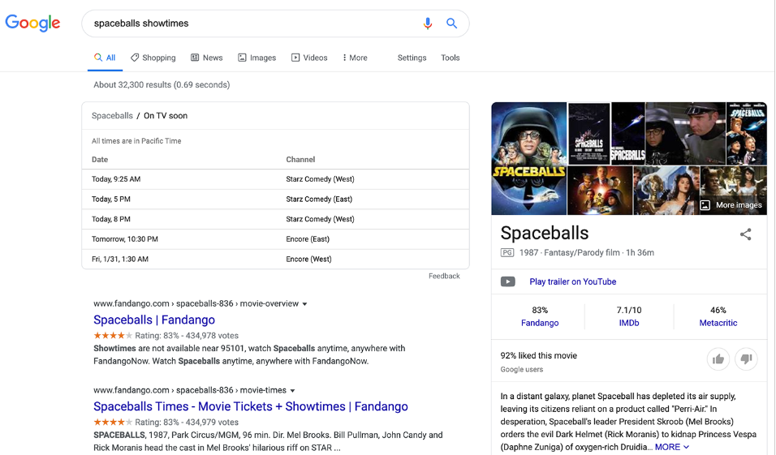
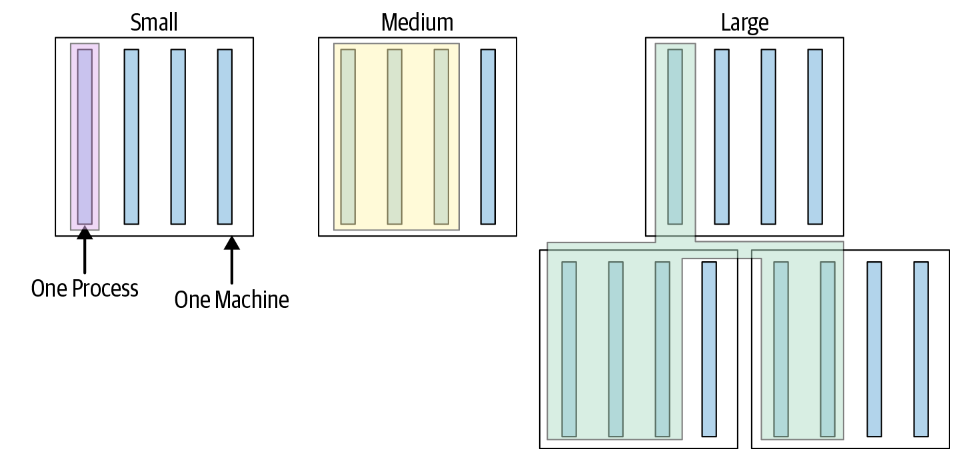
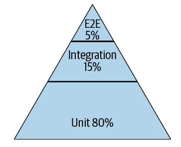
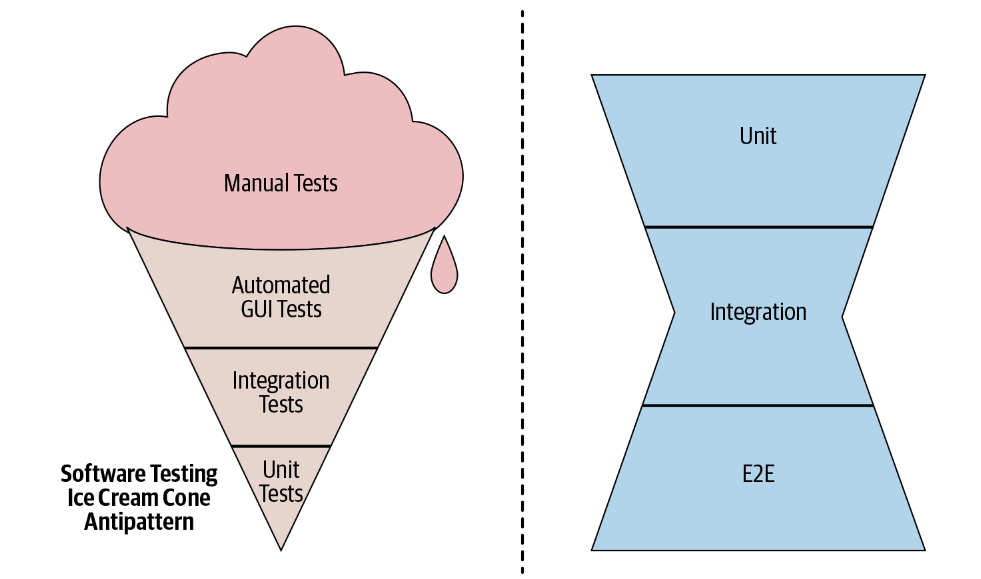

**CHAPTER  11 **

# Testing Overview

# 第十一章 测试概述

                       							 Written by Adam Bender Edited by Tom Manshreck

Testing has always been a part of programming. In fact, the first time you wrote a computer program you almost certainly threw some sample data at it to see whether it performed as you expected. For a long time, the state of the art in software testing resembled a very similar process, largely manual and error prone. However, since the early 2000s, the software industry’s approach to testing has evolved dramatically to cope with the size and complexity of modern software systems. Central to that evolution has been the practice of developer-driven, automated testing.

测试一直是编程的一部分。事实上，当你第一次编写计算机程序时，你几乎肯定向它抛出一些样本数据，看看它是否按照你的预期运行。在很长一段时间里，软件测试的技术水平类似于一个非常相近的过程，主要是手动和容易出错的。然而，自21世纪初以来，软件行业的测试方法已经发生了巨大的变化，以应对现代软件系统的规模和复杂性。这种演进的核心是开发人员驱动的自动化测试实践。

Automated testing can prevent bugs from escaping into the wild and affecting your users. The later in the development cycle a bug is caught, the more expensive it is; exponentially so in many cases.[1](#_bookmark841) However, “catching bugs” is only part of the motivation. An equally important reason why you want to test your software is to support the ability to change. Whether you’re adding new features, doing a refactoring focused on code health, or undertaking a larger redesign, automated testing can quickly catch mistakes, and this makes it possible to change software with confidence.

自动化测试可以防止bug外逃并影响用户。开发周期越晚发现bug，成本就越高；在许多情况下都是指数级的高。然而，“捕捉bug”只是动机的一部分。你希望测试软件的一个同样重要的原因是支持更改的能力。无论你是在添加新功能、进行以代码健康为重点的重构，还是进行更大规模的重新设计，自动化测试都可以快速发现错误，这使得有信心地更改软件成为可能。

Companies that can iterate faster can adapt more rapidly to changing technologies, market conditions, and customer tastes. If you have a robust testing practice, you needn’t fear change—you can embrace it as an essential quality of developing software. The more and faster you want to change your systems, the more you need a fast way to test them.

迭代速度更快的公司可以更快地适应不断变化的技术、市场条件和客户需求。如果你有一个健壮的测试实践，你不必害怕改变，你可以把它作为开发软件的基本质量。你越想高效改变你的系统，你就越需要一种快速的方法来测试它们。

The act of writing tests also improves the design of your systems. As the first clients of your code, a test can tell you much about your design choices. Is your system too tightly coupled to a database? Does the API support the required use cases? Does your system handle all of the edge cases? Writing automated tests forces you to confront these issues early on in the development cycle. Doing so generally leads to more modular software that enables greater flexibility later on.

编写测试的行为也改善了你的系统设计。作为你的代码的第一个客户，测试可以告诉你很多关于设计选择的信息。你的系统是否与数据库结合得太紧密了？API是否支持所需的用例？你的系统是否能处理所有的边缘情况？编写自动化测试迫使你在开发周期的早期就面对这些问题。这样做通常会导致更多的模块化软件，使以后有更大的灵活性。

Much ink has been spilled about the subject of testing software, and for good reason: for such an important practice, doing it well still seems to be a mysterious craft to many. At Google, while we have come a long way, we still face difficult problems getting our processes to scale reliably across the company. In this chapter, we’ll share what we have learned to help further the conversation.

关于测试软件的话题，人们已经倾注了大量的笔墨，这是有充分理由的：对于如此重要的实践，对许多人来说，把它做好似乎仍然是一门神秘的技艺。在谷歌，虽然我们已经取得了长足的进步，但我们仍然面临着让流程在整个公司内可靠扩展的难题。在本章中，我们将分享我们所学到的有助于进一步对话的知识。

```
1	See “Defect Prevention: Reducing Costs and Enhancing Quality.”
1  请参阅“缺陷预防：降低成本和提高质量”
```

## Why Do We Write Tests?  为什么我们要编写测试？

To better understand how to get the most out of testing, let’s start from the beginning. When we talk about automated testing, what are we really talking about?

为了更好地理解如何最大限度地利用测试，让我们从头开始。当我们谈论自动化测试时，我们真正谈论的是什么？

The simplest test is defined by:
- A single behavior you are testing, usually a method or API that you are calling

- A specific input, some value that you pass to the API

- An observable output or behavior

- A controlled environment such as a single isolated process

最简单的测试定义如下
- 你要测试的单一行为，通常是你要调用的一个方法或API
- 一个特定的输入，你传递给API的一些值
- 可观察的输出或行为
- 受控的环境，如一个单独的隔离过程

When you execute a test like this, passing the input to the system and verifying the output, you will learn whether the system behaves as you expect. Taken in aggregate, hundreds or thousands of simple tests (usually called a *test suite*) can tell you how well your entire product conforms to its intended design and, more important, when it doesn’t.

当你执行这样的测试时，将输入传给系统并验证输出，你将了解到系统是否期望运行。总的来说，成百上千个简单的测试（通常称为*测试套件*）可以告诉你整个产品符合预期设计的程度，更重要的是，何时不符合预期设计。

Creating and maintaining a healthy test suite takes real effort. As a codebase grows, so too will the test suite. It will begin to face challenges like instability and slowness. A failure to address these problems will cripple a test suite. Keep in mind that tests derive their value from the trust engineers place in them. If testing becomes a productivity sink, constantly inducing toil and uncertainty, engineers will lose trust and begin to find workarounds. A bad test suite can be worse than no test suite at all.

创建和维护一个健康的测试套件需要付出真正的努力。随着代码库的增长，测试套件也会增长。它将开始面临诸如不稳定和缓慢的挑战。如果不能解决这些问题，测试套件将被削弱。请记住，测试的价值来自工程师对测试的信任。如果测试成为生产力的短板，不断地带来辛劳和不确定性，工程师将失去信任并开始寻找解决办法。一个糟糕的测试套件可能比根本没有测试套件更糟糕。

In addition to empowering companies to build great products quickly, testing is becoming critical to ensuring the safety of important products and services in our lives. Software is more involved in our lives than ever before, and defects can cause  more than a little annoyance: they can cost massive amounts of money, loss of property, or, worst of all, loss of life.[2](#_bookmark848)

除了使公司能够快速生产出优秀的产品外，测试对于确保我们生活中重要产品和服务的安全也变得至关重要。软件比以往任何时候都更多地参与到我们的生活中，而缺陷可能会造成更多的烦恼：它们可能会造成大量的金钱损失，财产损失，或者最糟糕的是，生命损失。

At Google, we have determined that testing cannot be an afterthought. Focusing on quality and testing is part of how we do our jobs. We have learned, sometimes painfully, that failing to build quality into our products and services inevitably leads to bad outcomes. As a result, we have built testing into the heart of our engineering culture.

在谷歌，我们已经确定测试不能是事后诸葛亮。关注质量和测试是我们工作的一部分。我们已经了解到，有时是痛苦地认识到，未能将质量融入我们的产品和服务不可避免地会导致糟糕的结果。因此，我们将测试融入了我们工程文化的核心。

### The Story of Google Web Server  谷歌网络服务器的故事

In Google’s early days, engineer-driven testing was often assumed to be of little importance. Teams regularly relied on smart people to get the software right. A few systems ran large integration tests, but mostly it was the Wild West. One product in particular seemed to suffer the worst: it was called the Google Web Server, also known as GWS.

在谷歌的早期，工程师驱动的测试往往被认为是不重要的。团队经常依靠牛人来使软件正常。有几个系统进行了大规模的集成测试，但大多数情况下，这是一个狂野的西部。有一个产品似乎受到了最严重的影响：它被称为谷歌网络服务器，也被称为GWS。

GWS is the web server responsible for serving Google Search queries and is as important to Google Search as air traffic control is to an airport. Back in 2005, as the project swelled in size and complexity, productivity had slowed dramatically. Releases were becoming buggier, and it was taking longer and longer to push them out. Team members had little confidence when making changes to the service, and often found out something was wrong only when features stopped working in production. (At one point, more than 80% of production pushes contained user-affecting bugs that had to be rolled back.)

GWS是负责为谷歌搜索查询提供服务的网络服务器，它对谷歌搜索的重要性就像空中交通管制对机场的重要性一样。早在2005年，随着项目规模和复杂性的增加，生产力急剧下降。发布的版本越来越多的错误，推送的时间也越来越长。团队成员在对服务进行修改时信心不足，往往是在功能停止工作时才发现有问题。(有一次，超过80％的生产推送包含了影响用户的bug，不得不回滚）。

To address these problems, the tech lead (TL) of GWS decided to institute a policy of engineer-driven, automated testing. As part of this policy, all new code changes were required to include tests, and those tests would be run continuously. Within a year of instituting this policy, the number of emergency pushes *dropped by half*. This drop occurred despite the fact that the project was seeing a record number of new changes every quarter. Even in the face of unprecedented growth and change, testing brought renewed productivity and confidence to one of the most critical projects at Google. Today, GWS has tens of thousands of tests, and releases almost every day with relatively few customer-visible failures.

为了解决这些问题，GWS的技术负责人（TL）决定制定一项由工程师驱动的自动化测试政策。作为这项政策的一部分，所有新的代码修改都需要包括测试，而且这些测试将被持续运行。在实行这一政策的一年内，紧急推送的数量*下降了一半*。尽管该项目每季度都有创纪录的新改动，但还是出现了这种下降。即使面对前所未有的增长和变化，测试也给谷歌最关键的项目之一带来了新的生产力和信心。如今，GWS几乎每天都有数万个测试和发布，几乎没有客户可见的故障。

The changes in GWS marked a watershed for testing culture at Google as teams in other parts of the company saw the benefits of testing and moved to adopt similar tactics.

GWS的变化标志着谷歌测试文化的一个分水岭，因为公司其他部门的团队看到了测试的好处，并开始采用类似的策略。

One of the key insights the GWS experience taught us was that you can’t rely on programmer ability alone to avoid product defects. Even if each engineer writes only the occasional bug, after you have enough people working on the same project, you will be swamped by the ever-growing list of defects. Imagine a hypothetical 100-person team whose engineers are so good that they each write only a single bug a month. Collectively, this group of amazing engineers still produces five new bugs every workday. Worse yet, in a complex system, fixing one bug can often cause another, as engineers adapt to known bugs and code around them.

GWS的经验告诉我们的一个重要启示是，你不能仅仅依靠程序员的能力来避免产品缺陷。即使每个工程师只是偶尔写一些bug，当你有足够多的人在同一个项目上工作时，你也会被不断增长的缺陷清单所淹没。想象一下，一个假设的100人的团队，其工程师非常优秀，他们每个人每月只写一个bug。而这群了不起的工程师在每个工作日仍然会产生5个新的bug。更糟糕的是，在一个复杂的系统中，修复一个错误往往会导致另一个错误，因为工程师们会适配已知的bug并围绕它们编写代码。

The best teams find ways to turn the collective wisdom of its members into a benefit for the entire team. That is exactly what automated testing does. After an engineer on the team writes a test, it is added to the pool of common resources available to others. Everyone else on the team can now run the test and will benefit when it detects an issue. Contrast this with an approach based on debugging, wherein each time a bug occurs, an engineer must pay the cost of digging into it with a debugger. The cost in engineering resources is night and day and was the fundamental reason GWS was able to turn its fortunes around.

最好的团队会想办法将其成员的集体智慧转化为整个团队的利益。这正是自动化测试的作用。在团队中的一个工程师写了一个测试后，它被添加到其他人可用的公共资源池中。团队中的每个人现在都可以运行这个测试，当它检测到一个问题时，就会受益。这与基于调试的方法形成鲜明对比，在这种方法中，每次出现bug，工程师都必须付出代价，用调试器去深挖bug。工程资源的成本是夜以继日的，是GWS能够扭转其命运的根本原因。

```
2	See “Failure at Dhahran.”
2   参见“达兰的失败”
```

### Testing at the Speed of Modern Development  以现代开发的速度测试

Software systems are growing larger and ever more complex. A typical application or service at Google is made up of thousands or millions of lines of code. It uses hundreds of libraries or frameworks and must be delivered via unreliable networks to an increasing number of platforms running with an uncountable number of configurations. To make matters worse, new versions are pushed to users frequently, sometimes multiple times each day. This is a far cry from the world of shrink-wrapped software that saw updates only once or twice a year.

软件系统正在变得越来越大，越来越复杂。谷歌的一个典型的应用程序或服务是由数千或数百万行代码组成的。它使用数以百计的库或框架，必须通过不可靠的网络传递到越来越多的平台上，并以难以计数的配置运行。更糟糕的是，新版本被频繁地推送给用户，有时每天推送多次。这与每年只更新一到两次的压缩包安装的软件世界相去甚远。

The ability for humans to manually validate every behavior in a system has been unable to keep pace with the explosion of features and platforms in most software. Imagine what it would take to manually test all of the functionality of Google Search, like finding flights, movie times, relevant images, and of course web search results (see [Figure 11-1](#_bookmark854)). Even if you can determine how to solve that problem, you then need to multiply that workload by every language, country, and device Google Search must support, and don’t forget to check for things like accessibility and security. Attempting to assess product quality by asking humans to manually interact with every feature just doesn’t scale. When it comes to testing, there is one clear answer: automation.

人工手动验证系统中每一个行为的能力已经无法跟上大多数软件中功能和平台的爆炸性增长的步伐。想象一下，要手动测试谷歌搜索的所有功能，比如寻找航班、电影时间、相关图片，当然还有网页搜索结果（见图11-1），需要花费多少时间。即使你能确定如何解决这个问题，你也需要把这个工作量乘以谷歌搜索必须支持的每一种语言、国家和设备，而且别忘了检查诸如可访问性和安全性。试图通过要求人工手动与每个功能交互来评估产品质量是不可行的。当涉及到测试时，有一个明确的答案：自动化。




*Figure 11-1. Screenshots of two complex Google search results*  *图11-1. 两个复杂的谷歌搜索结果的截图*

### Write, Run, React  编写、运行、反应

In its purest form, automating testing consists of three activities: writing tests, running tests, and reacting to test failures. An automated test is a small bit of code, usually a single function or method, that calls into an isolated part of a larger system that you want to test. The test code sets up an expected environment, calls into the system, usually with a known input, and verifies the result. Some of the tests are very small, exercising a single code path; others are much larger and can involve entire systems, like a mobile operating system or web browser.

在最纯粹的形式中，自动化测试包括三个活动：编写测试、运行测试和对测试失败作出反应。自动测试是一小段代码，通常是单个函数或方法，它调用要测试的较大系统的一个独立部分。测试代码设置预期的环境，调用系统（通常使用已知的输入），并验证结果。有些测试非常小，只执行一条代码方式；另一些则要大得多，可能涉及整个系统，如移动操作系统或web浏览器。

[Example 11-1 ](#_bookmark857)presents a deliberately simple test in Java using no frameworks or testing libraries. This is not how you would write an entire test suite, but at its core every automated test looks similar to this very simple example.

例11-1绍了一个特意用Java写的简单测试，没有使用框架或测试库。这不是你编写整个测试套件的方式，但在其核心部分，每个自动化测试都与这个非常简单的例子类似。

*Example 11-1. An example test*  *例11-1. 一个测试实例*

```java
// Verifies a Calculator class can handle negative results.
public void main(String[] args) {
Calculator calculator = new Calculator();
int expectedResult = -3;
int actualResult = calculator.subtract(2, 5); // Given 2, Subtracts 5.
assert(expectedResult == actualResult);
}
```

Unlike the QA processes of yore, in which rooms of dedicated software testers pored over new versions of a system, exercising every possible behavior, the engineers who build systems today play an active and integral role in writing and running automated tests for their own code. Even in companies where QA is a prominent organization, developer-written tests are commonplace. At the speed and scale that today’s systems are being developed, the only way to keep up is by sharing the development of tests around the entire engineering staff.

与过去的QA过程不同的是，在过去的QA过程中，专门的软件测试人员仔细研究系统的新版本，练习各种可能的行为，而今天构建系统的工程师在为自己的代码编写和运行自动测试方面发挥着积极和不可或缺的作用。即使在QA是一个重要组织的公司，开发人员编写的测试也是很常见的。以当今系统开发的速度和规模，跟上的唯一方法是与整个工程人员共享测试开发。

Of course, writing tests is different from writing *good tests*. It can be quite difficult to train tens of thousands of engineers to write good tests. We will discuss what we have learned about writing good tests in the chapters that follow.

当然，写测试和写*好测试*是不同的。要训练数以万计的工程师写出好的测试是相当困难的。我们将在接下来的章节中讨论关于编写好测试的知识。

Writing tests is only the first step in the process of automated testing. After you have written tests, you need to run them. Frequently. At its core, automated testing consists of repeating the same action over and over, only requiring human attention when something breaks. We will discuss this Continuous Integration (CI) and testing in [Chapter 23](#_bookmark2022). By expressing tests as code instead of a manual series of steps, we can run them every time the code changes—easily thousands of times per day. Unlike human testers, machines never grow tired or bored.

编写测试只是自动化测试过程中的第一步。编写测试后，需要运行它们。频繁地自动化测试的核心是一遍又一遍地重复相同的操作，只有在出现故障时才需要人的注意。我们将在第23章讨论这种持续集成（CI）和测试。通过将测试表达为代码，而不是手动的一系列步骤，我们可以在每次代码改变时运行它们--每天很容易地运行数千次。与人工测试人员不同，机器从不感到疲劳或无聊。

Another benefit of having tests expressed as code is that it is easy to modularize them for execution in various environments. Testing the behavior of Gmail in Firefox requires no more effort than doing so in Chrome, provided you have configurations for both of these systems.[3](#_bookmark864) Running tests for a user interface (UI) in Japanese or German can be done using the same test code as for English.

将测试转变为代码的另一个好处是，很容易将它们模块化，以便在各种环境中执行。在Firefox中测试Gmail的行为并不需要比在Chrome中测试更多的努力，只要你有这两个系统的配置。可以使用与英语相同的测试代码对日语或德语用户界面（UI）进行测试。

Products and services under active development will inevitably experience test failures. What really makes a testing process effective is how it addresses test failures. Allowing failing tests to pile up quickly defeats any value they were providing, so it is imperative not to let that happen. Teams that prioritize fixing a broken test within minutes of a failure are able to keep confidence high and failure isolation fast, and therefore derive more value out of their tests.

正在开发的产品和服务将不可避免地经历测试失败。真正使测试过程有效的是如何解决测试失败。允许失败的测试迅速堆积起来，就会破坏它们提供的任何价值，所以一定不要让这种情况发生。在发生故障后几分钟内优先修复故障测试的团队能够保持较高的信心和快速的故障隔离，从而从他们的测试中获得更多的价值。

In summary, a healthy automated testing culture encourages everyone to share the work of writing tests. Such a culture also ensures that tests are run regularly. Last, and perhaps most important, it places an emphasis on fixing broken tests quickly so as to maintain high confidence in the process.

总之，一个健康的自动化测试文化鼓励每个人分享编写测试的工作。这种文化也确保了测试的定期运行。最后，也许也是最重要的，它强调快速修复损坏的测试，以保持对测试过程的高度信心。

### Benefits of Testing Code  测试代码的好处

To developers coming from organizations that don’t have a strong testing culture, the idea of writing tests as a means of improving productivity and velocity might seem antithetical. After all, the act of writing tests can take just as long (if not longer!) than implementing a feature would take in the first place. On the contrary, at Google, we’ve found that investing in software tests provides several key benefits to developer productivity:

*Less* *debugging*
	As you would expect, tested code has fewer defects when it is submitted. Critically, it also has fewer defects throughout its existence; most of them will be caught before the code is submitted. A piece of code at Google is expected to be modified dozens of times in its lifetime. It will be changed by other teams and even automated code maintenance systems. A test written once continues to pay dividends and prevent costly defects and annoying debugging sessions through the lifetime of the project. Changes to a project, or the dependencies of a project, that break a test can be quickly detected by test infrastructure and rolled back before the problem is ever released to production.

*Increased* *confidence* *in* *changes*
	All software changes. Teams with good tests can review and accept changes to their project with confidence because all important behaviors of their project are continuously verified. Such projects encourage refactoring. Changes that refactor code while preserving existing behavior should (ideally) require no changes to existing tests.

*Improved* *documentation*
	Software documentation is notoriously unreliable. From outdated requirements to missing edge cases, it is common for documentation to have a tenuous relationship to the code. Clear, focused tests that exercise one behavior at a time function as executable documentation. If you want to know what the code does in a particular case, look at the test for that case. Even better, when requirements change and new code breaks an existing test, we get a clear signal that the “documentation” is now out of date. Note that tests work best as documentation only if care is taken to keep them clear and concise.

*Simpler* *reviews*
	All code at Google is reviewed by at least one other engineer before it can be submitted (see [Chapter 9 ](#_bookmark664)for more details). A code reviewer spends less effort verifying code works as expected if the code review includes thorough tests that demonstrate code correctness, edge cases, and error conditions. Instead of the tedious effort needed to mentally walk each case through the code, the reviewer can verify that each case has a passing test.

*Thoughtful* *design*
	Writing tests for new code is a practical means of exercising the API design of the code itself. If new code is difficult to test, it is often because the code being tested has too many responsibilities or difficult-to-manage dependencies. Well- designed code should be modular, avoiding tight coupling and focusing on specific responsibilities. Fixing design issues early often means less rework later.

*Fast, high-quality releases*
	With a healthy automated test suite, teams can release new versions of their application with confidence. Many projects at Google release a new version to production every day—even large projects with hundreds of engineers and thousands of code changes submitted every day. This would not be possible without automated testing.

对于来自没有强大测试文化的组织的开发者来说，把编写测试作为提高生产力和速度的手段的想法可能看起来是对立的。毕竟，编写测试所需的时间（如果不是更长的话！）可能与实现功能所需的时间一样长。相反，在谷歌，我们发现投入于软件测试对开发人员的生产力有几个关键的好处：

*更少的调试*
	正如你所期望的那样，经过测试的代码在提交时有更少的缺陷。重要的是，它在整个存在过程中也有较少的缺陷；大多数缺陷在代码提交之前就会被发现。在谷歌，一段代码在其生命周期内预计会被修改几十次。它将被其他团队甚至是自动代码维护系统所改变。一次写好的测试会继续带来红利，并在项目的生命周期中防止昂贵的缺陷和恼人的调试过程。对项目或项目的依赖关系的改变，如果破坏了测试，可以被测试基础设施迅速发现，并在问题被发布到生产中之前回滚。

*增加了信心在变更中*
	所有的软件变更。具有良好测试的团队可以满怀信心地审查和接受项目的变更，因为他们的项目的所有重要行为都得到了持续验证。这样的项目鼓励重构。在保留现有行为的情况下，重构代码的变化应该（最好）不需要改变现有的测试。

*改进文档*
	软件文档是出了名的不可靠。从过时的需求到缺失的边缘案例，文档与代码的关系很脆弱，这很常见。清晰的、有针对性的测试，一次行使一个行为的功能是可执行的文档。如果你想知道代码在某一特定情况下做了什么，看看该情况的测试。更好的是，当需求发生变化，新的代码破坏了现有的测试时，我们会得到一个明确的信号，"文档 "现在已经过时了。请注意，只有在注意保持测试的清晰和简洁的情况下，测试才能作为文档发挥最佳效果。

*简单审查*
	在谷歌，所有的代码在提交之前都要经过至少一名其他工程师的审查（详见第九章）。如果代码审查包括彻底的测试，证明代码的正确性、边缘情况和错误情况，那么代码审查员花在验证代码是否按预期运行的精力就会减少。审查员可以验证每个案例都有一个合格的测试，而不必费心费力地在代码中对每个案例进行解读。

*深思熟虑设计*
	为新代码编写测试是锻炼代码本身的API设计的一种实用手段。如果新代码难以测试，往往是因为被测试的代码有太多的职责或难以管理的依赖关系。设计良好的代码应该是模块化的，避免紧密耦合，并专注于特定的责任。尽早修复设计问题往往意味着以后的返工更少。

*快速、高质量的发布*
	有了健康的自动化测试套件，团队可以放心地发布新版本的应用程序。谷歌的许多项目每天都会向生产部门发布一个新的版本--即使是有数百名工程师的大型项目，每天都会提交成千上万的代码修改。如果没有自动化测试，这是不可能的。


```
3	Getting the behavior right across different browsers and languages is a different story! But, ideally, the end- user experience should be the same for everyone.
```

## Designing a Test Suite  设计测试套件

Today, Google operates at a massive scale, but we haven’t always been so large, and the foundations of our approach were laid long ago. Over the years, as our codebase has grown, we have learned a lot about how to approach the design and execution of a test suite, often by making mistakes and cleaning up afterward.

今天，谷歌的运营规模很大，但我们并不一直以来都这么大，我们的方法的基础在很久以前就已奠定。多年来，随着我们代码库的增长，我们学到了很多关于如何设计和执行测试套件的方法，往往是通过犯错和事后复盘。

One of the lessons we learned fairly early on is that engineers favored writing larger, system-scale tests, but that these tests were slower, less reliable, and more difficult to debug than smaller tests. Engineers, fed up with debugging the system-scale tests, asked themselves, “Why can’t we just test one server at a time?” or, “Why do we need to test a whole server at once? We could test smaller modules individually.” Eventually, the desire to reduce pain led teams to develop smaller and smaller tests, which turned out to be faster, more stable, and generally less painful.

我们很早就学到的一个经验是，工程师们喜欢写更大的、系统规模的测试，但这些测试比小型测试更慢，更不可靠，更难调试。工程师们厌倦了调试系统规模的测试，问自己："为什么我们不能一次只测试一台服务器？"或者，"为什么我们需要一次测试整个服务器？我们可以单独测试较小的模块"。最终，减轻痛苦的愿望促使团队开发越来越小的测试，结果证明，这些测试更快、更稳定，而且通常也更少痛苦。

This led to a lot of discussion around the company about the exact meaning of “small.” Does small mean unit test? What about integration tests, what size are those? We have come to the conclusion that there are two distinct dimensions for every test case: size and scope. Size refers to the resources that are required to run a test case: things like memory, processes, and time. Scope refers to the specific code paths we are verifying. Note that executing a line of code is different from verifying that it worked as expected. Size and scope are interrelated but distinct concepts.

这导致公司上下对 "小 "的确切含义进行了大量的讨论。小是指单元测试吗？那集成测试呢，是什么规模？我们得出的结论是，每个测试用例都有两个不同的维度：规模和范围。规模是指运行一个测试用例所需的资源：如内存、进程和时间。范围指的是我们要验证的具体代码路径。请注意，执行一行代码与验证它是否按预期工作是不同的。规模和范围是相互关联但不同的概念。

### Test Size  测试规模

At Google, we classify every one of our tests into a size and encourage engineers to always write the smallest possible test for a given piece of functionality. A test’s size is determined not by its number of lines of code, but by how it runs, what it is allowed to do, and how many resources it consumes. In fact, in some cases, our definitions of small, medium, and large are actually encoded as constraints the testing infrastructure can enforce on a test. We go into the details in a moment, but in brief, *small tests* run in a single process, *medium tests* run on a single machine, and *large tests* run wherever they want, as demonstrated in [Figure 11-2](#_bookmark872).[4](#_bookmark873)

在谷歌，我们把每一个测试都归为一个规模，并鼓励工程师总是为一个给定的功能编写尽可能小的测试。一个测试的规模大小不是由它的代码行数决定的，而是由它的运行方式、它被允许做什么以及它消耗多少资源决定的。事实上，在某些情况下，我们对小、中、大的定义实际上被编码为测试基础设施可以在测试上执行的约束。我们稍后会讨论细节，但简单地说，*小型测试*在一个进程中运行，*中型测试*在一台机器上运行，而*大型测试*在任何地方运行，如图11-2所展示。



*Figure 11-2. Test sizes*  *Figure 11-2. 测试规模*

We make this distinction, as opposed to the more traditional “unit” or “integration,” because the most important qualities we want from our test suite are speed and determinism, regardless of the scope of the test. Small tests, regardless of the scope, are almost always faster and more deterministic than tests that involve more infrastructure or consume more resources. Placing restrictions on small tests makes speed and determinism much easier to achieve. As test sizes grow, many of the restrictions are relaxed. Medium tests have more flexibility but also more risk of nondeterminism. Larger tests are saved for only the most complex and difficult testing scenarios. Let’s take a closer look at the exact constraints imposed on each type of test.

我们做出这样的区分，而不是更传统的 "单元 "或 "集成"，因为我们希望从我们的测试套件中得到的最重要的品质是速度和确定性，无论测试的范围如何。小型测试，无论范围如何，几乎总是比涉及更多基础设施或消耗更多资源的测试更快、更有确定性。对小型测试施加限制，使速度和确定性更容易实现。随着测试规模的增长，许多限制都被放松了。中型测试有更多的灵活性，但也有更多的非确定性的风险。大型测试只保存在最复杂和困难的测试场景中。让我们仔细看看每一种测试的确切约束条件。

```
4	Technically, we have four sizes of test at Google: small, medium, large, and enormous. The internal difference between large and enormous is actually subtle and historical; so, in this book, most descriptions of large actually apply to our notion of enormous.
4 从技术上讲，我们在谷歌有四种规模的测试：小型、中型、大型和超大型。大型和超大型之间的内部差异实际上是微妙的和历史性的；因此，在本书中，大多数关于大型的描述实际上适用于我们的超大型概念。
```

#### Small tests  小型测试

Small tests are the most constrained of the three test sizes. The primary constraint is that small tests must run in a single process. In many languages, we restrict this even further to say that they must run on a single thread. This means that the code performing the test must run in the same process as the code being tested. You can’t run a server and have a separate test process connect to it. It also means that you can’t run a third-party program such as a database as part of your test.

小型测试是三种测试规模中最受限制的。主要的限制是，小测试必须在一个进程中运行。在许多语言中，我们甚至进一步限制，说它们必须在一个单线程上运行。这意味着执行测试的代码必须与被测试的代码在同一进程中运行。你不能运行一个服务器，而让一个单独的测试进程连接到它。这也意味着你不能运行第三方程序，如数据库作为你测试的一部分。

The other important constraints on small tests are that they aren’t allowed to sleep, perform I/O operations,[5](#_bookmark877) or make any other blocking calls. This means that small tests aren’t allowed to access the network or disk. Testing code that relies on these sorts of operations requires the use of test doubles (see [Chapter 13](#_bookmark1056)) to replace the heavyweight dependency with a lightweight, in-process dependency.

对小测试的其他重要限制是，它们不允许休眠，执行I/O操作，或进行任何其他阻塞调用。这意味着，小测试不允许访问网络或磁盘。测试依赖于这类操作的代码需要使用测试替代（见第13章)），用轻量级的进程内依赖取代重量级依赖。

The purpose of these restrictions is to ensure that small tests don’t have access to the main sources of test slowness or nondeterminism. A test that runs on a single process and never makes blocking calls can effectively run as fast as the CPU can handle. It’s difficult (but certainly not impossible) to accidentally make such a test slow or nondeterministic. The constraints on small tests provide a sandbox that prevents engineers from shooting themselves in the foot.

这些限制的目的是确保小的测试没有机会使用到测试缓慢或非确定性的主要来源。在单个进程上运行且从不进行阻塞调用的测试可以有效地以CPU能够处理的速度运行。很难（但肯定不是不可能）意外地使这样的测试变得缓慢或不确定。对小型测试的限制提供了一个沙盒，防止工程师自食其果。

These restrictions might seem excessive at first, but consider a modest suite of a couple hundred small test cases running throughout the day. If even a few of them fail nondeterministically (often called [flaky tests](https://oreil.ly/NxC4A)), tracking down the cause becomes a serious drain on productivity. At Google’s scale, such a problem could grind our testing infrastructure to a halt.

起初，这些限制可能看起来太过夸张，但考虑一套完整的一组数百个小测试用例，在一天内运行完成。如果哪怕是其中的一小部分测试不确定地失败（通常称为松散测试），那么追踪原因将严重影响生产率。按照谷歌的规模，这样的问题可能会使我们的测试基础设施陷入停顿。

At Google, we encourage engineers to try to write small tests whenever possible, regardless of the scope of the test, because it keeps the entire test suite running fast and reliably. For more discussion on small versus unit tests, see [Chapter 12](#_bookmark938).

在谷歌，我们鼓励工程师尽可能地编写小型测试，而不管测试的范围如何，因为这样可以使整个测试套件快速可靠地运行。有关小测试与单元测试的更多讨论，请参阅第12章。

```
5	There is a little wiggle room in this policy. Tests are allowed to access a filesystem if they use a hermetic, in- memory implementation.
5 这个政策有一点回旋余地。如果测试使用的是密封的、内存中的实现，则允许访问文件系统。
```

#### Medium tests  中型测试

The constraints placed on small tests can be too restrictive for many interesting kinds of tests. The next rung up the ladder of test sizes is the medium test. Medium tests can span multiple processes, use threads, and can make blocking calls, including network calls, to localhost. The only remaining restriction is that medium tests aren’t allowed to make network calls to any system other than localhost. In other words, the test must be contained within a single machine.

对于许多有趣的测试类型来说，对小型测试的限制可能过于严格。测试规模的下一个阶梯是中型测试。中型测试可以跨越多个进程，使用线程，并可以对本地主机进行阻塞调用，包括网络调用。剩下的唯一限制是，中型测试不允许对 localhost 以外的任何系统进行网络调用。换句话说，测试必须包含在一台机器内。

The ability to run multiple processes opens up a lot of possibilities. For example, you could run a database instance to validate that the code you’re testing integrates correctly in a more realistic setting. Or you could test a combination of web UI and server code. Tests of web applications often involve tools like [WebDriver ](https://oreil.ly/W27Uf)that start a real browser and control it remotely via the test process.

运行多个进程的能力提供了很多可能性。例如，你可以运行一个数据库实例来验证你正在测试的代码是否正确地集成在更现实的设置中。或者你可以测试网络用户界面和服务器代码的组合。网络应用程序的测试经常涉及到像[WebDriver](https://oreil.ly/W27Uf)这样的工具，它可以启动一个真正的浏览器，并通过测试过程远程控制它。

Unfortunately, with increased flexibility comes increased potential for tests to become slow and nondeterministic. Tests that span processes or are allowed to make blocking calls are dependent on the operating system and third-party processes to be fast and deterministic, which isn’t something we can guarantee in general. Medium tests still provide a bit of protection by preventing access to remote machines via the network, which is far and away the biggest source of slowness and nondeterminism in most systems. Still, when writing medium tests, the “safety” is off, and engineers need to be much more careful.

不幸的是，随着灵活性的增加，测试变得缓慢和不确定的可能性也在增加。跨进程的测试或被允许进行阻塞性调用的测试依赖于操作系统和第三方进程的快速和确定性，这在一般情况下我们是无法保证的。中型测试仍然通过防止通过网络访问远程机器来提供一些保护，而网络是大多数系统中速度慢和非确定性的最大来源。尽管如此，在编写中型测试时，"安全 "是关闭的，工程师需要更加小心。

#### Large tests  大型测试

Finally, we have large tests. Large tests remove the localhost restriction imposed on medium tests, allowing the test and the system being tested to span across multiple machines. For example, the test might run against a system in a remote cluster.

最后，我们有大型测试。大型测试取消了对中型测试的本地主机限制，允许测试和被测系统跨越多台机器。例如，测试可能针对远程集群中的系统运行。

As before, increased flexibility comes with increased risk. Having to deal with a system that spans multiple machines and the network connecting them increases the chance of slowness and nondeterminism significantly compared to running on a single machine. We mostly reserve large tests for full-system end-to-end tests that are more about validating configuration than pieces of code, and for tests of legacy components for which it is impossible to use test doubles. We’ll talk more about use cases for large tests in [Chapter 14](#_bookmark1181). Teams at Google will frequently isolate their large tests from their small or medium tests, running them only during the build and release process so as not to impact developer workflow.

和以前一样，灵活性的提高伴随着风险的增加。与在单一机器上运行相比，必须处理跨多台机器的系统以及连接这些机器的网络会显著增加速度慢和不确定性的可能性。我们主要为全系统端到端测试保留大型测试，这些测试更多的是验证配置，而不是代码片段，并且为不可能使用测试替代的遗留组件的测试保留大型测试。我们将在第14章中更多地讨论大型测试的用例。谷歌的团队经常将大型测试与小型或中型测试隔离开来，只在构建和发布过程中运行它们，以免影响开发人员的工作流程。

-----

#### Case Study: Flaky Tests Are Expensive  案例研究：松散（不稳定）测试很昂贵

If you have a few thousand tests, each with a very tiny bit of nondeterminism, running all day, occasionally one will probably fail (flake). As the number of tests grows, statistically so will the number of flakes. If each test has even a 0.1% of failing when it should not, and you run 10,000 tests per day, you will be investigating 10 flakes per day. Each investigation takes time away from something more productive that your team could be doing.

如果你有几千个测试，每个测试都有非常小的非确定性，整天运行，偶尔会有一个可能会失败（松散）。随着测试数量的增加，从统计学上看，松散的数量也会增加。如果每个测试都有0.1%的失败率，而你每天运行10,000个测试，你每天将调查10个松散。每次调查都会从团队可能会做的更有效率的事情中抽出时间。

In some cases, you can limit the impact of flaky tests by automatically rerunning them when they fail. This is effectively trading CPU cycles for engineering time. At low levels of flakiness, this trade-off makes sense. Just keep in mind that rerunning a test is only delaying the need to address the root cause of flakiness.

在某些情况下，你可以通过在测试失败时自动重新运行它们来限制松散测试的影响。这实际上是用CPU周期换取工程时间。在低水平的松散情况下，这种权衡是有意义的。记住，重新运行测试只会推迟解决片状问题根本原因的需要。

If test flakiness continues to grow, you will experience something much worse than lost productivity: a loss of confidence in the tests. It doesn’t take needing to investigate many flakes before a team loses trust in the test suite. After that happens, engineers will stop reacting to test failures, eliminating any value the test suite provided. Our experience suggests that as you approach 1% flakiness, the tests begin to lose value. At Google, our flaky rate hovers around 0.15%, which implies thousands of flakes every day. We fight hard to keep flakes in check, including actively investing engineering hours to fix them.

如果测试失误继续增长，你将经历比生产力损失更糟糕的事情：对测试的信心丧失。在团队失去对测试套件的信任之前，不需要投入太多的精力。发生这种情况后，工程师将停止对测试失败的反应，消除测试套件提供的任何价值。我们的经验表明，当你接近1%的松散率时，测试开始失去价值。在谷歌，我们的松散率徘徊在0.15%左右，这意味着每天有成千上万的不稳定。我们努力地控制故障率，包括积极地投入工程时间来修复它们。

In most cases, flakes appear because of nondeterministic behavior in the tests themselves. Software provides many sources of nondeterminism: clock time, thread scheduling, network latency, and more. Learning how to isolate and stabilize the effects of randomness is not easy. Sometimes, effects are tied to low-level concerns like hardware interrupts or browser rendering engines. A good automated test infrastructure should help engineers identify and mitigate any nondeterministic behavior.

在大多数情况下，松散出现是因为测试本身的非确定性行为。软件提供了许多非确定性的来源：时钟时间、线程调度、网络延迟，等等。学习如何隔离和稳定随机性的影响并不容易。有时，影响与硬件中断或浏览器渲染引擎等低层的问题联系在一起。一个好的自动化测试基础设施应该帮助工程师识别和缓解任何不确定性行为。

-----

#### Properties common to all test sizes  所有测试规模的共同属性

All tests should strive to be hermetic: a test should contain all of the information necessary to set up, execute, and tear down its environment. Tests should assume as little as possible about the outside environment, such as the order in which the tests are run. For example, they should not rely on a shared database. This constraint becomes more challenging with larger tests, but effort should still be made to ensure isolation.

所有测试应力求封闭性：测试应包含设置、执行和拆除其环境所需的所有信息。测试应该尽可能少地假设外部环境，例如测试的运行顺序。例如，他们不应该依赖共享数据库。这种约束在大型测试中变得更具挑战性，但仍应努力确保隔离

A test should contain *only* the information required to exercise the behavior in question. Keeping tests clear and simple aids reviewers in verifying that the code does what it says it does. Clear code also aids in diagnosing failure when they fail. We like to say that “a test should be obvious upon inspection.” Because there are no tests for the tests themselves, they require manual review as an important check on correctness. As a corollary to this, we also [strongly discourage the use of control flow statements like conditionals and loops in a test](https://oreil.ly/fQSuk). More complex test flows risk containing bugs themselves and make it more difficult to determine the cause of a test failure.

测试应该*仅*包含测试行为所需的信息。保持测试的清晰和简单，有助于审查人员验证代码是否做了它所说的事情。清晰的代码也有助于在测试失败时诊断失败。我们喜欢说，"测试应该在检查时是明显的"。因为测试本身没有测试，所以需要手动检查，作为对正确性的重要检查。作为一个推论，我们也强烈反对在测试中使用控制流语句，如条件和循环。更加复杂的测试流程有可能包含bug本身，并使确定测试失败的原因更加困难。

Remember that tests are often revisited only when something breaks. When you are called to fix a broken test that you have never seen before, you will be thankful someone took the time to make it easy to understand. Code is read far more than it is written, so make sure you write the test you’d like to read!

请记住，测试只有在出现故障时，才会重新检查测试。当你被要求修复一个你从未见过的失败测试时，你会感激有人花时间让它变得容易理解。代码的读取量远远大于写入量，所以要确保你写的测试是你看得懂的！

**Test sizes in practice.** Having precise definitions of test sizes has allowed us to create tools to enforce them. Enforcement enables us to scale our test suites and still make certain guarantees about speed, resource utilization, and stability. The extent to which these definitions are enforced at Google varies by language. For example, we run all Java tests using a custom security manager that will cause all tests tagged as small to fail if they attempt to do something prohibited, such as establish a network connection.

**测试规模的实践。**有了测试规模的精确定义，我们就可以创建工具来执行它们。强制执行使我们能够扩展我们的测试套件，并仍然对速度、资源利用和稳定性做出一定的保证。在谷歌，这些定义的执行程度因语言而异。例如，我们使用一个自定义的安全管理器来运行所有的Java测试，如果它们试图做一些被禁止的事情，如建立网络连接，就会导致所有被标记为小型测试失败。

### Test Scope

Though we at Google put a lot of emphasis on test size, another important property to consider is test scope. Test scope refers to how much code is being validated by a given test. Narrow-scoped tests (commonly called “unit tests”) are designed to validate the logic in a small, focused part of the codebase, like an individual class or method. Medium-scoped tests (commonly called *integration tests*) are designed to verify interactions between a small number of components; for example, between a server and its database. Large-scoped tests (commonly referred to by names like *functional tests*, *end-to-end* tests, or *system tests*) are designed to validate the interaction of several distinct parts of the system, or emergent behaviors that aren’t expressed in a single class or method.

It’s important to note that when we talk about unit tests as being narrowly scoped, we’re referring to the code that is being *validated*, not the code that is being *executed*. It’s quite common for a class to have many dependencies or other classes it refers to, and these dependencies will naturally be invoked while testing the target class. Though some [other testing strategies ](https://oreil.ly/Lj-t3)make heavy use of test doubles (fakes or mocks) to avoid executing code outside of the system under test, at Google, we prefer to keep the real dependencies in place when it is feasible to do so. [Chapter 13 ](#_bookmark1056)discusses this issue in more detail.

Narrow-scoped tests tend to be small, and broad-scoped tests tend to be medium or large, but this isn’t always the case. For example, it’s possible to write a broad-scoped test of a server endpoint that covers all of its normal parsing, request validation, and business logic, which is nevertheless small because it uses doubles to stand in for all out-of-process dependencies like a database or filesystem. Similarly, it’s possible to write a narrow-scoped test of a single method that must be medium sized. For example, modern web frameworks often bundle HTML and JavaScript together, and testing a UI component like a date picker often requires running an entire browser, even to validate a single code path.

Just as we encourage tests of smaller size, at Google, we also encourage engineers to write tests of narrower scope. As a very rough guideline, we tend to aim to have a mix of around 80% of our tests being narrow-scoped unit tests that validate the majority of our business logic; 15% medium-scoped integration tests that validate the interactions between two or more components; and 5% end-to-end tests that validate the entire system. [Figure 11-3 ](#_bookmark893)depicts how we can visualize this as a pyramid.



*Figure 11-3. Google’s version of Mike Cohn’s test pyramid;*[*6*](#_bookmark896) *percentages are by test case* *count, and every team’s mix will be a little different*

Unit tests form an excellent base because they are fast, stable, and dramatically narrow the scope and reduce the cognitive load required to identify all the possible behaviors a class or function has. Additionally, they make failure diagnosis quick and painless. Two antipatterns to be aware of are the “ice cream cone” and the “hourglass,” as illustrated in [Figure 11-4](#_bookmark897).

With the ice cream cone, engineers write many end-to-end tests but few integration or unit tests. Such suites tend to be slow, unreliable, and difficult to work with. This pattern often appears in projects that start as prototypes and are quickly rushed to production, never stopping to address testing debt.

The hourglass involves many end-to-end tests and many unit tests but few integration tests. It isn’t quite as bad as the ice cream cone, but it still results in many end-to- end test failures that could have been caught quicker and more easily with a suite of medium-scope tests. The hourglass pattern occurs when tight coupling makes it difficult to instantiate individual dependencies in isolation.



*Figure* *11-4.* *Test* *suite* *antipatterns*

Our recommended mix of tests is determined by our two primary goals: engineering productivity and product confidence. Favoring unit tests gives us high confidence quickly, and early in the development process. Larger tests act as sanity checks as the product develops; they should not be viewed as a primary method for catching bugs.

When considering your own mix, you might want a different balance. If you emphasize integration testing, you might discover that your test suites take longer to run but catch more issues between components. When you emphasize unit tests, your test suites can complete very quickly, and you will catch many common logic bugs. But, unit tests cannot verify the interactions between components, like [a contract between](https://oreil.ly/mALqH) [two systems developed by different teams](https://oreil.ly/mALqH). A good test suite contains a blend of different test sizes and scopes that are appropriate to the local architectural and organizational realities.

```
6	Mike Cohn, Succeeding with Agile: Software Development Using Scrum (New York: Addison-Wesley Professional, 2009).
```

### The Beyoncé Rule

We are often asked, when coaching new hires, which behaviors or properties actually need to be tested? The straightforward answer is: test everything that you don’t want to break. In other words, if you want to be confident that a system exhibits a particular behavior, the only way to be sure it will is to write an automated test for it. This includes all of the usual suspects like testing performance, behavioral correctness, accessibility, and security. It also includes less obvious properties like testing how a system handles failure.

We have a name for this general philosophy: we call it the [Beyoncé Rule](https://oreil.ly/X7_-z). Succinctly, it can be stated as follows: “If you liked it, then you shoulda put a test on it.” The Beyoncé Rule is often invoked by infrastructure teams that are responsible for making changes across the entire codebase. If unrelated infrastructure changes pass all of your tests but still break your team’s product, you are on the hook for fixing it and adding the additional tests.

----

#### Testing for Failure

One of the most important situations a system must account for is failure. Failure is inevitable, but waiting for an actual catastrophe to find out how well a system responds to a catastrophe is a recipe for pain. Instead of waiting for a failure, write automated tests that simulate common kinds of failures. This includes simulating exceptions or errors in unit tests and injecting Remote Procedure Call (RPC) errors or latency in integration and end-to-end tests. It can also include much larger disruptions that affect the real production network using techniques like Chaos Engineering. A predictable and controlled response to adverse conditions is a hallmark of a reliable system.

-----

### A Note on Code Coverage

Code coverage is a measure of which lines of feature code are exercised by which tests. If you have 100 lines of code and your tests execute 90 of them, you have 90% code coverage.[7](#_bookmark905) Code coverage is often held up as the gold standard metric for understanding test quality, and that is somewhat unfortunate. It is possible to exercise a lot of lines of code with a few tests, never checking that each line is doing anything useful. That’s because code coverage only measures that a line was invoked, not what happened as a result. (We recommend only measuring coverage from small tests to avoid coverage inflation that occurs when executing larger tests.)

An even more insidious problem with code coverage is that, like other metrics, it quickly becomes a goal unto itself. It is common for teams to establish a bar for expected code coverage—for instance, 80%. At first, that sounds eminently reasonable; surely you want to have at least that much coverage. In practice, what happens is that instead of treating 80% like a floor, engineers treat it like a ceiling. Soon, changes begin landing with no more than 80% coverage. After all, why do more work than the metric requires?

A better way to approach the quality of your test suite is to think about the behaviors that are tested. Do you have confidence that everything your customers expect to work will work? Do you feel confident you can catch breaking changes in your dependencies? Are your tests stable and reliable? Questions like these are a more holistic way to think about a test suite. Every product and team is going to be different; some will have difficult-to-test interactions with hardware, some involve massive datasets. Trying to answer the question “do we have enough tests?” with a single number ignores a lot of context and is unlikely to be useful. Code coverage can provide some insight into untested code, but it is not a substitute for thinking critically about how well your system is tested.

```
7	Keep in mind that there are different kinds of coverage (line, path, branch, etc.), and each says something different about which code has been tested. In this simple example, line coverage is being used.
```

## Testing at Google Scale

Much of the guidance to this point can be applied to codebases of almost any size. However, we should spend some time on what we have learned testing at our very large scale. To understand how testing works at Google, you need an understanding of our development environment, the most important fact about which is that most of Google’s code is kept in a single, monolithic repository ([monorepo](https://oreil.ly/qSihi)). Almost every line of code for every product and service we operate is all stored in one place. We have more than two billion lines of code in the repository today.

Google’s codebase experiences close to 25 million lines of change every week. Roughly half of them are made by the tens of thousands of engineers working in our monorepo, and the other half by our automated systems, in the form of configuration updates or large-scale changes ([Chapter 22](#_bookmark1935)). Many of those changes are initiated from outside the immediate project. We don’t place many limitations on the ability of engineers to reuse code.

The openness of our codebase encourages a level of co-ownership that lets everyone take responsibility for the codebase. One benefit of such openness is the ability to directly fix bugs in a product or service you use (subject to approval, of course) instead of complaining about it. This also implies that many people will make changes in a part of the codebase owned by someone else.

Another thing that makes Google a little different is that almost no teams use repository branching. All changes are committed to the repository head and are immediately visible for everyone to see. Furthermore, all software builds are performed using the last committed change that our testing infrastructure has validated. When a product or service is built, almost every dependency required to run it is also built from source, also from the head of the repository. Google manages testing at this scale by use of a CI system. One of the key components of our CI system is our Test Automated Platform (TAP).

Whether you are considering our size, our monorepo, or the number of products we offer, Google’s engineering environment is complex. Every week it experiences millions of changing lines, billions of test cases being run, tens of thousands of binaries being built, and hundreds of products being updated—talk about complicated!

### The Pitfalls of a Large Test Suite

As a codebase grows, you will inevitably need to make changes to existing code. When poorly written, automated tests can make it more difficult to make those changes. Brittle tests—those that over-specify expected outcomes or rely on extensive and complicated boilerplate—can actually resist change. These poorly written tests can fail even when unrelated changes are made.

If you have ever made a five-line change to a feature only to find dozens of unrelated, broken tests, you have felt the friction of brittle tests. Over time, this friction can make a team reticent to perform necessary refactoring to keep a codebase healthy. The subsequent chapters will cover strategies that you can use to improve the robustness and quality of your tests.

Some of the worst offenders of brittle tests come from the misuse of mock objects. Google’s codebase has suffered so badly from an abuse of mocking frameworks that it has led some engineers to declare “no more mocks!” Although that is a strong statement, understanding the limitations of mock objects can help you avoid misusing them.

In addition to the friction caused by brittle tests, a larger suite of tests will be slower to run. The slower a test suite, the less frequently it will be run, and the less benefit it provides. We use a number of techniques to speed up our test suite, including parallelizing execution and using faster hardware. However, these kinds of tricks are eventually swamped by a large number of individually slow test cases.

Tests can become slow for many reasons, like booting significant portions of a system, firing up an emulator before execution, processing large datasets, or waiting for disparate systems to synchronize. Tests often start fast enough but slow down as the system grows. For example, maybe you have an integration test exercising a single dependency that takes five seconds to respond, but over the years you grow to depend on a dozen services, and now the same tests take five minutes.

Tests can also become slow due to unnecessary speed limits introduced by functions like sleep() and setTimeout(). Calls to these functions are often used as naive heuristics before checking the result of nondeterministic behavior. Sleeping for half a second here or there doesn’t seem too dangerous at first; however, if a “wait-and-check” is embedded in a widely used utility, pretty soon you have added minutes of idle time to every run of your test suite. A better solution is to actively poll for a state transition with a frequency closer to microseconds. You can combine this with a timeout value in case a test fails to reach a stable state.

Failing to keep a test suite deterministic and fast ensures it will become roadblock to productivity. At Google, engineers who encounter these tests have found ways to work around slowdowns, with some going as far as to skip the tests entirely when submitting changes. Obviously, this is a risky practice and should be discouraged, but if a test suite is causing more harm than good, eventually engineers will find a way to get their job done, tests or no tests.

The secret to living with a large test suite is to treat it with respect. Incentivize engineers to care about their tests; reward them as much for having rock-solid tests as you would for having a great feature launch. Set appropriate performance goals and refactor slow or marginal tests. Basically, treat your tests like production code. When simple changes begin taking nontrivial time, spend effort making your tests less brittle.

In addition to developing the proper culture, invest in your testing infrastructure by developing linters, documentation, or other assistance that makes it more difficult to write bad tests. Reduce the number of frameworks and tools you need to support to increase the efficiency of the time you invest to improve things.[8](#_bookmark919) If you don’t invest in making it easy to manage your tests, eventually engineers will decide it isn’t worth having them at all.

```
8	Each supported language at Google has one standard test framework and one standard mocking/stubbing library. One set of infrastructure runs most tests in all languages across the entire codebase.
```

## History of Testing at Google

Now that we’ve discussed how Google approaches testing, it might be enlightening to learn how we got here. As mentioned previously, Google’s engineers didn’t always embrace the value of automated testing. In fact, until 2005, testing was closer to a curiosity than a disciplined practice. Most of the testing was done manually, if it was done at all. However, from 2005 to 2006, a testing revolution occurred and changed the way we approach software engineering. Its effects continue to reverberate within the company to this day.

The experience of the GWS project, which we discussed at the opening of this chapter, acted as a catalyst. It made it clear how powerful automated testing could be. Following the improvements to GWS in 2005, the practices began spreading across the entire company. The tooling was primitive. However, the volunteers, who came to be known as the Testing Grouplet, didn’t let that slow them down.

Three key initiatives helped usher automated testing into the company’s consciousness: Orientation Classes, the Test Certified program, and Testing on the Toilet. Each one had influence in a completely different way, and together they reshaped Google’s engineering culture.

### Orientation Classes

Even though much of the early engineering staff at Google eschewed testing, the pioneers of automated testing at Google knew that at the rate the company was growing, new engineers would quickly outnumber existing team members. If they could reach all the new hires in the company, it could be an extremely effective avenue for introducing cultural change. Fortunately, there was, and still is, a single choke point that all new engineering hires pass through: orientation.

Most of Google’s early orientation program concerned things like medical benefits and how Google Search worked, but starting in 2005 it also began including an hour- long discussion of the value of automated testing.[9](#_bookmark922) The class covered the various benefits of testing, such as increased productivity, better documentation, and support for refactoring. It also covered how to write a good test. For many Nooglers (new Googlers) at the time, such a class was their first exposure to this material. Most important, all of these ideas were presented as though they were standard practice at the company. The new hires had no idea that they were being used as trojan horses to sneak this idea into their unsuspecting teams.

As Nooglers joined their teams following orientation, they began writing tests and questioning those on the team who didn’t. Within only a year or two, the population of engineers who had been taught testing outnumbered the pretesting culture engineers. As a result, many new projects started off on the right foot.

Testing has now become more widely practiced in the industry, so most new hires arrive with the expectations of automated testing firmly in place. Nonetheless, orientation classes continue to set expectations about testing and connect what Nooglers  know about testing outside of Google to the challenges of doing so in our very large and very complex codebase.

```
9	This class was so successful that an updated version is still taught today. In fact, it is one of the longest- running orientation classes in the company’s history.
```

### Test Certified

Initially, the larger and more complex parts of our codebase appeared resistant to good testing practices. Some projects had such poor code quality that they were almost impossible to test. To give projects a clear path forward, the Testing Grouplet devised a certification program that they called Test Certified. Test Certified aimed to give teams a way to understand the maturity of their testing processes and, more critically, cookbook instructions on how to improve it.

The program was organized into five levels, and each level required some concrete actions to improve the test hygiene on the team. The levels were designed in such a way that each step up could be accomplished within a quarter, which made it a convenient fit for Google’s internal planning cadence.

Test Certified Level 1 covered the basics: set up a continuous build; start tracking code coverage; classify all your tests as small, medium, or large; identify (but don’t necessarily fix) flaky tests; and create a set of fast (not necessarily comprehensive) tests that can be run quickly. Each subsequent level added more challenges like “no releases with broken tests” or “remove all nondeterministic tests.” By Level 5, all tests were automated, fast tests were running before every commit, all nondeterminism had been removed, and every behavior was covered. An internal dashboard applied social pressure by showing the level of every team. It wasn’t long before teams were competing with one another to climb the ladder.

By the time the Test Certified program was replaced by an automated approach in 2015 (more on pH later), it had helped more than 1,500 projects improve their testing culture.

### Testing on the Toilet

Of all the methods the Testing Grouplet used to try to improve testing at Google, perhaps none was more off-beat than Testing on the Toilet (TotT). The goal of TotT was fairly simple: actively raise awareness about testing across the entire company. The question is, what’s the best way to do that in a company with employees scattered around the world?

The Testing Grouplet considered the idea of a regular email newsletter, but given the heavy volume of email everyone deals with at Google, it was likely to become lost in the noise. After a little bit of brainstorming, someone proposed the idea of posting flyers in the restroom stalls as a joke. We quickly recognized the genius in it: the bathroom is one place that everyone must visit at least once each day, no matter what. Joke or not, the idea was cheap enough to implement that it had to be tried.

In April 2006, a short writeup covering how to improve testing in Python appeared in restroom stalls across Google. This first episode was posted by a small band of volunteers. To say the reaction was polarized is an understatement; some saw it as an invasion of personal space, and they objected strongly. Mailing lists lit up with complaints, but the TotT creators were content: the people complaining were still talking about testing.

Ultimately, the uproar subsided and TotT quickly became a staple of Google culture. To date, engineers from across the company have produced several hundred episodes, covering almost every aspect of testing imaginable (in addition to a variety of other technical topics). New episodes are eagerly anticipated and some engineers even volunteer to post the episodes around their own buildings. We intentionally limit each episode to exactly one page, challenging authors to focus on the most important and actionable advice. A good episode contains something an engineer can take back to the desk immediately and try.

Ironically for a publication that appears in one of the more private locations, TotT has had an outsized public impact. Most external visitors see an episode at some point in their visit, and such encounters often lead to funny conversations about how Googlers always seem to be thinking about code. Additionally, TotT episodes make great blog posts, something the original TotT authors recognized early on. They began publishing [lightly edited versions publicly](https://oreil.ly/86Nho), helping to share our experience with the industry at large.

Despite starting as a joke, TotT has had the longest run and the most profound impact of any of the testing initiatives started by the Testing Grouplet.

### Testing Culture Today

Testing culture at Google today has come a long way from 2005. Nooglers still attend orientation classes on testing, and TotT continues to be distributed almost weekly. However, the expectations of testing have more deeply embedded themselves in the daily developer workflow.

Every code change at Google is required to go through code review. And every change is expected to include both the feature code and tests. Reviewers are expected to review the quality and correctness of both. In fact, it is perfectly reasonable to block a change if it is missing tests.

As a replacement for Test Certified, one of our engineering productivity teams recently launched a tool called Project Health (pH). The pH tool continuously gathers dozens of metrics on the health of a project, including test coverage and test latency, and makes them available internally. pH is measured on a scale of one (worst) to five (best). A pH-1 project is seen as a problem for the team to address. Almost every team that runs a continuous build automatically gets a pH score.

Over time, testing has become an integral part of Google’s engineering culture. We have myriad ways to reinforce its value to engineers across the company. Through a combination of training, gentle nudges, mentorship, and, yes, even a little friendly competition, we have created the clear expectation that testing is everyone’s job.

Why didn’t we start by mandating the writing of tests?

The Testing Grouplet had considered asking for a testing mandate from senior leadership but quickly decided against it. Any mandate on how to develop code would be seriously counter to Google culture and likely slow the progress, independent of the idea being mandated. The belief was that successful ideas would spread, so the focus became demonstrating success.

If engineers were deciding to write tests on their own, it meant that they had fully accepted the idea and were likely to keep doing the right thing—even if no one was compelling them to.

## The Limits of Automated Testing

Automated testing is not suitable for all testing tasks. For example, testing the quality of search results often involves human judgment. We conduct targeted, internal studies using Search Quality Raters who execute real queries and record their impressions. Similarly, it is difficult to capture the nuances of audio and video quality in an automated test, so we often use human judgment to evaluate the performance of telephony or video-calling systems.

In addition to qualitative judgements, there are certain creative assessments at which humans excel. For example, searching for complex security vulnerabilities is something that humans do better than automated systems. After a human has discovered and understood a flaw, it can be added to an automated security testing system like Google’s [Cloud Security Scanner ](https://oreil.ly/6_W_q)where it can be run continuously and at scale.

A more generalized term for this technique is Exploratory Testing. Exploratory Testing is a fundamentally creative endeavor in which someone treats the application under test as a puzzle to be broken, maybe by executing an unexpected set of steps or by inserting unexpected data. When conducting an exploratory test, the specific problems to be found are unknown at the start. They are gradually uncovered by probing commonly overlooked code paths or unusual responses from the application. As with the detection of security vulnerabilities, as soon as an exploratory test discovers an issue, an automated test should be added to prevent future regressions.

Using automated testing to cover well-understood behaviors enables the expensive and qualitative efforts of human testers to focus on the parts of your products for which they can provide the most value—and avoid boring them to tears in the process.

### Conclusion

The adoption of developer-driven automated testing has been one of the most transformational software engineering practices at Google. It has enabled us to build larger systems with larger teams, faster than we ever thought possible. It has helped us keep up with the increasing pace of technological change. Over the past 15 years, we have successfully transformed our engineering culture to elevate testing into a cultural norm. Despite the company growing by a factor of almost 100 times since the journey began, our commitment to quality and testing is stronger today than it has ever been.

This chapter has been written to help orient you to how Google thinks about testing. In the next few chapters, we are going to dive even deeper into some key topics that have helped shape our understanding of what it means to write good, stable, and reliable tests. We will discuss the what, why, and how of unit tests, the most common kind of test at Google. We will wade into the debate on how to effectively use test doubles in tests through techniques such as faking, stubbing, and interaction testing. Finally, we will discuss the challenges with testing larger and more complex systems, like many of those we have at Google.

At the conclusion of these three chapters, you should have a much deeper and clearer picture of the testing strategies we use and, more important, why we use them.

## TL;DRs

- Automated testing is foundational to enabling software to change.

- For tests to scale, they must be automated.

- A balanced test suite is necessary for maintaining healthy test coverage.

- “If you liked it, you should have put a test on it.”

- Changing the testing culture in organizations takes time.

