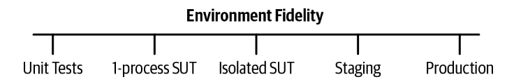
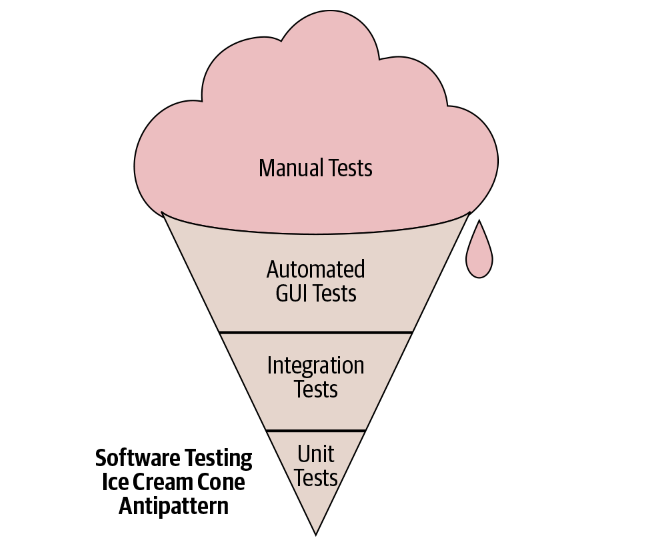
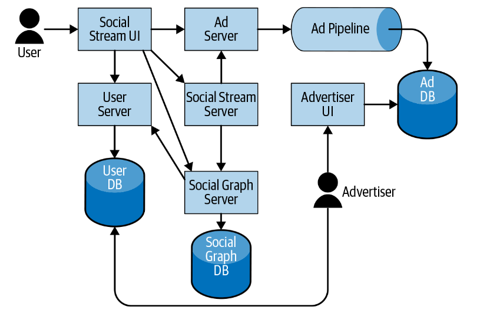
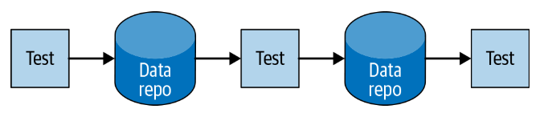
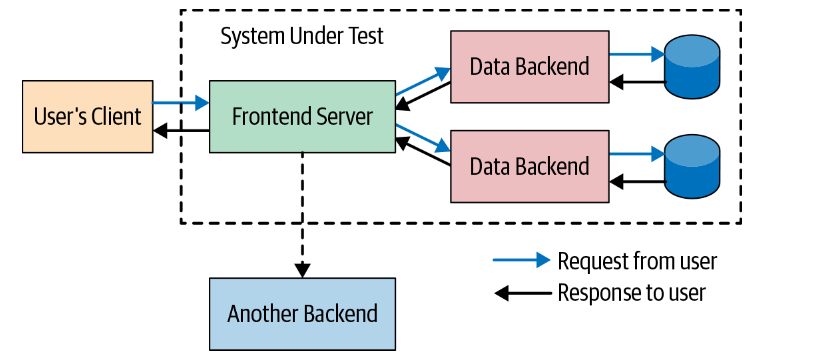

**CHAPTER** **14**

# Larger Testing

# 第十四章 大型测试

            Written by  Written by Joseph Graves Edited by Lisa Carey


In previous chapters, we have recounted how a testing culture was established at Google and how small unit tests became a fundamental part of the developer workflow. But what about other kinds of tests? It turns out that Google does indeed use many larger tests, and these comprise a significant part of the risk mitigation strategy necessary for healthy software engineering. But these tests present additional challenges to ensure that they are valuable assets and not resource sinks. In this chapter, we’ll discuss what we mean by “larger tests,” when we execute them, and best practices for keeping them effective.

在前几章中，我们已经讲述了测试文化是如何在Google建立的，以及小单元测试是如何成为开发人员工作流程的基本组成部分。但是其他类型的测试呢？事实证明，Google确实使用了许多大型测试，这些测试构成了健康的软件工程所需的风险缓解策略的重要组成部分。但是，这些测试导致了额外的挑战，以确保它们是有价值的资产而不是资源黑洞。在这一章中，我们将讨论什么是 "大型测试"，什么时候执行这些测试，以及保持其有效性的最佳做法。

## What Are Larger Tests? 什么是大型测试？

As mentioned previously, Google has specific notions of test size. Small tests are restricted to one thread, one process, one machine. Larger tests do not have the same restrictions. But Google also has notions of test scope. A unit test necessarily is of smaller scope than an integration test. And the largest-scoped tests (sometimes called end-to-end or system tests) typically involve several real dependencies and fewer test doubles.

如前所述，谷歌对测试规模有特定的概念。小型测试仅限于一个线程、一个进程、一台机器。较大的测试没有相同的限制。但谷歌也有测试范围的概念。单元测试的范围必然比集成测试的范围小。而最大范围的测试（有时被称为端到端或系统测试）通常涉及多个实际依赖项和较少的测试替身。（`Test Double`是在Martin Fowler的文章[Test Double](https://martinfowler.com/bliki/TestDouble.html)中，Gerard Meszaros提出了这个概念。虽然是06年的文章了，但里面的概念并不过时。这篇文章提到`Test Double`只是一个通用的词，代表为了达到测试目的并且减少被测试对象的依赖，使用“替身”代替一个真实的依赖对象，从而保证了测试的速度和稳定性。统一翻译为测试替代）

Larger tests are many things that small tests are not. They are not bound by the same constraints; thus, they can exhibit the following characteristics:
•	They may be slow. Our large tests have a default timeout of 15 minutes or 1 hour, but we also have tests that run for multiple hours or even days.
•	They may be nonhermetic. Large tests may share resources with other tests and traffic.
•   They may be nondeterministic. If a large test is nonhermetic, it is almost impossible to guarantee determinism: other tests or user state may interfere with it.

较大的测试有许多是小测试所不具备的内容。它们不受相同的约束；因此，它们可以表现出以下特征：
- 它们可能很慢。我们的大型测试的默认超时时间为15分钟或1小时，但我们也有运行数小时甚至数天的测试。
- 它们可能是不封闭的。大型测试可能与其他测试和流量共享资源。
- 它们可能是不确定的。如果大型测试是非密封的，则几乎不可能保证确定性：其他测试或用户状态可能会干扰它。

So why have larger tests? Reflect back on your coding process. How do you confirm that the programs you write actually work? You might be writing and running unit tests as you go, but do you find yourself running the actual binary and trying it out yourself? And when you share this code with others, how do they test it? By running your unit tests, or by trying it out themselves?

那么，为什么要进行大型测试？回想一下你的编码过程。你是如何确认你写的程序真的能工作的？你可能边写边运行单元测试，但你是否发现自己在运行实际的二进制文件并亲自体验？而当你与他人分享这些代码时，他们是如何测试的呢？是通过运行你的单元测试，还是通过自己体验？

Also, how do you know that your code continues to work during upgrades? Suppose that you have a site that uses the Google Maps API and there’s a new API version. Your unit tests likely won’t help you to know whether there are any compatibility issues. You’d probably run it and try it out to see whether anything broke.

另外，你怎么知道你的代码在升级时还能继续工作？假设你有一个使用谷歌地图API的网站，有一个新的API版本。你的单元测试很可能无法帮助你知道是否有任何兼容性问题。你可能会运行它，试一试，看看是否有什么故障。

Unit tests can give you confidence about individual functions, objects, and modules, but large tests provide more confidence that the overall system works as intended. And having actual automated tests scales in ways that manual testing does not.

单元测试可以让你对单个功能、对象和模块有信心，但大型测试可以让你对整个系统按预期工作更有信心。而以手动测试无法实现的方式进行实际的自动化测试。

### Fidelity 仿真度

The primary reason larger tests exist is to address *fidelity*. Fidelity is the property by which a test is reflective of the real behavior of the system under test (SUT).

大型测试存在的主要原因是为了解决保真度问题。仿真度是测试反映被测系统（SUT）真实行为的属性。

One way of envisioning fidelity is in terms of the environment. As [Figure 14-1 ](#_bookmark1192)illustrates, unit tests bundle a test and a small portion of code together as a runnable unit, which ensures the code is tested but is very different from how production code runs. Production itself is, naturally, the environment of highest fidelity in testing. There is also a spectrum of interim options. A key for larger tests is to find the proper fit, because increasing fidelity also comes with increasing costs and (in the case of production) increasing risk of failure.

一种设想保真度的方法是在环境方面。如图14-1所示，单元测试将测试和一小部分代码捆绑在一起作为一个可运行的单元，这确保了代码得到测试，但与生产代码的运行方式有很大不同。产品本身才是测试中仿真度最高的环境。也有一系列的临时选项。大型测试的一个关键是要找到适当的契合点，因为提高仿真度也伴随着成本的增加和（在线上的情况下）故障风险的增加。



*Figure 14-1. Scale of increasing fidelity*

Tests can also be measured in terms of how faithful the test content is to reality. Many handcrafted, large tests are dismissed by engineers if the test data itself looks unrealistic. Test data copied from production is much more faithful to reality (having been captured that way), but a big challenge is how to create realistic test traffic *before* launching the new code. This is particularly a problem in artificial intelligence (AI), for which the “seed” data often suffers from intrinsic bias. And, because most data for unit tests is handcrafted, it covers a narrow range of cases and tends to conform to the biases of the author. The uncovered scenarios missed by the data represent a fidelity gap in the tests.

测试也可以用测试内容对现实的仿真度程度来衡量。如果测试数据本身看起来不真实，许多手工配置的大型测试就会被工程师驳回。从生产中复制的测试数据仿真度更高（以这种方式捕获），但一个很大的挑战是如何在*启动新代码之前创建真实的测试流量。这在人工智能（AI）中尤其是一个问题，因为 "种子 "数据经常受到内在偏见的影响。而且，由于大多数单元测试的数据是手工配置的，它涵盖的案例范围很窄，并倾向于符合作者的偏见。数据所遗漏的场景代表了测试中的仿真度差距。

### Common Gaps in Unit Tests 单元测试中常见的差距

Larger tests might also be necessary where smaller tests fail. The subsections that follow present some particular areas where unit tests do not provide good risk mitigation coverage.

如果较小的测试失败，也可能需要进行较大的测试。下面的小节介绍了单元测试无法提供良好风险缓解覆盖率的一些特殊领域

#### Unfaithful doubles 仿真度不足的测试替代

A single unit test typically covers one class or module. Test doubles (as discussed in [Chapter 13](#_bookmark1056)) are frequently used to eliminate heavyweight or hard-to-test dependencies. But when those dependencies are replaced, it becomes possible that the replacement and the doubled thing do not agree.

一个单元测试通常覆盖一个类或模块。测试替代（如第13章所讨论的）经常被用来消除重量级或难以测试的依赖项。但是当这些依赖关系被替换时，就有可能出现替换后的东西和被替换的东西不一致的情况。

Almost all unit tests at Google are written by the same engineer who is writing the unit under test. When those unit tests need doubles and when the doubles used are mocks, it is the engineer writing the unit test defining the mock and its intended behavior. But that engineer usually did *not* write the thing being mocked and can be misinformed about its actual behavior. The relationship between the unit under test and a given peer is a behavioral contract, and if the engineer is mistaken about the actual behavior, the understanding of the contract is invalid.

在谷歌，几乎所有的单元测试都是由编写被测单元的工程师编写的。当这些单元测试需要替代时，当使用的替代是模拟时，是编写单元测试的工程师在定义模拟和它的预期行为。但该工程师通常没有*写被模拟的东西，因此可能对其实际行为有误解。被测单元与给定对等方之间的关系是一种行为契约，如果工程师对实际行为有误解，则对契约的理解无效。

Moreover, mocks become stale. If this mock-based unit test is not visible to the author of the real implementation and the real implementation changes, there is no signal that the test (and the code being tested) should be updated to keep up with the changes.

此外，模拟会变得过时。如果实际实现的作者看不到这个基于模拟的单元测试，并且实际实现发生了变化，那么就没有信号表明应该更新测试（以及正在测试的代码）以跟上变化。

Note that, as mentioned in [Chapter 13](#_bookmark1056), if teams provide fakes for their own services, this concern is mostly alleviated.

请注意，正如在第13章中提到的，如果团队为他们自己的服务提供模拟，这种担忧大多会得到缓解。

#### Configuration issues 配置问题

Unit tests cover code within a given binary. But that binary is typically not completely self-sufficient in terms of how it is executed. Usually a binary has some kind of deployment configuration or starter script. Additionally, real end-user-serving production instances have their own configuration files or configuration databases.

单元测试涵盖了给定二进制中的代码。但该二进制文件在如何执行方面通常不是完全自足的。通常情况下，二进制文件有某种部署配置或启动脚本。此外，真正为终端用户服务的生产实例有他们自己的配置文件或配置数据库。

If there are issues with these files or the compatibility between the state defined by these stores and the binary in question, these can lead to major user issues. Unit tests alone cannot verify this compatibility.[1](#_bookmark1199) Incidentally, this is a good reason to ensure that your configuration is in version control as well as your code, because then, changes to configuration can be identified as the source of bugs as opposed to introducing random external flakiness and can be built in to large tests.

如果这些文件存在问题，或者这些存储定义的状态与有问题的二进制文件之间存在兼容性问题，则可能会导致重大的用户故障。单元测试不能验证这种兼容性。顺便说一下，这是一个很好的理由，确保你的配置和你的代码一样在版本控制中，因为这样，配置的变更可以被识别为bug的来源，而不是引入随机的外部碎片，并且可以在大型测试中构建。

At Google, configuration changes are the number one reason for our major outages. This is an area in which we have underperformed and has led to some of our most embarrassing bugs. For example, there was a global Google outage back in 2013 due to a bad network configuration push that was never tested. Configurations tend to be written in configuration languages, not production code languages. They also often have faster production rollout cycles than binaries, and they can be more difficult to test. All of these lead to a higher likelihood of failure. But at least in this case (and others), configuration was version controlled, and we could quickly identify the culprit and mitigate the issue.

在谷歌，配置变更是我们重大故障的头号原因。这是一个我们表现不佳的领域，并导致了我们一些最尴尬的错误。例如，2013年，由于一次从未测试过的糟糕网络配置推送，谷歌出现了一次全球停机。它们通常也比二进制文件具有更快的生产部署周期，而且它们可能更难测试。所有这些都会导致更高的失败可能性。但至少在这种情况下（和其他情况下），配置是由版本控制的，我们可以快速识别故障并缓解问题。

```
1	See “Continuous Delivery” on page 483 and Chapter 25 for more information.
1   有关更多信息，请参见第483页和第25章的“连续交付”。
```

#### Issues that arise under load

At Google, unit tests are intended to be small and fast because they need to fit into our standard test execution infrastructure and also be run many times as part of a frictionless developer workflow. But performance, load, and stress testing often require sending large volumes of traffic to a given binary. These volumes become difficult to test in the model of a typical unit test. And our large volumes are big, often thousands or millions of queries per second (in the case of ads, [real-time bidding](https://oreil.ly/brV5-))!

#### Unanticipated behaviors, inputs, and side effects

Unit tests are limited by the imagination of the engineer writing them. That is, they can only test for anticipated behaviors and inputs. However, issues that users find with a product are mostly unanticipated (otherwise it would be unlikely that they would make it to end users as issues). This fact suggests that different test techniques are needed to test for unanticipated behaviors.

[Hyrum’s Law ](http://hyrumslaw.com/)is an important consideration here: even if we could test 100% for conformance to a strict, specified contract, the effective user contract applies to all visible behaviors, not just a stated contract. It is unlikely that unit tests alone test for all visible behaviors that are not specified in the public API.

#### Emergent behaviors and the “vacuum effect”

Unit tests are limited to the scope that they cover (especially with the widespread use of test doubles), so if behavior changes in areas outside of this scope, it cannot be detected. And because unit tests are designed to be fast and reliable, they deliberately eliminate the chaos of real dependencies, network, and data. A unit test is like a problem in theoretical physics: ensconced in a vacuum, neatly hidden from the mess of the real world, which is great for speed and reliability but misses certain defect categories.

### Why Not Have Larger Tests?

In earlier chapters, we discussed many of the properties of a developer-friendly test. In particular, it needs to be as follows:
*Reliable*
	It must not be flaky and it must provide a useful pass/fail signal.
*Fast*
	It needs to be fast enough to not interrupt the developer workflow.
*Scalable*
	Google needs to be able to run all such useful affected tests efficiently for presubmits and for post-submits.

Good unit tests exhibit all of these properties. Larger tests often violate all of these constraints. For example, larger tests are often flakier because they use more infrastructure than does a small unit test. They are also often much slower, both to set up as well as to run. And they have trouble scaling because of the resource and time requirements, but often also because they are not isolated—these tests can collide with one another.

Additionally, larger tests present two other challenges. First, there is a challenge of ownership. A unit test is clearly owned by the engineer (and team) who owns the unit. A larger test spans multiple units and thus can span multiple owners. This presents a long-term ownership challenge: who is responsible for maintaining the test and who is responsible for diagnosing issues when the test breaks? Without clear ownership, a test rots.

The second challenge for larger tests is one of standardization (or the lack thereof). Unlike unit tests, larger tests suffer a lack of standardization in terms of the infrastructure and process by which they are written, run, and debugged. The approach to larger tests is a product of a system’s architectural decisions, thus introducing variance in the type of tests required. For example, the way we build and run A-B diff regression tests in Google Ads is completely different from the way such tests are built and run in Search backends, which is different again from Drive. They use different platforms, different languages, different infrastructures, different libraries, and competing testing frameworks.

This lack of standardization has a significant impact. Because larger tests have so many ways of being run, they often are skipped during large-scale changes. (See [Chapter 22](#_bookmark1935).) The infrastructure does not have a standard way to run those tests, and asking the people executing LSCs to know the local particulars for testing on every team doesn’t scale. Because larger tests differ in implementation from team to team, tests that actually test the integration between those teams require unifying incompatible infrastructures. And because of this lack of standardization, we cannot teach a single approach to Nooglers (new Googlers) or even more experienced engineers, which both perpetuates the situation and also leads to a lack of understanding about the motivations of such tests.

## Larger Tests at Google

When we discussed the history of testing at Google earlier (see Chapter 11), we mentioned how Google Web Server (GWS) mandated automated tests in 2003 and how this was a watershed moment. However, we actually had automated tests in use before this point, but a common practice was using automated large and enormous tests. For example, AdWords created an end-to-end test back in 2001 to validate product scenarios. Similarly, in 2002, Search wrote a similar “regression test” for its indexing code, and AdSense (which had not even publicly launched yet) created its variation on the AdWords test.
Other “larger” testing patterns also existed circa 2002. The Google search frontend relied heavily on manual QA—manual versions of end-to-end test scenarios. And Gmail got its version of a “local demo” environment—a script to bring up an end-to- end Gmail environment locally with some generated test users and mail data for local manual testing.
When C/J Build (our first continuous build framework) launched, it did not distinguish between unit tests and other tests, but there were two critical developments that led to a split. First, Google focused on unit tests because we wanted to encourage the testing pyramid and to ensure the vast majority of written tests were unit tests. Second, when TAP replaced C/J Build as our formal continuous build system, it was only able to do so for tests that met TAP’s eligibility requirements: hermetic tests buildable at a single change that could run on our build/test cluster within a maximum time limit. Although most unit tests satisfied this requirement, larger tests mostly did not. However, this did not stop the need for other kinds of tests, and they have continued to fill the coverage gaps. C/J Build even stuck around for years specifically to handle these kinds of tests until newer systems replaced it.

### Larger Tests and Time

Throughout this book, we have looked at the influence of time on software engineering, because Google has built software running for more than 20 years. How are larger tests influenced by the time dimension? We know that certain activities make more sense the longer the expected lifespan of code, and testing of various forms is an activity that makes sense at all levels, but the test types that are appropriate change over the expected lifetime of code.

As we pointed out before, unit tests begin to make sense for software with an expected lifespan from hours on up. At the minutes level (for small scripts), manual testing is most common, and the SUT usually runs locally, but the local demo likely *is* production, especially for one-off scripts, demos, or experiments. At longer lifespans, manual testing continues to exist, but the SUTs usually diverge because the production instance is often cloud hosted instead of locally hosted.

The remaining larger tests all provide value for longer-lived software, but the main concern becomes the maintainability of such tests as time increases.

Incidentally, this time impact might be one reason for the development of the “ice cream cone” testing antipattern, as mentioned in the [Chapter 11 ](#_bookmark838)and shown again in [Figure 14-2](#_bookmark1221).



*Figure 14-2. The ice cream cone testing antipattern*

When development starts with manual testing (when engineers think that code is meant to last only for minutes), those manual tests accumulate and dominate the initial overall testing portfolio. For example, it’s pretty typical to hack on a script or an app and test it out by running it, and then to continue to add features to it but continue to test it out by running it manually. This prototype eventually becomes functional and is shared with others, but no automated tests actually exist for it.

Even worse, if the code is difficult to unit test (because of the way it was implemented in the first place), the only automated tests that can be written are end-to-end ones, and we have inadvertently created “legacy code” within days.

It is *critical* for longer-term health to move toward the test pyramid within the first few days of development by building out unit tests, and then to top it off after that point by introducing automated integration tests and moving away from manual end- to-end tests. We succeeded by making unit tests a requirement for submission, but covering the gap between unit tests and manual tests is necessary for long-term health.

#### Larger Tests at Google Scale

It would seem that larger tests should be more necessary and more appropriate at larger scales of software, but even though this is so, the complexity of authoring, running, maintaining, and debugging these tests increases with the growth in scale, even more so than with unit tests.

In a system composed of microservices or separate servers, the pattern of interconnections looks like a graph: let the number of nodes in that graph be our *N*. Every time a new node is added to this graph, there is a multiplicative effect on the number of distinct execution paths through it.

[Figure 14-3 ](#_bookmark1226)depicts an imagined SUT: this system consists of a social network with users, a social graph, a stream of posts, and some ads mixed in. The ads are created by advertisers and served in the context of the social stream. This SUT alone consists of two groups of users, two UIs, three databases, an indexing pipeline, and six servers. There are 14 edges enumerated in the graph. Testing all of the end-to-end possibilities is already difficult. Imagine if we add more services, pipelines, and databases to this mix: photos and images, machine learning photo analysis, and so on?



*Figure 14-3. Example of a fairly small SUT: a social network with advertising*

The rate of distinct scenarios to test in an end-to-end way can grow exponentially or combinatorially depending on the structure of the system under test, and that growth does not scale. Therefore, as the system grows, we must find alternative larger testing strategies to keep things manageable.

However, the value of such tests also increases because of the decisions that were necessary to achieve this scale. This is an impact of fidelity: as we move toward larger-*N* layers of software, if the service doubles are lower fidelity (1-epsilon), the chance of bugs when putting it all together is exponential in *N*. Looking at this example SUT again, if we replace the user server and ad server with doubles and those doubles are low fidelity (e.g., 10% accurate), the likelihood of a bug is 99% (1 – (0.1 ∗ 0.1)). And that’s just with two low-fidelity doubles.

Therefore, it becomes critical to implement larger tests in ways that work well at this scale but maintain reasonably high fidelity.

------

Tip:"The Smallest Possible Test"
Even for integration tests,smaller is better-a handful of large tests is preferable to anenormous one.And,because the scope of a test is often coupled to the scope of theSUT,finding ways to make the SUT smaller help make the test smaller.

One way to achieve this test ratio when presented with a user journey that can requirecontributions from many internal systems is to "chain"tests,as illustrated inFigure 14-4,not specifically in their execution,but to create multiple smaller pairwiseintegration tests that represent the overall scenario.This is done by ensuring that theoutput of one test is used as the input to another test by persisting this output to adata repository.



Figure 14-4. Chained tests


## Structure of a Large Test

Although large tests are not bound by small test constraints and could conceivably consist of anything, most large tests exhibit common patterns. Large tests usually consist of a workflow with the following phases:
•   Obtain a system under test
•   Seed necessary test data
•   Perform actions using the system under test
•   Verify behaviors

### The System Under Test

One key component of large tests is the aforementioned SUT (see [Figure 14-5](#_bookmark1234)). A typical unit test focuses its attention on one class or module. Moreover, the test code runs in the same process (or Java Virtual Machine [JVM], in the Java case) as the code being tested. For larger tests, the SUT is often very different; one or more separate processes with test code often (but not always) in its own process.



*Figure 14-5. An example system under test (SUT)*

At Google, we use many different forms of SUTs, and the scope of the SUT is one of the primary drivers of the scope of the large test itself (the larger the SUT, the larger the test). Each SUT form can be judged based on two primary factors:
*Hermeticity*
	This is the SUT’s isolation from usages and interactions from other components than the test in question. An SUT with high hermeticity will have the least exposure to sources of concurrency and infrastructure flakiness.
*Fidelity*
	The SUT’s accuracy in reflecting the production system being tested. An SUT with high fidelity will consist of binaries that resemble the production versions (rely on similar configurations, use similar infrastructures, and have a similar overall topology).

Often these two factors are in direct conflict. Following are some examples of SUTs:
*Single-process* *SUT*
	The entire system under test is packaged into a single binary (even if in production these are multiple separate binaries). Additionally, the test code can be packaged into the same binary as the SUT. Such a test-SUT combination can be a “small” test if everything is single-threaded, but it is the least faithful to the production topology and configuration.
*Single-machine SUT*
	The system under test consists of one or more separate binaries (same as production) and the test is its own binary. But everything runs on one machine. This is used for “medium” tests. Ideally, we use the production launch configuration of each binary when running those binaries locally for increased fidelity.
*Multimachine* *SUT*
	The system under test is distributed across multiple machines (much like a production cloud deployment). This is even higher fidelity than the single-machine SUT, but its use makes tests “large” size and the combination is susceptible to increased network and machine flakiness.
*Shared environments (staging and production)*
	Instead of running a standalone SUT, the test just uses a shared environment. This has the lowest cost because these shared environments usually already exist, but the test might conflict with other simultaneous uses and one must wait for the code to be pushed to those environments. Production also increases the risk of end-user impact.
*Hybrids*
	Some SUTs represent a mix: it might be possible to run some of the SUT but have it interact with a shared environment. Usually the thing being tested is explicitly run but its backends are shared. For a company as expansive as Google, it is practically impossible to run multiple copies of all of Google’s interconnected services, so some hybridization is required.

#### The benefits of hermetic SUTs

The SUT in a large test can be a major source of both unreliability and long turnaround time. For example, an in-production test uses the actual production system deployment. As mentioned earlier, this is popular because there is no extra overhead cost for the environment, but production tests cannot be run until the code reaches that environment, which means those tests cannot themselves block the release of the code to that environment—the SUT is too late, essentially.

The most common first alternative is to create a giant shared staging environment and to run tests there. This is usually done as part of some release promotion process, but it again limits test execution to only when the code is available. As an alternative, some teams will allow engineers to “reserve” time in the staging environment and to use that time window to deploy pending code and to run tests, but this does not scale with a growing number of engineers or a growing number of services, because the environment, its number of users, and the likelihood of user conflicts all quickly grow.

The next step is to support cloud-isolated or machine-hermetic SUTs. Such an environment improves the situation by avoiding the conflicts and reservation requirements for code release.

------

*Case Study:Risks of testing in production and Webdriver Torso*
We mentioned that testing in production can be risky.One humorous episode resulting from testing in production was known as the Webdriver Torso incident.Weneeded a way to verify that video rendering in You Tube production was workingproperly and so created automated scripts to generate test videos,upload them,andverify the quality of the upload.This was done in a Google-owned YouTube channelcalled Webdriver Torso.But this channel was public,as were most of the videos.

Subsequently,this channel was publicized in an article at Wired,which led to itsspread throughout the media and subsequent efforts to solve the mystery.Finally,ablogger tied everything back to Google.Eventually,we came clean by having a bit offun with it,including a Rickroll and an Easter Egg,so everything worked out well.Butwe do need to think about the possibility of end-user discovery of any test data weinclude in production and be prepared for it.

----------

#### Reducing the size of your SUT at problem boundaries

There are particularly painful testing boundaries that might be worth avoiding. Tests that involve both frontends and backends become painful because user interface (UI) tests are notoriously unreliable and costly:
•   UIs often change in look-and-feel ways that make UI tests brittle but do not actually impact the underlying behavior.
•   UIs often have asynchronous behaviors that are difficult to test.

Although it is useful to have end-to-end tests of a UI of a service all the way to its backend, these tests have a multiplicative maintenance cost for both the UI and the backends. Instead, if the backend provides a public API, it is often easier to split the tests into connected tests at the UI/API boundary and to use the public API to drive the end-to-end tests. This is true whether the UI is a browser, command-line interface (CLI), desktop app, or mobile app.

Another special boundary is for third-party dependencies. Third-party systems might not have a public shared environment for testing, and in some cases, there is a cost with sending traffic to a third party. Therefore, it is not recommended to have automated tests use a real third-party API, and that dependency is an important seam at which to split tests.

To address this issue of size, we have made this SUT smaller by replacing its databases with in-memory databases and removing one of the servers outside the scope of the SUT that we actually care about, as shown in [Figure 14-6](#_bookmark1248). This SUT is more likely to fit on a single machine.


*Figure 14-6. A reduced-size SUT*

The key is to identify trade-offs between fidelity and cost/reliability, and to identify reasonable boundaries. If we can run a handful of binaries and a test and pack it all into the same machines that do our regular compiles, links, and unit test executions, we have the easiest and most stable “integration” tests for our engineers.

#### Record/replay proxies

In the previous chapter, we discussed test doubles and approaches that can be used to decouple the class under test from its difficult-to-test dependencies. We can also double entire servers and processes by using a mock, stub, or fake server or process with the equivalent API. However, there is no guarantee that the test double used actually conforms to the contract of the real thing that it is replacing.

One way of dealing with an SUT’s dependent but subsidiary services is to use a test double, but how does one know that the double reflects the dependency’s actual behavior? A growing approach outside of Google is to use a framework for [consumer-driven contract ](https://oreil.ly/RADVJ)tests. These are tests that define a contract for both the client and the provider of the service, and this contract can drive automated tests. That is, a client defines a mock of the service saying that, for these input arguments, I get a particular output. Then, the real service uses this input/output pair in a real test to ensure that it produces that output given those inputs. Two public tools for consumer-driven contract testing are [Pact Contract Testing ](https://docs.pact.io/)and [Spring Cloud Con‐](https://oreil.ly/szQ4j) [tracts](https://oreil.ly/szQ4j). Google’s heavy dependency on protocol buffers means that we don’t use these internally.

At Google, we do something a little bit different. [Our most popular approach ](https://oreil.ly/-wvYi)(for which there is a public API) is to use a larger test to generate a smaller one by recording the traffic to those external services when running the larger test and replaying it when running smaller tests. The larger, or “Record Mode” test runs continuously on post-submit, but its primary purpose is to generate these traffic logs (it must pass, however, for the logs to be generated). The smaller, or “Replay Mode” test is used during development and presubmit testing.

One of the interesting aspects of how record/replay works is that, because of nondeterminism, requests must be matched via a matcher to determine which response to replay. This makes them very similar to stubs and mocks in that argument matching is used to determine the resulting behavior.

What happens for new tests or tests where the client behavior changes significantly? In these cases, a request might no longer match what is in the recorded traffic file, so the test cannot pass in Replay mode. In that circumstance, the engineer must run the test in Record mode to generate new traffic, so it is important to make running Record tests easy, fast, and stable.

### Test Data

A test needs data, and a large test needs two different kinds of data:
*Seeded* *data*
	Data preinitialized into the system under test reflecting the state of the SUT at the inception of the test
*Test* *traffic*
	Data sent to the system under test by the test itself during its execution
	Because of the notion of the separate and larger SUT, the work to seed the SUT state is often orders of magnitude more complex than the setup work done in a unit test. For example:
*Domain* *data*
	Some databases contain data prepopulated into tables and used as configuration for the environment. Actual service binaries using such a database may fail on startup if domain data is not provided.
*Realistic* *baseline*
	For an SUT to be perceived as realistic, it might require a realistic set of base data at startup, both in terms of quality and quantity. For example, large tests of a social network likely need a realistic social graph as the base state for tests: enough test users with realistic profiles as well as enough interconnections between those users must exist for the testing to be accepted.
*Seeding* *APIs*
	The APIs by which data is seeded may be complex. It might be possible to directly write to a datastore, but doing so might bypass triggers and checks performed by the actual binaries that perform the writes.

Data can be generated in different ways, such as the following:
*Handcrafted* *data*
	Like for smaller tests, we can create test data for larger tests by hand. But it might require more work to set up data for multiple services in a large SUT, and we might need to create a lot of data for larger tests.
*Copied* *data*
	We can copy data, typically from production. For example, we might test a map of Earth by starting with a copy of our production map data to provide a baseline and then test our changes to it.
*Sampled* *data*
	Copying data can provide too much data to reasonably work with. Sampling data can reduce the volume, thus reducing test time and making it easier to reason about. “Smart sampling” consists of techniques to copy the minimum data necessary to achieve maximum coverage.

### Verification

After an SUT is running and traffic is sent to it, we must still verify the behavior. There are a few different ways to do this:
*Manual*
Much like when you try out your binary locally, manual verification uses humans to interact with an SUT to determine whether it functions correctly. This verification can consist of testing for regressions by performing actions as defined on a consistent test plan or it can be exploratory, working a way through different interaction paths to identify possible new failures.
Note that manual regression testing does not scale sublinearly: the larger a system grows and the more journeys through it there are, the more human time is needed to manually test.
*Assertions*
Much like with unit tests, these are explicit checks about the intended behavior of the system. For example, for an integration test of Google search of xyzzy, an assertion might be as follows:
```java 
assertThat(response.Contains("Colossal Cave"))
```
*A/B* *comparison* *(differential)*
	Instead of defining explicit assertions, A/B testing involves running two copies of the SUT, sending the same data, and comparing the output. The intended behavior is not explicitly defined: a human must manually go through the differences to ensure any changes are intended.

## Types of Larger Tests

We can now combine these different approaches to the SUT, data, and assertions to create different kinds of large tests. Each test then has different properties as to which risks it mitigates; how much toil is required to write, maintain, and debug it; and how much it costs in terms of resources to run.

What follows is a list of different kinds of large tests that we use at Google, how they are composed, what purpose they serve, and what their limitations are:
•   Functional testing of one or more binaries
•   Browser and device testing
•   Performance, load, and stress testing
•   Deployment configuration testing
•   Exploratory testing
•   A/B diff (regression) testing
•   User acceptance testing (UAT)
•   Probers and canary analysis
•   Disaster recovery and chaos engineering
•   User evaluation

Given such a wide number of combinations and thus a wide range of tests, how do we manage what to do and when? Part of designing software is drafting the test plan, and a key part of the test plan is a strategic outline of what types of testing are needed and how much of each. This test strategy identifies the primary risk vectors and the necessary testing approaches to mitigate those risk vectors.

At Google, we have a specialized engineering role of “Test Engineer,” and one of the things we look for in a good test engineer is the ability to outline a test strategy for our products.

### Functional Testing of One or More Interacting Binaries

Tests of these type have the following characteristics:
•   SUT: single-machine hermetic or cloud-deployed isolated
•   Data: handcrafted
•   Verification: assertions

As we have seen so far, unit tests are not capable of testing a complex system with true fidelity, simply because they are packaged in a different way than the real code is packaged. Many functional testing scenarios interact with a given binary differently than with classes inside that binary, and these functional tests require separate SUTs and thus are canonical, larger tests.

Testing the interactions of multiple binaries is, unsurprisingly, even more complicated than testing a single binary. A common use case is within microservices environments when services are deployed as many separate binaries. In this case, a functional test can cover the real interactions between the binaries by bringing up an SUT composed of all the relevant binaries and by interacting with it through a published API.

### Browser and Device Testing

Testing web UIs and mobile applications is a special case of functional testing of one or more interacting binaries. It is possible to unit test the underlying code, but for the end users, the public API is the application itself. Having tests that interact with the application as a third party through its frontend provides an extra layer of coverage.

### Performance, Load, and Stress testing

Tests of these type have the following characteristics:
•   SUT: cloud-deployed isolated
•   Data: handcrafted or multiplexed from production
•   Verification: diff (performance metrics)

Although it is possible to test a small unit in terms of performance, load, and stress, often such tests require sending simultaneous traffic to an external API. That definition implies that such tests are multithreaded tests that usually test at the scope of a binary under test. However, these tests are critical for ensuring that there is no degradation in performance between versions and that the system can handle expected spikes in traffic.

As the scale of the load test grows, the scope of the input data also grows, and it eventually becomes difficult to generate the scale of load required to trigger bugs under load. Load and stress handling are “highly emergent” properties of a system; that is, these complex behaviors belong to the overall system but not the individual members. Therefore, it is important to make these tests look as close to production as possible. Each SUT requires resources akin to what production requires, and it becomes difficult to mitigate noise from the production topology.

One area of research for eliminating noise in performance tests is in modifying the deployment topology—how the various binaries are distributed across a network of machines. The machine running a binary can affect the performance characteristics; thus, if in a performance diff test, the base version runs on a fast machine (or one with a fast network) and the new version on a slow one, it can appear like a performance regression. This characteristic implies that the optimal deployment is to run both versions on the same machine. If a single machine cannot fit both versions of the binary, an alternative is to calibrate by performing multiple runs and removing peaks and valleys.

### Deployment Configuration Testing

Tests of these type have the following characteristics:
•   SUT: single-machine hermetic or cloud-deployed isolated
•   Data: none
•   Verification: assertions (doesn’t crash)

Many times, it is not the code that is the source of defects but instead configuration: data files, databases, option definitions, and so on. Larger tests can test the integration of the SUT with its configuration files because these configuration files are read during the launch of the given binary.

Such a test is really a smoke test of the SUT without needing much in the way of additional data or verification. If the SUT starts successfully, the test passes. If not, the test fails.

### Exploratory Testing

Tests of these type have the following characteristics:
•   SUT: production or shared staging
•   Data: production or a known test universe
•   Verification: manual

Exploratory testing[2](#_bookmark1281) is a form of manual testing that focuses not on looking for behavioral regressions by repeating known test flows, but on looking for questionable behavior by trying out new user scenarios. Trained users/testers interact with a product through its public APIs, looking for new paths through the system and for which behavior deviates from either expected or intuitive behavior, or if there are security vulnerabilities.

Exploratory testing is useful for both new and launched systems to uncover unanticipated behaviors and side effects. By having testers follow different reachable paths through the system, we can increase the system coverage and, when these testers identify bugs, capture new automated functional tests. In a sense, this is a bit like a manual “fuzz testing” version of functional integration testing.

#### Limitations

Manual testing does not scale sublinearly; that is, it requires human time to perform the manual tests. Any defects found by exploratory tests should be replicated with an automated test that can run much more frequently.

#### Bug bashes

One common approach we use for manual exploratory testing is the [bug bash](https://oreil.ly/zRLyA). A team of engineers and related personnel (managers, product managers, test engineers, anyone with familiarity with the product) schedules a “meeting,” but at this session, everyone involved manually tests the product. There can be some published guidelines as to particular focus areas for the bug bash and/or starting points for using the system, but the goal is to provide enough interaction variety to document questionable product behaviors and outright bugs.

### A/B Diff Regression Testing

Tests of these type have the following characteristics:
•   SUT: two cloud-deployed isolated environments
•   Data: usually multiplexed from production or sampled
•   Verification: A/B diff comparison

Unit tests cover expected behavior paths for a small section of code. But it is impossible to predict many of the possible failure modes for a given publicly facing product. Additionally, as Hyrum’s Law states, the actual public API is not the declared one but all user-visible aspects of a product. Given those two properties, it is no surprise that A/B diff tests are possibly the most common form of larger testing at Google. This approach conceptually dates back to 1998. At Google, we have been running tests based on this model since 2001 for most of our products, starting with Ads, Search, and Maps.

A/B diff tests operate by sending traffic to a public API and comparing the responses between old and new versions (especially during migrations). Any deviations in behavior must be reconciled as either anticipated or unanticipated (regressions). In this case, the SUT is composed of two sets of real binaries: one running at the candidate version and the other running at the base version. A third binary sends traffic and compares the results.

There are other variants. We use A-A testing (comparing a system to itself) to identify nondeterministic behavior, noise, and flakiness, and to help remove those from A-B diffs. We also occasionally use A-B-C testing, comparing the last production version, the baseline build, and a pending change, to make it easy at one glance to see not only the impact of an immediate change, but also the accumulated impacts of what would be the next-to-release version.

A/B diff tests are a cheap but automatable way to detect unanticipated side effects for any launched system.

```
2	James A. Whittaker, Exploratory Software Testing: Tips, Tricks, Tours, and Techniques to Guide Test Design
(New York: Addison-Wesley Professional, 2009).

```

#### Limitations

Diff testing does introduce a few challenges to solve:
*Approval*
	Someone must understand the results enough to know whether any differences are expected. Unlike a typical test, it is not clear whether diffs are a good or bad thing (or whether the baseline version is actually even valid), and so there is often a manual step in the process.
*Noise*
	For a diff test, anything that introduces unanticipated noise into the results leads to more manual investigation of the results. It becomes necessary to remediate noise, and this is a large source of complexity in building a good diff test.
*Coverage*
	Generating enough useful traffic for a diff test can be a challenging problem. The test data must cover enough scenarios to identify corner-case differences, but it is difficult to manually curate such data.
*Setup*
	Configuring and maintaining one SUT is fairly challenging. Creating two at a time can double the complexity, especially if these share interdependencies.

### UAT

Tests of these type have the following characteristics:
•   SUT: machine-hermetic or cloud-deployed isolated
•   Data: handcrafted
•   Verification: assertions

A key aspect of unit tests is that they are written by the developer writing the code under test. But that makes it quite likely that misunderstandings about the *intended* behavior of a product are reflected not only in the code, but also the unit tests. Such unit tests verify that code is “Working as implemented” instead of “Working as intended.”

For cases in which there is either a specific end customer or a customer proxy (a customer committee or even a product manager), UATs are automated tests that exercise the product through public APIs to ensure the overall behavior for specific [user jour‐](https://oreil.ly/lOaOq) [neys ](https://oreil.ly/lOaOq)is as intended. Multiple public frameworks exist (e.g., Cucumber and RSpec) to make such tests writable/readable in a user-friendly language, often in the context of “runnable specifications.”

Google does not actually do a lot of automated UAT and does not use specification languages very much. Many of Google’s products historically have been created by the software engineers themselves. There has been little need for runnable specification languages because those defining the intended product behavior are often fluent in the actual coding languages themselves.

### Probers and Canary Analysis

Tests of these type have the following characteristics:
•   SUT: production
•   Data: production
•   Verification: assertions and A/B diff (of metrics)

Probers and canary analysis are ways to ensure that the production environment itself is healthy. In these respects, they are a form of production monitoring, but they are structurally very similar to other large tests.

Probers are functional tests that run encoded assertions against the production environment. Usually these tests perform well-known and deterministic read-only actions so that the assertions hold even though the production data changes over time. For example, a prober might perform a Google search at [www.google.com ](http://www.google.com/)and verify that a result is returned, but not actually verify the contents of the result. In that respect, they are “smoke tests” of the production system, but they provide early detection of major issues.

Canary analysis is similar, except that it focuses on when a release is being pushed to the production environment. If the release is staged over time, we can run both prober assertions targeting the upgraded (canary) services as well as compare health metrics of both the canary and baseline parts of production and make sure that they are not out of line.

Probers should be used in any live system. If the production rollout process includes a phase in which the binary is deployed to a limited subset of the production machines (a canary phase), canary analysis should be used during that procedure.

#### Limitations

Any issues caught at this point in time (in production) are already affecting end users.

If a prober performs a mutable (write) action, it will modify the state of production. This could lead to one of three outcomes: nondeterminism and failure of the assertions, failure of the ability to write in the future, or user-visible side effects.


### Disaster Recovery and Chaos Engineering

Tests of these type have the following characteristics:
•   SUT: production
•   Data: production and user-crafted (fault injection)
•   Verification: manual and A/B diff (metrics)

These test how well your systems will react to unexpected changes or failures.

For years, Google has run an annual war game called [DiRT ](https://oreil.ly/17ffL)(Disaster Recovery Testing) during which faults are injected into our infrastructure at a nearly planetary scale. We simulate everything from datacenter fires to malicious attacks. In one memorable case, we simulated an earthquake that completely isolated our headquarters in Mountain View, California, from the rest of the company. Doing so exposed not only technical shortcomings but also revealed the challenge of running a company when all the key decision makers were unreachable.[3](#_bookmark1293)

The impacts of DiRT tests require a lot of coordination across the company; by contrast, chaos engineering is more of a “continuous testing” for your technical infrastructure. [Made popular by Netflix](https://oreil.ly/BCwdM), chaos engineering involves writing programs that continuously introduce a background level of faults into your systems and seeing what happens. Some of the faults can be quite large, but in most cases, chaos testing tools are designed to restore functionality before things get out of hand. The goal of chaos engineering is to help teams break assumptions of stability and reliability and help them grapple with the challenges of building resiliency in. Today, teams at Google perform thousands of chaos tests each week using our own home-grown system called Catzilla.

These kinds of fault and negative tests make sense for live production systems that have enough theoretical fault tolerance to support them and for which the costs and risks of the tests themselves are affordable.

```
3	During this test, almost no one could get anything done, so many people gave up on work and went to one of our many cafes, and in doing so, we ended up creating a DDoS attack on our cafe teams!
```

#### Limitations

Any issues caught at this point in time (in production) are already affecting end users.

DiRT is quite expensive to run, and therefore we run a coordinated exercise on an infrequent scale. When we create this level of outage, we actually cause pain and negatively impact employee performance.

If a prober performs a mutable (write) action, it will modify the state of production. This could lead to either nondeterminism and failure of the assertions, failure of the ability to write in the future, or user-visible side effects.

### User Evaluation

Tests of these type have the following characteristics:
•   SUT: production
•   Data: production
•   Verification: manual and A/B diffs (of metrics)

Production-based testing makes it possible to collect a lot of data about user behavior. We have a few different ways to collect metrics about the popularity of and issues with upcoming features, which provides us with an alternative to UAT:
*Dogfooding*
	It’s possible using limited rollouts and experiments to make features in production available to a subset of users. We do this with our own staff sometimes (eat our own dogfood), and they give us valuable feedback in the real deployment environment.
*Experimentation*
	A new behavior is made available as an experiment to a subset of users without their knowing. Then, the experiment group is compared to the control group at an aggregate level in terms of some desired metric. For example, in YouTube, we had a limited experiment changing the way video upvotes worked (eliminating the downvote), and only a portion of the user base saw this change.
	This is a [massively important approach for Google](https://oreil.ly/OAvqF). One of the first stories a Noogler hears upon joining the company is about the time Google launched an experiment changing the background shading color for AdWords ads in Google Search and noticed a significant increase in ad clicks for users in the experimental group versus the control group.
*Rater* *evaluation*
	Human raters are presented with results for a given operation and choose which one is “better” and why. This feedback is then used to determine whether a given change is positive, neutral, or negative. For example, Google has historically used rater evaluation for search queries (we have published the guidelines we give our raters). In some cases, the feedback from this ratings data can help determine launch go/no-go for algorithm changes. Rater evaluation is critical for nondeterministic systems like machine learning systems for which there is no clear correct answer, only a notion of better or worse.

## Large Tests and the Developer Workflow

We’ve talked about what large tests are, why to have them, when to have them, and how much to have, but we have not said much about the who. Who writes the tests? Who runs the tests and investigates the failures? Who owns the tests? And how do we make this tolerable?

Although standard unit test infrastructure might not apply, it is still critical to integrate larger tests into the developer workflow. One way of doing this is to ensure that automated mechanisms for presubmit and post-submit execution exist, even if these are different mechanisms than the unit test ones. At Google, many of these large tests do not belong in TAP. They are nonhermetic, too flaky, and/or too resource intensive. But we still need to keep them from breaking or else they provide no signal and become too difficult to triage. What we do, then, is to have a separate post-submit continuous build for these. We also encourage running these tests presubmit, because that provides feedback directly to the author.

A/B diff tests that require manual blessing of diffs can also be incorporated into such a workflow. For presubmit, it can be a code-review requirement to approve any diffs in the UI before approving the change. One such test we have files release-blocking bugs automatically if code is submitted with unresolved diffs.

In some cases, tests are so large or painful that presubmit execution adds too much developer friction. These tests still run post-submit and are also run as part of the release process. The drawback to not running these presubmit is that the taint makes it into the monorepo and we need to identify the culprit change to roll it back. But we need to make the trade-off between developer pain and the incurred change latency and the reliability of the continuous build.

### Authoring Large Tests

Although the structure of large tests is fairly standard, there is still a challenge with creating such a test, especially if it is the first time someone on the team has done so.

The best way to make it possible to write such tests is to have clear libraries, documentation, and examples. Unit tests are easy to write because of native language support (JUnit was once esoteric but is now mainstream). We reuse these assertion libraries for functional integration tests, but we also have created over time libraries for interacting with SUTs, for running A/B diffs, for seeding test data, and for orchestrating test workflows.

Larger tests are more expensive to maintain, in both resources and human time, but not all large tests are created equal. One reason that A/B diff tests are popular is that they have less human cost in maintaining the verification step. Similarly, production SUTs have less maintenance cost than isolated hermetic SUTs. And because all of this authored infrastructure and code must be maintained, the cost savings can compound.

However, this cost must be looked at holistically. If the cost of manually reconciling diffs or of supporting and safeguarding production testing outweighs the savings, it becomes ineffective.

### Running Large Tests

We mentioned above how our larger tests don’t fit in TAP and so we have alternate continuous builds and presubmits for them. One of the initial challenges for our engineers is how to even run nonstandard tests and how to iterate on them.

As much as possible, we have tried to make our larger tests run in ways familiar for our engineers. Our presubmit infrastructure puts a common API in front of running both these tests and running TAP tests, and our code review infrastructure shows both sets of results. But many large tests are bespoke and thus need specific documentation for how to run them on demand. This can be a source of frustration for unfamiliar engineers.

#### Speeding up tests

Engineers don’t wait for slow tests. The slower a test is, the less frequently an engineer will run it, and the longer the wait after a failure until it is passing again.

The best way to speed up a test is often to reduce its scope or to split a large test into two smaller tests that can run in parallel. But there are some other tricks that you can do to speed up larger tests.

Some naive tests will use time-based sleeps to wait for nondeterministic action to occur, and this is quite common in larger tests. However, these tests do not have thread limitations, and real production users want to wait as little as possible, so it is best for tests to react the way real production users would. Approaches include the following:

•   Polling for a state transition repeatedly over a time window for an event to complete with a frequency closer to microseconds. You can combine this with a timeout value in case a test fails to reach a stable state.
•   Implementing an event handler.
•   Subscribing to a notification system for an event completion.

Note that tests that rely on sleeps and timeouts will all start failing when the fleet running those tests becomes overloaded, which spirals because those tests need to be rerun more often, increasing the load further.
*Lower internal system timeouts and delays*
	A production system is usually configured assuming a distributed deployment topology, but an SUT might be deployed on a single machine (or at least a cluster of colocated machines). If there are hardcoded timeouts or (especially) sleep statements in the production code to account for production system delay, these should be made tunable and reduced when running tests.
*Optimize test build time*
	One downside of our monorepo is that all of the dependencies for a large test are built and provided as inputs, but this might not be necessary for some larger tests. If the SUT is composed of a core part that is truly the focus of the test and some other necessary peer binary dependencies, it might be possible to use prebuilt versions of those other binaries at a known good version. Our build system (based on the monorepo) does not support this model easily, but the approach is actually more reflective of production in which different services release at different versions.

#### Driving out flakiness

Flakiness is bad enough for unit tests, but for larger tests, it can make them unusable. A team should view eliminating flakiness of such tests as a high priority. But how can flakiness be removed from such tests?

Minimizing flakiness starts with reducing the scope of the test—a hermetic SUT will not be at risk of the kinds of multiuser and real-world flakiness of production or a shared staging environment, and a single-machine hermetic SUT will not have the network and deployment flakiness issues of a distributed SUT. But you can mitigate other flakiness issues through test design and implementation and other techniques. In some cases, you will need to balance these with test speed.

Just as making tests reactive or event driven can speed them up, it can also remove flakiness. Timed sleeps require timeout maintenance, and these timeouts can be embedded in the test code. Increasing internal system timeouts can reduce flakiness, whereas reducing internal timeouts can lead to flakiness if the system behaves in a nondeterministic way. The key here is to identify a trade-off that defines both a tolerable system behavior for end users (e.g., our maximum allowable timeout is *n* seconds) but handles flaky test execution behaviors well.

A bigger problem with internal system timeouts is that exceeding them can lead to difficult errors to triage. A production system will often try to limit end-user exposure to catastrophic failure by handling possible internal system issues gracefully. For example, if Google cannot serve an ad in a given time limit, we don’t return a 500, we just don’t serve an ad. But this looks to a test runner as if the ad-serving code might be broken when there is just a flaky timeout issue. It’s important to make the failure mode obvious in this case and to make it easy to tune such internal timeouts for test scenarios.

#### Making tests understandable

A specific case for which it can be difficult to integrate tests into the developer workflow is when those tests produce results that are unintelligible to the engineer running the tests. Even unit tests can produce some confusion—if my change breaks your test, it can be difficult to understand why if I am generally unfamiliar with your code—but for larger tests, such confusion can be insurmountable. Tests that are assertive must provide a clear pass/fail signal and must provide meaningful error output to help triage the source of failure. Tests that require human investigation, like A/B diff tests, require special handling to be meaningful or else risk being skipped during presubmit.

How does this work in practice? A good large test that fails should do the following:
*Have a message that clearly identifies what the failure is*
	The worst-case scenario is to have an error that just says “Assertion failed” and a stack trace. A good error anticipates the test runner’s unfamiliarity with the code and provides a message that gives context: “In test_ReturnsOneFullPageOfSearchResultsForAPopularQuery, expected 10 search results but got 1.” For a performance or A/B diff test that fails, there should be a clear explanation in the output of what is being measured and why the behavior is considered suspect.
*Minimize* *the* *effort* *necessary* *to* *identify* *the* *root* *cause* *of* *the* *discrepancy*
	A stack trace is not useful for larger tests because the call chain can span multiple process boundaries. Instead, it’s necessary to produce a trace across the call chain or to invest in automation that can narrow down the culprit. The test should produce some kind of artifact to this effect. For example, [Dapper](https://oreil.ly/FXzbv) is a framework used by Google to associate a single request ID with all the requests in an RPC call chain, and all of the associated logs for that request can be correlated by that ID to facilitate tracing.
*Provide* *support* *and* *contact* *information.*
	It should be easy for the test runner to get help by making the owners and supporters of the test easy to contact.

#### Owning Large Tests

Larger tests must have documented owners—engineers who can adequately review changes to the test and who can be counted on to provide support in the case of test failures. Without proper ownership, a test can fall victim to the following:
•   It becomes more difficult for contributors to modify and update the test
•   It takes longer to resolve test failures

And the test rots.

Integration tests of components within a particular project should be owned by the project lead. Feature-focused tests (tests that cover a particular business feature across a set of services) should be owned by a “feature owner”; in some cases, this owner might be a software engineer responsible for the feature implementation end to end; in other cases it might be a product manager or a “test engineer” who owns the description of the business scenario. Whoever owns the test must be empowered to ensure its overall health and must have both the ability to support its maintenance and the incentives to do so.

It is possible to build automation around test owners if this information is recorded in a structured way. Some approaches that we use include the following:
*Regular code ownership*
	In many cases, a larger test is a standalone code artifact that lives in a particular location in our codebase. In that case, we can use the OWNERS ([Chapter 9](#_bookmark664)) information already present in the monorepo to hint to automation that the owner(s) of a particular test are the owners of the test code.
*Per-test* *annotations*
	In some cases, multiple test methods can be added to a single test class or module, and each of these test methods can have a different feature owner. We use  per-language structured annotations to document the test owner in each of these cases so that if a particular test method fails, we can identify the owner to contact.

## Conclusion

A comprehensive test suite requires larger tests, both to ensure that tests match the fidelity of the system under test and to address issues that unit tests cannot adequately cover. Because such tests are necessarily more complex and slower to run, care must be taken to ensure such larger tests are properly owned, well maintained, and run when necessary (such as before deployments to production). Overall, such larger tests must still be made as small as possible (while still retaining fidelity) to avoid developer friction. A comprehensive test strategy that identifies the risks of a system, and the larger tests that address them, is necessary for most software projects.

## TL;DRs
•   Larger tests cover things unit tests cannot.
•   Large tests are composed of a System Under Test, Data, Action, and Verification.
•   A good design includes a test strategy that identifies risks and larger tests that mitigate them.
•   Extra effort must be made with larger tests to keep them from creating friction in the developer workflow.


