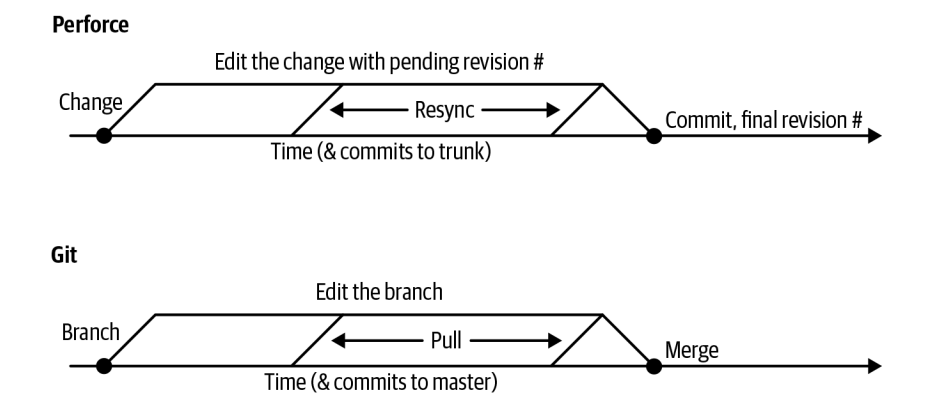

**CHAPTER  16 **

# Version Control and Branch Management

# 第十六章 版本控制和分支管理

                       							 Written by Titus Winters Edited by Lisa Carey

Perhaps no software engineering tool is quite as universally adopted throughout the industry as version control. One can hardly imagine any software organization larger than a few people that doesn’t rely on a formal Version Control System (VCS) to manage its source code and coordinate activities between engineers.

也许没有一种软件工程工具像版本控制那样在整个行业中被广泛采用。你很难想象有哪个软件组织比不依赖正式版本控制系统（VCS）来管理其源代码和协调工程师之间的活动。

In this chapter, we’re going to look at why the use of version control has become such an unambiguous norm in software engineering, and we describe the various possible approaches to version control and branch management, including how we do it at scale across all of Google. We’ll also examine the pros and cons of various approaches; although we believe everyone should use version control, some version control policies and processes might work better for your organization (or in general) than others. In particular, we find “trunk-based development” as popularized by DevOps[1](#_bookmark1369) (one repository, no dev branches) to be a particularly scalable policy approach, and we’ll provide some suggestions as to why that is.

在本章中，我们将了解为什么版本控制的使用在软件工程中已成为如此明确的规范，我们将描述版本控制和分支管理的各种可能方法，包括我们如何在整个谷歌范围内大规模地进行。我们还将研究各种方法的优缺点；尽管我们认为每个人都应该使用版本控制，但某些版本控制策略和流程可能比其他策略和流程更适合你的组织（或总体而言）。特别是，我们发现由DevOps[1]推广的 "基于主干的开发"（一个版本库，没有开发分支）是一种特别可扩展的策略方法，我们将提供一些建议来解释为什么会这样。

```
1	The DevOps Research Association, which was acquired by Google between the first draft of this chapter and publication, has published extensively on this in the annual “State of DevOps Report” and the book Accelerate. As near as we can tell, it popularized the terminology trunk-based development.

1 DevOps研究协会，在本章初稿和出版之间被谷歌收购，在年度 "DevOps状况报告 "和《加速》一书中广泛发表了这方面的内容。据我们所知，它推广了基于主干的开发这一术语。
```

## What Is Version Control?  什么是版本控制？

A VCS is a system that tracks revisions (versions) of files over time. A VCS maintains some metadata about the set of files being managed, and collectively a copy of the files and metadata is called a repository[2](#_bookmark1374) (repo for short). A VCS helps coordinate the activities of teams by allowing multiple developers to work on the same set of files simultaneously. Early VCSs did this by granting one person at a time the right to edit a file—that style of locking is enough to establish sequencing (an agreed-upon “which is newer,” an important feature of VCS). More advanced systems ensure that changes to a *collection* of files submitted at once are treated as a single unit (*atomicity* when a logical change touches multiple files). Systems like CVS (a popular VCS from the 90s) that didn’t have this atomicity for a commit were subject to corruption and lost changes. Ensuring atomicity removes the chance of previous changes being overwritten unintentionally, but requires tracking which version was last synced to—at commit time, the commit is rejected if any file in the commit has been modified at head since the last time the local developer synced. Especially in such a change-tracking VCS, a developer’s working copy of the managed files will therefore need metadata of its own. Depending on the design of the VCS, this copy of the repository can be a repository itself, or might contain a reduced amount of metadata—such a reduced copy is usually a “client” or “workspace.”

VCS是一个跟踪文件随时间变化的修订（版本）的系统。VCS维护一些关于被管理的文件集的元数据，文件和元数据的副本统称为版本库（简称repo）。VCS通过允许多个开发者同时在同一组文件上工作来帮助协调团队的活动。早期的VCS是通过每次授予一个人编辑文件的权利来实现的--这种锁定方式足以建立顺序（一种约定的“更新的”，VCS的一个重要特性）。更高级的系统确保对一次提交的*文件集合*的更改被视为单个单元（当逻辑更改涉及多个文件时，原子性）。像CVS（90年代流行的VCS）这样的系统，如果没有这种提交的原子性，就会出现损坏和丢失更改。确保原子性消除了以前的更改被无意覆盖的可能性，但需要跟踪最后同步的版本--在提交时，如果提交中的任何文件在本地开发者最后一次同步后被修改过，则提交将被拒绝。特别是在这样一个变化跟踪的VCS中，开发者管理文件的工作副本因此需要有自己的元数据。根据VCS的设计，这个版本库的副本可以是一个版本库本身，也可以包含一个减少的元数据--这样一个减少的副本通常是一个 "客户端 "或 "工作区"。

This seems like a lot of complexity: why is a VCS necessary? What is it about this sort of tool that has allowed it to become one of the few nearly universal tools for software development and software engineering?

这似乎很复杂：为什么需要一个VCS？是什么让这种工具成为为数不多的软件开发和软件工程几乎通用的工具之一？

Imagine for a moment working without a VCS. For a (very) small group of distributed developers working on a project of limited scope without any understanding of version control, the simplest and lowest-infrastructure solution is to just pass copies of the project back and forth. This works best when edits are nonsimultaneous (people are working in different time zones, or at least with different working hours). If there’s any chance for people to not know which version is the most current, we immediately have an annoying problem: tracking which version is the most up to date. Anyone who has attempted to collaborate in a non-networked environment will likely recall the horrors of copying back-and-forth files named *Presentation v5 - final - redlines - Josh’s version v2*. And as we shall see, when there isn’t a single agreed-upon source of truth, collaboration becomes high friction and error prone.

想象一下，在没有VCS的情况下工作。对于一个（非常）小的分布式开发人员小组，在一个范围有限的项目上工作，而不了解版本控制，最简单和最低的基础设施解决方案是只是来回传递项目的副本。这在非同步编辑时效果最好（人们在不同的时区工作，或至少在不同的工作时间）。如果有任何时机让人们不知道哪个版本是最新的，我们马上就会有一个恼人的问题：追踪哪个版本是最新的。任何试图在非网络环境下进行协作的人都可能会想起来回复制名为*Presentation v5 - final - redlines - Josh's version v2*的文件的恐怖。正如我们将看到的那样， 当没有一个统一的信息来源时，合作就会变得阻力很大，容易出错。

Introducing shared storage requires slightly more infrastructure (getting access to shared storage), but provides an easy and obvious solution. Coordinating work in a shared drive might suffice for a while with a small enough number of people but still requires out-of-band collaboration to avoid overwriting one another’s work. Further, working directly in that shared storage means that any development task that doesn’t keep the build working continuously will begin to impede everyone on the team—if I’m making a change to some part of this system at the same time that you kick off a build, your build won’t work. Obviously, this doesn’t scale well.

引入共享存储需要稍多的基础设施（获得对共享存储的访问），但提供了一个简单而显著的解决方案。在一个共享驱动器中协调工作，在人数足够少的情况下可能已经足够了，但仍然需要带外协作以避免覆盖彼此的工作。此外，直接在共享存储中工作意味着任何不能保持构建持续工作的开发任务都会开始阻碍团队中的每个人--如果我在你启动构建的同时对这个系统的某些部分进行了修改，你的构建就无法工作。很明显，这并不能很好地扩展。

In practice, lack of file locking and lack of merge tracking will inevitably lead to collisions and work being overwritten. Such a system is very likely to introduce out-of-band coordination to decide who is working on any given file. If that file-locking is encoded in software, we’ve begun reinventing an early-generation version control like RCS (among others). After you realize that granting write permissions a file at a time is too coarse grained and you begin wanting line-level tracking—we’re definitely reinventing version control. It seems nearly inevitable that we’ll want some structured mechanism to govern these collaborations. Because we seem to just be reinventing the wheel in this hypothetical, we might as well use an off-the-shelf tool.

在实践中，缺乏文件锁和缺乏合并跟踪将不可避免地导致冲突和工作被覆盖。这样一个系统很有可能引入带外协调，以决定谁在任何给定的文件上工作。如果这种文件锁定被编码在软件中，我们就开始重新发明像RCS（包括其他）这样的早期版本控制。当你意识到一次授予一个文件的写入权限过于粗放，而你开始需要行级跟踪时，我们肯定在重新发明版本控制。似乎不可避免的是，我们将需要一些结构化的机制来管理这些合作。因为在这个假设中，我们似乎只是在重新发明车轮，我们不妨使用一个现成的工具。

```
2	Although the formal idea of what is and is not a repository changes a bit depending on your choice of VCS, and the terminology will vary.
2 虽然什么是和什么不是版本库的正式概念会因你选择的VCS而有些变化，术语也会有所不同。
```

### Why Is Version Control Important?  为什么版本控制很重要？

While version control is practically ubiquitous now, this was not always the case. The very first VCSs date back to the 1970s (SCCS) and 1980s (RCS)—many years later than the first references to software engineering as a distinct discipline. Teams participated in “the [multiperson development of multiversion software](https://arxiv.org/pdf/1805.02742.pdf)” before the industry had any formal notion of version control. Version control evolved as a response to the novel challenges of digital collaboration. It took decades of evolution and dissemination for reliable, consistent use of version control to evolve into the norm that it is today.[3](#_bookmark1382) So how did it become so important, and, given that it seems like a self-evident solution, why might anyone resist the idea of VCS?

虽然现在版本控制几乎无处不在，但情况并非总是如此。最早的VCS可以追溯到20世纪70年代（SCCS）和80年代（RCS）--比首次将软件工程作为一门独立学科的时间晚了许多年。在业界有任何正式的版本控制概念之前，团队就参与了"[多版本软件的多人开发](https://arxiv.org/pdf/1805.02742.pdf)"。版本控制是为了应对数字协作的新挑战而发展起来的。经过几十年的演变和传播，版本控制的可靠、一致的使用才演变成今天的规范。 那么，它是如何变得如此重要的呢？鉴于它似乎是一个不言而喻的解决方案，为什么会有人抵制VCS的想法呢？

Recall that software engineering is programming integrated over time; we’re drawing a distinction (in dimensionality) between the instantaneous production of source code and the act of maintaining that product over time. That basic distinction goes a long way to explaining the importance of, and hesitation toward, VCS: at the most fundamental level, version control is the engineer’s primary tool for managing the interplay between raw source and time. We can conceptualize VCS as a way to extend a standard filesystem. A filesystem is a mapping from filename to contents. A VCS extends that to provide a mapping from (filename, time) to contents, along with the metadata necessary to track last sync points and audit history. Version control makes the consideration of time an explicit part of the operation: unnecessary in a program‐ming task, critical in a software engineering task. In most cases, a VCS also allows for an extra input to that mapping (a branch name) to allow for parallel mappings; thus:

回顾一下，软件工程是随着时间的推移而整合的编程；我们在源代码的即时生产和随着时间的推移维护该产品的行为之间（在维度上）进行了区分。这一基本区别在很大程度上解释了VCS的重要性和对VCS的犹豫：在最基本的层面上，版本控制是工程师管理原始源和时间之间相互作用的主要工具。我们可以将VCS概念化为一种扩展标准文件系统的方式。文件系统是一个从文件名到内容的映射。VCS扩展了它，提供了从（文件名，时间）到内容的映射，以及跟踪最后同步点和审计历史所需的元数据。版本控制使时间的考虑成为操作的一个明确的部分：在编程任务中是不必要的，在软件工程任务中是关键的。在大多数情况下，VCS还允许对该映射有一个额外的输入（一个分支名称），以允许并行映射；因此：

```
VCS(filename, time, branch) => file contents
```

In the default usage, that branch input will have a commonly understood default: we call that “head,” “default,” or “trunk” to denote main branch.

在默认的用法中，该分支输入将有一个普遍理解的默认值：我们称之为“head”、“default”或“trunk”来表示主分支

The (minor) remaining hesitation toward consistent use of version control comes almost directly from conflating programming and software engineering—we teach programming, we train programmers, we interview for jobs based on programming problems and techniques. It’s perfectly reasonable for a new hire, even at a place like Google, to have little or no experience with code that is worked on by more than one person or for more than a couple weeks. Given that experience and understanding of the problem, version control seems like an alien solution. Version control is solving a problem that our new hire hasn’t necessarily experienced: an “undo,” not for a single file but for an entire project, adding a lot of complexity for sometimes nonobvious benefits.

对持续使用版本控制的（微小的）剩余犹豫几乎直接来自于编程和软件工程的融合--我们教编程，我们培训程序员，我们根据编程问题和技术来面试工作。对于一个新员工来说，即使是在像谷歌这样的地方，对于由一个以上的人或几个星期以上的时间来处理的代码，几乎没有经验，这是完全合理的。鉴于这种经验和对问题的理解，版本控制似乎是一个陌生的解决方案。版本控制正在解决一个我们的新雇员不一定经历过的问题：“撤销”，不是针对单个文件，而是针对整个项目，这增加了很多复杂性，有时并没有带来了明显的好处。

In some software groups, the same result plays out when management views the job of the techies as “software development” (sit down and write code) rather than “software engineering” (produce code, keep it working and useful for some extended period). With a mental model of programming as the primary task and little understanding of the interplay between code and the passage of time, it’s easy to see something described as “go back to a previous version to undo a mistake” as a weird, high- overhead luxury.

在一些软件团队中，当管理层将技术人员的工作视为“软件开发”（坐下来编写代码）而不是“软件工程”（生成代码，使其在较长时间内保持工作和有用）时，也会产生同样的结果。在把编程作为主要任务的思维模式下，以及对代码和时间流逝之间的相互作用了解甚少的情况下，很容易把 "返回到以前的版本以撤销错误 "这样的描述看作是一种奇怪的、高开销的奢侈品。

In addition to allowing separate storage and reference to versions over time, version control helps us bridge the gap between single-developer and multideveloper processes. In practical terms, this is why version control is so critical to software engineering, because it allows us to scale up teams and organizations, even though we use it only infrequently as an “undo” button. Development is inherently a branch-and- merge process, both when coordinating between multiple developers or a single developer at different points in time. A VCS removes the question of “which is more recent?” Use of modern version control automates error-prone operations like tracking which set of changes have been applied. Version control is how we coordinate between multiple developers and/or multiple points in time.

除了允许随着时间的推移单独存储和长期引用版本外，版本控制还帮助我们弥合单个开发人员和多个开发人员流程之间的差距。在实践中，这就是为什么版本控制对软件工程如此关键，因为它允许我们扩大团队和组织的规模，尽管我们只是不经常使用它作为一个 "撤销 "按钮。**开发本质上是一个分支和合并的过程，无论是在多个开发人员之间还是在不同时间点的单个开发人员之间进行协调。**版本控制系统消除了 "哪个是最新的？"的问题。使用现代的版本控制可以将容易出错的操作自动化，比如跟踪哪一组修改已经被应用。版本控制是我们在多个开发者和/或多个时间点之间协调的方式。

Because VCS has become so thoroughly embedded in the process of software engineering, even legal and regulatory practices have caught up. VCS allows a formal record of every change to every line of code, which is increasingly necessary for satisfying audit requirements. When mixing between in-house development and appropriate use of third-party sources, VCS helps track provenance and origination for every line of code.

由于风险投资已经完全融入到软件工程的过程中，甚至连法律和监管实践也迎头赶上。VCS允许对每一行代码的每一次更改进行正式记录，这对于满足审计要求越来越必要。当混合使用内部开发和第三方资源时，VCS帮助跟踪每行代码的出处和起源。

In addition to the technical and regulatory aspects of tracking source over time and handling sync/branch/merge operations, version control triggers some nontechnical changes in behavior. The ritual of committing to version control and producing a commit log is a trigger for a moment of reflection: what have you accomplished since your last commit? Is the source in a state that you’re happy with? The moment of introspection associated with committing, writing up a summary, and marking a task complete might have value on its own for many people. The start of the commit process is a perfect time to run through a checklist, run static analyses (see [Chapter 20](#_bookmark1781)), check test coverage, run tests and dynamic analysis, and so on.

除了随时间跟踪源和处理同步/分支/合并操作的技术和法规方面外，版本控制还会触发一些行为上的非技术性更改。提交到版本控制并生成提交日志的惯例是引发思考的一刻：自上次提交以来，你完成了什么？来源是否处于你满意的状态？对于许多人来说，与提交、撰写总结和完成任务相关的内省时刻本身可能具有价值。提交过程的开始是运行检查表、运行静态分析（参见第20章）、检查测试覆盖率、运行测试和动态分析等的最佳时机。

Like any process, version control comes with some overhead: someone must configure and manage your version control system, and individual developers must use it. But make no mistake about it: these can almost always be pretty cheap. Anecdotally, most experienced software engineers will instinctively use version control for any project that lasts more than a day or two, even for a single-developer project. The consistency of that result argues that the trade-off in terms of value (including risk reduction) versus overhead must be a pretty easy one. But we’ve promised to acknowledge that context matters and to encourage engineering leaders to think for themselves. It is always worth considering alternatives, even on something as fundamental as version control.

与任何流程一样，版本控制也会带来一些开销：必须有人配置和管理你的版本控制系统，并且每个开发人员都必须使用它。但别搞错了：这些几乎总是相当低成本的。有趣的是，大多数经验丰富的软件工程师会本能地对任何持续一到两天以上的项目使用版本控制，即使是单个开发人员的项目。这一结果的一致性表明，在价值（包括风险降低）和管理费用方面的权衡必须非常容易。但我们承诺要承认背景的重要性，并鼓励工程负责人独立思考。即使在像版本控制这样的基本问题上，也总是值得考虑其他选择。

In truth, it’s difficult to envision any task that can be considered modern software engineering that doesn’t immediately adopt a VCS. Given that you understand the value and need for version control, you are likely now asking what type of version control you need.

事实上，很难设想任何可以被认为是现代软件工程的任务不立即采用VCS。鉴于你了解版本控制的价值和需要，你现在可能会问你需要什么类型的版本控制。

```
3	Indeed, I’ve given several public talks that use “adoption of version control” as the canonical example of how the norms of software engineering can and do evolve over time. In my experience, in the 1990s, version control was pretty well understood as a best practice but not universally followed. In the early 2000s, it was still common to encounter professional groups that didn’t use it. Today, the use of tools like Git seems ubiquitous even among college students working on personal projects. Some of this rise in adoption is likely due to better user experience in the tools (nobody wants to go back to RCS), but the role of experience and changing norms is significant.

3 事实上，我曾多次公开演讲，以 "版本控制的采用 "为例，说明软件工程的规范是如何随着时间的推移而演变的。根据我的经验，在20世纪90年代，版本控制被理解为一种最佳实践，但没有得到普遍遵守。在21世纪初，不使用版本控制的专业团体仍然很常见。今天，即使在从事个人项目的大学生中，像Git这样的工具的使用似乎也是无处不在的。这种采用率的上升可能是由于在工具中更好的用户体验（没有人愿意回到RCS），但经验和不断变化的规范的作用也很重要。
```


### Centralized VCS Versus Distributed VCS  集中式VCS与分布式VCS

At the most simplistic level, all modern VCSs are equivalent to one another: so long as your system has a notion of atomically committing changes to a batch of files, everything else is just UI. You could build the same general semantics (not workflow) of any modern VCS out of another one and a pile of simple shell scripts. Thus, arguing about which VCS is “better” is primarily a matter of user experience—the core functionality is the same, the differences come in user experience, naming, edge-case features, and performance. Choosing a VCS is like choosing a filesystem format: when choosing among a modern-enough format, the differences are fairly minor, and the more important question by far is the content you fill that system with and the way you *use* it. However, major architectural differences in VCSs can make configuration, policy, and scaling decisions easier or more difficult, so it’s important to be aware of the big architectural differences, chiefly the decision between centralized or decentralized.

#### Centralized VCS

In centralized VCS implementations, the model is one of a single central repository (likely stored on some shared compute resource for your organization). Although a developer can have files checked out and accessible on their local workstation, operations that interact on the version control status of those files need to be communicated to the central server (adding files, syncing, updating existing files, etc.). Any code that is committed by a developer is committed into that central repository. The first VCS implementations were all centralized VCSs.

Going back to the 1970s and early 1980s, we see that the earliest of these VCSs, such as RCS, focused on locking and preventing multiple simultaneous edits. You could copy the contents of a repository, but if you wanted to edit a file, you might need to acquire a lock, enforced by the VCS, to ensure that only you are making edits. When you’ve completed an edit, you release the lock. The model worked fine when any given change was a quick thing, or if there was rarely more than one person that wanted the lock for a file at any given time. Small edits like tweaking config files worked OK, as did working on a small team that either kept disjointed working hours or that rarely worked on overlapping files for extended periods. This sort of simplistic locking has inherent problems with scale: it can work fine for a few people, but has the potential to fall apart with larger groups if any of those locks become contended.[4](#_bookmark1395)

As a response to this scaling problem, the VCSs that were popular through the 90s and early 2000s operated at a higher level. These more modern centralized VCSs avoid the exclusive locking but track which changes you’ve synced, requiring your edit to be based on the most-current version of every file in your commit. CVS wrapped and refined RCS by (mostly) operating on batches of files at a time and allowing multiple developers to check out a file at the same time: so long as your base version contained all of the changes in the repository, you’re allowed to commit. Subversion advanced further by providing true atomicity for commits, version tracking, and better tracking for unusual operations (renames, use of symbolic links, etc.). The centralized repository/checked-out client model continues today within Subversion as well as most commercial VCSs.

```
4	Anecdote: To illustrate this, I looked for information on what pending/unsubmitted edits Googlers had outstanding for a semipopular file in my most recent project. At the time of this writing, 27 changes are pending, 12 from people on my team, 5 from people on related teams, and 10 from engineers I’ve never met. This is basically working as expected. Technical systems or policies that require out-of-band coordination certainly don’t scale to 24/7 software engineering in distributed locations.
```

#### Distributed VCS

Starting in the mid-2000s, many popular VCSs followed the Distributed Version Control System (DVCS) paradigm, seen in systems like Git and Mercurial. The primary conceptual difference between DVCS and more traditional centralized VCS (Subversion, CVS) is the question: “Where can you commit?” or perhaps, “Which copies of these files count as a repository?”

A DVCS world does not enforce the constraint of a central repository: if you have a copy (clone, fork) of the repository, you have a repository that you can commit to as well as all of the metadata necessary to query for information about things like revision history. A standard workflow is to clone some existing repository, make some edits, commit them locally, and then push some set of commits to another repository, which may or may not be the original source of the clone. Any notion of centrality is purely conceptual, a matter of policy, not fundamental to the technology or the underlying protocols.

The DVCS model allows for better offline operation and collaboration without inherently declaring one particular repository to be the source of truth. One repository isn’t necessary “ahead” or “behind” because changes aren’t inherently projected into a linear timeline. However, considering common *usage*, both the centralized and DVCS models are largely interchangeable: whereas a centralized VCS provides a clearly defined central repository through technology, most DVCS ecosystems define a central repository for a project as a matter of policy. That is, most DVCS projects are built around one conceptual source of truth (a particular repository on GitHub, for instance). DVCS models tend to assume a more distributed use case and have found particularly strong adoption in the open source world.

Generally speaking, the dominant source control system today is Git, which implements DVCS.[5](#_bookmark1398) When in doubt, use that—there’s some value in doing what everyone else does. If your use cases are expected to be unusual, gather some data and evaluate the trade-offs.

Google has a complex relationship with DVCS: our main repository is based on a (massive) custom in-house centralized VCS. There are periodic attempts to integrate more standard external options and to match the workflow that our engineers (especially Nooglers) have come to expect from external development. Unfortunately, those attempts to move toward more common tools like Git have been stymied by the sheer size of the codebase and userbase, to say nothing of Hyrum’s Law effects tying us to a particular VCS and interface for that VCS.[6](#_bookmark1399) This is perhaps not surprising: most existing tools don’t scale well with 50,000 engineers and tens of millions of commits.[7](#_bookmark1405) The DVCS model, which often (but not always) includes transmission of history and metadata, requires a lot of data to spin up a repository to work out of.

In our workflow, centrality and in-the-cloud storage for the codebase seem to be critical to scaling. The DVCS model is built around the idea of downloading the entire codebase and having access to it locally. In practice, over time and as your organization scales up, any given developer is going to operate on a relatively smaller percentage of the files in a repository, and a small fraction of the versions of those files. As we grow (in file count and engineer count), that transmission becomes almost entirely waste. The only need for locality for most files occurs when building, but distributed (and reproducible) build systems seem to scale better for that task as well (see [Chapter 18](#_bookmark1596)).

```
5	Stack Overflow Developer Survey Results, 2018.
6	Monotonically increasing version numbers, rather than commit hashes, are particularly troublesome. Many systems and scripts have grown up in the Google developer ecosystem that assume that the numeric ordering of commits is the same as the temporal order—undoing those hidden dependencies is difficult.

```

### Source of Truth

Centralized VCSs (Subversion, CVS, Perforce, etc.) bake the source-of-truth notion into the very design of the system: whatever is most recently committed at trunk is the current version. When a developer goes to check out the project, by default that trunk version is what they will be presented with. Your changes are “done” when they have been recommitted on top of that version.

However, unlike centralized VCS, there is no *inherent* notion of which copy of the distributed repository is the single source of truth in DVCS systems. In theory, it’s possible to pass around commit tags and PRs with no centralization or coordination, allowing disparate branches of development to propagate unchecked, and thus risking a conceptual return to the world of *Presentation v5 - final - redlines - Josh’s version* *v2*. Because of this, DVCS requires more explicit policy and norms than a centralized VCS does.

Well-managed projects using DVCS declare one specific branch in one specific repository to be the source of truth and thus avoid the more chaotic possibilities. We see this in practice with the spread of hosted DVCS solutions like GitHub or GitLab— users can clone and fork the repository for a project, but there is still a single primary repository: things are “done” when they are in the trunk branch on that repository.

It isn’t an accident that centralization and Source of Truth has crept back into the usage even in a DVCS world. To help illustrate just how important this Source of Truth idea is, let’s imagine what happens when we don’t have a clear source of truth.

```
7	For that matter, as of the publication of the Monorepo paper, the repository itself had something like 86 TB of data and metadata, ignoring release branches. Fitting that onto a developer workstation directly would be… challenging.
```

#### Scenario: no clear source of truth

Imagine that your team adheres to the DVCS philosophy enough to avoid defining a specific branch+repository as the ultimate source of truth.

In some respects, this is reminiscent of the *Presentation v5 - final - redlines - Josh’s version v2* model—after you pull from a teammate’s repository, it isn’t necessarily clear which changes are present and which are not. In some respects, it’s better than that because the DVCS model tracks the merging of individual patches at a much finer granularity than those ad hoc naming schemes, but there’s a difference between the DVCS knowing *which* changes are incorporated and every engineer being sure they have *all* the past/relevant changes represented.

Consider what it takes to ensure that a release build includes all of the features that have been developed by each developer for the past few weeks. What (noncentralized, scalable) mechanisms are there to do that? Can we design policies that are fundamentally better than having everyone sign off? Are there any that require only sublinear human effort as the team scales up? Is that going to continue working as the number of developers on the team scales up? As far as we can see: probably not. Without a central Source of Truth, someone is going to keep a list of which features are potentially ready to be included in the next release. Eventually that bookkeeping is reproducing the model of having a centralized Source of Truth.

Further imagine: when a new developer joins the team, where do they get a fresh, known-good copy of the code?

DVCS enables a lot of great workflows and interesting usage models. But if you’re concerned with finding a system that requires sublinear human effort to manage as the team grows, it’s pretty important to have one repository (and one branch) actually defined to be the ultimate source of truth.

There is some relativity in that Source of Truth. That is, for a given project, that Source of Truth might be different for a different organization. This caveat is important: it’s reasonable for engineers at Google or RedHat to have different Sources of Truth for Linux Kernel patches, still different than Linus (the Linux Kernel maintainer) himself would. DVCS works fine when organizations and their Sources of Truth are hierarchical (and invisible to those outside the organization)—that is perhaps the most practically useful effect of the DVCS model. A RedHat engineer can commit to the local Source of Truth repository, and changes can be pushed from there upstream periodically, while Linus has a completely different notion of what is the Source of Truth. So long as there is no choice or uncertainty as to where a change should be pushed, we can avoid a large class of chaotic scaling problems in the DVCS model.

In all of this thinking, we’re assigning special significance to the trunk branch. But of course, “trunk” in your VCS is only the technology default, and an organization can choose different policies on top of that. Perhaps the default branch has been abandoned and all work actually happens on some custom development branch—other than needing to provide a branch name in more operations, there’s nothing inherently broken in that approach; it’s just nonstandard. There’s an (oft-unspoken) truth when discussing version control: the technology is only one part of it for any given organization; there is almost always an equal amount of policy and usage convention on top of that.

No topic in version control has more policy and convention than the discussion of how to use and manage branches. We look at branch management in more detail in the next section.

### Version Control Versus Dependency Management

There’s a lot of conceptual similarity between discussions of version control policies and dependency management (see [Chapter 21](#_bookmark1845)). The differences are primarily in two forms: VCS policies are largely about how you manage your own code, and are usually much finer grained. Dependency management is more challenging because we primarily focus on projects managed and controlled by other organizations, at a higher granularity, and these situations mean that you don’t have perfect control. We’ll discuss a lot more of these high-level issues later in the book.

## Branch Management

Being able to track different revisions in version control opens up a variety of different approaches for how to manage those different versions. Collectively, these different approaches fall under the term *branch management*, in contrast to a single “trunk.”

### Work in Progress Is Akin to a Branch

Any discussion that an organization has about branch management policies ought to at least acknowledge that every piece of work-in-progress in the organization is equivalent to a branch. This is more explicitly the case with a DVCS in which developers are more likely to make numerous local staging commits before pushing back to the upstream Source of Truth. This is still true of centralized VCSs: uncommitted local changes aren’t conceptually different than committed changes on a branch, other than potentially being more difficult to find and diff against. Some centralized systems even make this explicit. For example, when using Perforce, every change is given two revision numbers: one indicating the implicit branch point where the change was created, and one indicating where it was recommitted, as illustrated in [Figure 16-1](#_bookmark1418). Perforce users can query to see who has outstanding changes to a given file, inspect the pending changes in other users’ uncommitted changes, and more.



*Figure 16-1. Two revision numbers in Perforce*

This “uncommitted work is akin to a branch” idea is particularly relevant when thinking about refactoring tasks. Imagine a developer being told, “Go rename Widget to OldWidget.” Depending on an organization’s branch management policies and understanding, what counts as a branch, and which branches matter, this could have several interpretations:

•    Rename Widget on the trunk branch in the Source of Truth repository

•    Rename Widget on all branches in the Source of Truth repository

•    Rename Widget on all branches in the Source of Truth repository, and find all devs with outstanding changes to files that reference Widget

If we were to speculate, attempting to support that “rename this everywhere, even in outstanding changes” use case is part of why commercial centralized VCSs tend to track things like “which engineers have this file open for editing?” (We don’t think this is a scalable way to *perform* a refactoring task, but we understand the point of view.)

### Dev Branches

In the age before consistent unit testing (see [Chapter 11](#_bookmark838)), when the introduction of any given change had a high risk of regressing functionality elsewhere in the system, it made sense to treat *trunk* specially. “We don’t commit to trunk,” your Tech Lead might say, “until new changes have gone through a full round of testing. Our team uses feature-specific development branches instead.”

A development branch (usually “dev branch”) is a halfway point between “this is done but not committed” and “this is what new work is based on.” The problem that these are attempting to solve (instability of the product) is a legitimate one—but one that we have found to be solved far better with more extensive use of tests, Continuous Integration (CI) (see [Chapter 23](#_bookmark2022)), and quality enforcement practices like thorough code review.

We believe that a version control policy that makes extensive use of dev branches as a means toward product stability is inherently misguided. The same set of commits are going to be merged to trunk eventually. Small merges are easier than big ones. Merges done by the engineer who authored those changes are easier than batching unrelated changes and merging later (which will happen eventually if a team is sharing a dev branch). If presubmit testing on the merge reveals any new problems, the same argument applies: it’s easier to determine whose changes are responsible for a regression if there is only one engineer involved. Merging a large dev branch implies that more changes are happening in that test run, making failures more difficult to isolate. Triaging and root-causing the problem is difficult; fixing it is even worse.

Beyond the lack of expertise and inherent problems in merging a single branch, there are significant scaling risks when relying on dev branches. This is a very common productivity drain for a software organization. When there are multiple branches being developed in isolation for long periods, coordinating merge operations becomes significantly more expensive (and possibly riskier) than they would be with trunk-based development.

#### How did we become addicted to dev branches?

It’s easy to see how organizations fall into this trap: they see, “Merging this long-lived development branch reduced stability” and conclude, “Branch merges are risky.” Rather than solve that with “Better testing” and “Don’t use branch-based development strategies,” they focus on slowing down and coordinating the symptom: the branch merges. Teams begin developing new branches based on other in-flight branches. Teams working on a long-lived dev branch might or might not regularly have that branch synched with the main development branch. As the organization scales up, the number of development branches grows as well, and the more effort is placed on coordinating that branch merge strategy. Increasing effort is thrown at coordination of branch merges—a task that inherently doesn’t scale. Some unlucky engineer becomes the Build Master/Merge Coordinator/Content Management Engineer, focused on acting as the single point coordinator to merge all the disparate branches in the organization. Regularly scheduled meetings attempt to ensure that the organization has “worked out the merge strategy for the week.”[8](#_bookmark1427) The teams that aren’t chosen to merge often need to re-sync and retest after each of these large merges.

 All of that effort in merging and retesting is *pure overhead*. The alternative requires a different paradigm: trunk-based development, rely heavily on testing and CI, keep the build green, and disable incomplete/untested features at runtime. Everyone is responsible to sync to trunk and commit; no “merge strategy” meetings, no large/expensive merges. And, no heated discussions about which version of a library should be used

—there can be only one. There must be a single Source of Truth. In the end, there will be a single revision used for a release: narrowing down to a single source of truth is just the “shift left” approach for identifying what is and is not being included.

```
 8	Recent informal Twitter polling suggests about 25% of software engineers have been subjected to “regularly scheduled” merge strategy meetings.
```

### Release Branches

If the period between releases (or the release lifetime) for a product is longer than a few hours, it may be sensible to create a release branch that represents the exact code that went into the release build for your product. If any critical flaws are discovered between the actual release of that product into the wild and the next release cycle, fixes can be cherry-picked (a minimal, targeted merge) from trunk to your release branch.

By comparison to dev branches, release branches are generally benign: it isn’t the technology of branches that is troublesome, it’s the usage. The primary difference between a dev branch and a release branch is the expected end state: a dev branch is expected to merge back to trunk, and could even be further branched by another team. A release branch is expected to be abandoned eventually.

In the highest-functioning technical organizations that Google’s DevOps Research and Assessment (DORA) organization has identified, release branches are practically nonexistent. Organizations that have achieved Continuous Deployment (CD)—the ability to release from trunk many times a day—likely tend to skip release branches: it’s much easier to simply add the fix and redeploy. Thus, cherry-picks and branches seem like unnecessary overhead. Obviously, this is more applicable to organizations that deploy digitally (such as web services and apps) than those that push any form of tangible release to customers; it is generally valuable to know exactly what has been pushed to customers.

That same DORA research also suggests a strong positive correlation between “trunk- based development,” “no long-lived dev branches,” and good technical outcomes. The underlying idea in both of those ideas seems clear: branches are a drag on productivity. In many cases we think complex branch and merge strategies are a perceived safety crutch—an attempt to keep trunk stable. As we see throughout this book, there are other ways to achieve that outcome.

## Version Control at Google

At Google, the vast majority of our source is managed in a single repository (monorepo) shared among roughly 50,000 engineers. Almost all projects that are owned by Google live there, except large open source projects like Chromium and Android. This includes public-facing products like Search, Gmail, our advertising products, our Google Cloud Platform offerings, as well as the internal infrastructure necessary to support and develop all of those products.

We rely on an in-house-developed centralized VCS called Piper, built to run as a distributed microservice in our production environment. This has allowed us to use Google-standard storage, communication, and Compute as a Service technology to provide a globally available VCS storing more than 80 TB of content and metadata. The Piper monorepo is then simultaneously edited and committed to by many thousands of engineers every day. Between humans and semiautomated processes that make use of version control (or improve things checked into VCS), we’ll regularly handle 60,000 to 70,000 commits to the repository per work day. Binary artifacts are fairly common because the full repository isn’t transmitted and thus the normal costs of binary artifacts don’t really apply. Because of the focus on Google-scale from the earliest conception, operations in this VCS ecosystem are still cheap at human scale: it takes perhaps 15 seconds total to create a new client at trunk, add a file, and commit an (unreviewed) change to Piper. This low-latency interaction and well-understood/ well-designed scaling simplifies a lot of the developer experience.

By virtue of Piper being an in-house product, we have the ability to customize it and enforce whatever source control policies we choose. For instance, we have a notion of granular ownership in the monorepo: at every level of the file hierarchy, we can find OWNERS files that list the usernames of engineers that are allowed to approve commits within that subtree of the repository (in addition to the OWNERS that are listed at higher levels in the tree). In an environment with many repositories, this might have been achieved by having separate repositories with filesystem permissions enforcement controlling commit access or via a Git “commit hook” (action triggered at commit time) to do a separate permissions check. By controlling the VCS, we can make the concept of ownership and approval more explicit and enforced by the VCS during an attempted commit operation. The model is also flexible: ownership is just a text file, not tied to a physical separation of repositories, so it is trivial to update as the result of a team transfer or organization restructuring.

### One Version

The incredible scaling powers of Piper alone wouldn’t allow the sort of collaboration that we rely upon. As we said earlier: version control is also about policy. In addition to our VCS, one key feature of Google’s version control policy is what we’ve come to refer to as “One Version.” This extends the “Single Source of Truth” concept we looked at earlier—ensuring that a developer knows which branch and repository is their source of truth—to something like “For every dependency in our repository, there must be only one version of that dependency to choose.”[9](#_bookmark1445) For third-party packages, this means that there can be only a single version of that package checked into our repository, in the steady state.[10](#_bookmark1446) For internal packages, this means no forking without repackaging/renaming: it must be technologically safe to mix both the original and the fork into the same project with no special effort. This is a powerful feature for our ecosystem: there are very few packages with restrictions like “If you include this package (A), you cannot include other package (B).”

This notion of having a single copy on a single branch in a single repository as our Source of Truth is intuitive but also has some subtle depth in application. Let’s investigate a scenario in which we have a monorepo (and thus arguably have fulfilled the letter of the law on Single Source of Truth), but have allowed forks of our libraries to propagate on trunk.

### Scenario: Multiple Available Versions

Imagine the following scenario: some team discovers a bug in common infrastructure code (in our case, Abseil or Guava or the like). Rather than fix it in place, the team decides to fork that infrastructure and tweak it to work around the bug—without renaming the library or the symbols. It informs other teams near them, “Hey, we have an improved version of Abseil checked in over here: check it out.” A few other teams build libraries that themselves rely on this new fork.

As we’ll see in [Chapter 21](#_bookmark1845), we’re now in a dangerous situation. If any project in the codebase comes to depend on both the original and the forked versions of Abseil simultaneously, in the best case, the build fails. In the worst case, we’ll be subjected to difficult-to-understand runtime bugs stemming from linking in two mismatched versions of the same library. The “fork” has effectively added a coloring/partitioning property to the codebase: the transitive dependency set for any given target must include exactly one copy of this library. Any link added from the “original flavor” partition of the codebase to the “new fork” partition will likely break things. This means that in the end that something as simple as “adding a new dependency” becomes an operation that might require running all tests for the entire codebase, to ensure that we haven’t violated one of these partitioning requirements. That’s expensive, unfortunate, and doesn’t scale well.

In some cases, we might be able to hack things together in a way to allow a resulting executable to function correctly. Java, for instance, has a relatively standard practice called [*shading*](https://oreil.ly/RuWX3), which tweaks the names of the internal dependencies of a library to hide those dependencies from the rest of the application. When dealing with functions, this is technically sound, even if it is theoretically a bit of a hack. When dealing with types that can be passed from one package to another, shading solutions work neither in theory nor in practice. As far as we know, any technological trickery that allows multiple isolated versions of a library to function in the same binary share this limitation: that approach will work for functions, but there is no good (efficient) solution to shading types—multiple versions for any library that provides a vocabulary type (or any higher-level construct) will fail. Shading and related approaches are patching over the underlying issue: multiple versions of the same dependency are needed. (We’ll discuss how to minimize that in general in [Chapter 21](#_bookmark1845).)

Any policy system that allows for multiple versions in the same codebase is allowing for the possibility of these costly incompatibilities. It’s possible that you’ll get away with it for a while (we certainly have a number of small violations of this policy), but in general, any multiple-version situation has a very real possibility of leading to big problems.

```
9	For example, during an upgrade operation, there might be two versions checked in, but if a developer is adding a new dependency on an existing package, there should be no choice in which version to depend upon.
10	That said, we fail at this in many cases because external packages sometimes have pinned copies of their own dependencies bundled in their source release. You can read more on how all of this goes wrong in Chapter 21.

```

### The “One-Version” Rule

With that example in mind, on top of the Single Source of Truth model, we can hopefully understand the depth of this seemingly simple rule for source control and branch management:

Developers must never have a choice of “What version of this component should I depend upon?”

Colloquially, this becomes something like a “One-Version Rule.” In practice, “One- Version” is not hard and fast,[11](#_bookmark1451) but phrasing this around limiting the versions that can be *chosen* when adding a new dependency conveys a very powerful understanding.

For an individual developer, lack of choice can seem like an arbitrary impediment. Yet we see again and again that for an organization, it’s a critical component in efficient scaling. Consistency has a profound importance at all levels in an organization. From one perspective, this is a direct side effect of discussions about consistency and ensuring the ability to leverage consistent “choke points.”

```
11	For instance, if there are external/third-party libraries that are periodically updated, it might be infeasible to update that library and update all use of it in a single atomic change. As such, it is often necessary to add a new version of that library, prevent new users from adding dependencies on the old one, and incrementally switch usage from old to new.
```

### (Nearly) No Long-Lived Branches

There are several deeper ideas and policies implicit in our One-Version Rule; foremost among them: development branches should be minimal, or at best be very short lived. This follows from a lot of published work over the past 20 years, from Agile processes to DORA research results on trunk-based development and even Phoenix Project[12](#_bookmark1459) lessons on “reducing work-in-progress.” When we include the idea of pending work as akin to a dev branch, this further reinforces that work should be done in small increments against trunk, committed regularly.

As a counterexample: in a development community that depends heavily on long- lived development branches, it isn’t difficult to imagine opportunity for choice creeping back in.

Imagine this scenario: some infrastructure team is working on a new Widget, better than the old one. Excitement grows. Other newly started projects ask, “Can we depend on your new Widget?” Obviously, this can be handled if you’ve invested in codebase visibility policies, but the deep problem happens when the new Widget is “allowed” but only exists in a parallel branch. Remember: new development must not have a choice when adding a dependency. That new Widget should be committed to trunk, disabled from the runtime until it’s ready, and hidden from other developers by visibility if possible—or the two Widget options should be designed such that they can coexist, linked into the same programs.

Interestingly, there is already evidence of this being important in the industry. In Accelerate and the most recent State of DevOps reports, DORA points out that there is a predictive relationship between trunk-based development and high-performing software organizations. Google is not the only organization to have discovered this— nor did we necessarily have expected outcomes in mind when these policies evolved

—it just seemed like nothing else worked. DORA’s result certainly matches our experience.

Our policies and tools for large-scale changes (LSCs; see [Chapter 22](#_bookmark1935)) put additional weight on the importance of trunk-based development: broad/shallow changes that are applied across the codebase are already a massive (often tedious) undertaking when modifying everything checked in to the trunk branch. Having an unbounded number of additional dev branches that might need to be refactored at the same time would be an awfully large tax on executing those types of changes, finding an ever- expanding set of hidden branches. In a DVCS model, it might not even be possible to identify all of those branches.

Of course, our experience is not universal. You might find yourself in unusual situations that require longer-lived dev branches in parallel to (and regularly merged with) trunk.

Those scenarios should be rare, and should be understood to be expensive. Across the roughly 1,000 teams that work in the Google monorepo, there are only a couple that have such a dev branch.[13](#_bookmark1462) Usually these exist for a very specific (and very unusual) reason. Most of those reasons boil down to some variation of “We have an unusual requirement for compatibility over time.” Oftentimes this is a matter of ensuring compatibility for data at rest across versions: readers and writers of some file format need to agree on that format over time even if the reader or writer implementations are modified. Other times, long-lived dev branches might come from promising API compatibility over time—when One Version isn’t enough and we need to promise that an older version of a microservice client still works with a newer server (or vice versa). That can be a very challenging requirement, something that you should not promise lightly for an actively evolving API, and something you should treat carefully to ensure that period of time doesn’t accidentally begin to grow. Dependency across time in any form is far more costly and complicated than code that is time invariant. Internally, Google production services make relatively few promises of that form.[14](#_bookmark1463) We also benefit greatly from a cap on potential version skew imposed by our “build horizon”: every job in production needs to be rebuilt and redeployed every six months, maximum. (Usually it is far more frequent than that.)

We’re sure there are other situations that might necessitate long-lived dev branches. Just make sure to keep them rare. If you adopt other tools and practices discussed in this book, many will tend to exert pressure against long-lived dev branches. Automation and tooling that works great at trunk and fails (or takes more effort) for a dev branch can help encourage developers to stay current.

```
12	Kevin Behr, Gene Kim, and George Spafford, The Phoenix Project (Portland: IT Revolution Press, 2018).
```

#### What About Release Branches?

Many Google teams use release branches, with limited cherry picks. If you’re going to put out a monthly release and continue working toward the next release, it’s perfectly reasonable to make a release branch. Similarly, if you’re going to ship devices to customers, it’s valuable to know exactly what version is out “in the field.” Use caution and reason, keep cherry picks to a minimum, and don’t plan to remerge with trunk. Our various teams have all sorts of policies about release branches given that relatively few teams have arrived at the sort of rapid release cadence promised by CD (see [Chap‐](#_bookmark2100) [ter 24](#_bookmark2100)) that obviates the need or desire for a release branch. Generally speaking,release branches don’t cause any widespread cost in our experience. Or, at least, no noticeable cost above and beyond the additional inherent cost to the VCS.

```
13	It’s difficult to get a precise count, but the number of such teams is almost certainly fewer than 10.
14	Cloud interfaces are a different story.

```

## Monorepos

In 2016, we published a (highly cited, much discussed) paper on Google’s monorepo approach.[15](#_bookmark1469) The monorepo approach has some inherent benefits, and chief among them is that adhering to One Version is trivial: it’s usually more difficult to violate One Version than it would be to do the right thing. There’s no process of deciding which versions of anything are official, or discovering which repositories are important. Building tools to understand the state of the build (see [Chapter 23](#_bookmark2022)) doesn’t also require discovering where important repositories exist. Consistency helps scale up the impact of introducing new tools and optimizations. By and large, engineers can see what everyone else is doing and use that to inform their own choices in code and system design. These are all very good things.

Given all of that and our belief in the merits of the One-Version Rule, it is reasonable to ask whether a monorepo is the One True Way. By comparison, the open source community seems to work just fine with a “manyrepo” approach built on a seemingly infinite number of noncoordinating and nonsynchronized project repositories.

In short: no, we don’t think the monorepo approach as we’ve described it is the perfect answer for everyone. Continuing the parallel between filesystem format and VCS, it’s easy to imagine deciding between using 10 drives to provide one very large logical filesystem or 10 smaller filesystems accessed separately. In a filesystem world, there are pros and cons to both. Technical issues when evaluating filesystem choice would range from outage resilience, size constraints, performance characteristics, and so on. Usability issues would likely focus more on the ability to reference files across filesystem boundaries, add symlinks, and synchronize files.

A very similar set of issues governs whether to prefer a monorepo or a collection of finer-grained repositories. The specific decisions of how to store your source code (or store your files, for that matter) are easily debatable, and in some cases, the particulars of your organization and your workflow are going to matter more than others. These are decisions you’ll need to make yourself.

What is important is not whether we focus on monorepo; it’s to adhere to the One- Version principle to the greatest extent possible: developers must not have a *choice* when adding a dependency onto some library that is already in use in the organization. Choice violations of the One-Version Rule lead to merge strategy discussions, diamond dependencies, lost work, and wasted effort.

Software engineering tools including both VCS and build systems are increasingly providing mechanisms to smartly blend between fine-grained repositories and monorepos to provide an experience akin to the monorepo—an agreed-upon ordering of commits and understanding of the dependency graph. Git submodules, Bazel with external dependencies, and CMake subprojects all allow modern developers to synthesize something weakly approximating monorepo behavior without the costs and downsides of a monorepo.[16](#_bookmark1477) For instance, fine-grained repositories are easier to deal with in terms of scale (Git often has performance issues after a few million commits and tends to be slow to clone when repositories include large binary artifacts) and storage (VCS metadata can add up, especially if you have binary artifacts in your version control system). Fine-grained repositories in a federated/virtual-monorepo (VMR)–style repository can make it easier to isolate experimental or top-secret projects while still holding to One Version and allowing access to common utilities.

To put it another way: if every project in your organization has the same secrecy, legal, privacy, and security requirements,[17](#_bookmark1478) a true monorepo is a fine way to go. Otherwise, *aim* for the functionality of a monorepo, but allow yourself the flexibility of implementing that experience in a different fashion. If you can manage with disjoint repositories and adhere to One Version or your workload is all disconnected enough to allow truly separate repositories, great. Otherwise, synthesizing something like a VMR in some fashion may represent the best of both worlds.

After all, your choice of filesystem format really doesn’t matter as much as what you write to it.

```
15	Rachel Potvin and Josh Levenberg, “Why Google stores billions of lines of code in a single repository,” Communications of the ACM, 59 No. 7 (2016): 78-87.
```

## Future of Version Control

Google isn’t the only organization to publicly discuss the benefits of a monorepo approach. Microsoft, Facebook, Netflix, and Uber have also publicly mentioned their reliance on the approach. DORA has published about it extensively. It’s vaguely possible that all of these successful, long-lived companies are misguided, or at least that their situations are sufficiently different as to be inapplicable to the average smaller organization. Although it’s possible, we think it is unlikely.

Most arguments against monorepos focus on the technical limitations of having a single large repository. If cloning a repository from upstream is quick and cheap, developers are more likely to keep changes small and isolated (and to avoid making mistakes with committing to the wrong work-in-progress branch). If cloning a repository (or doing some other common VCS operation) takes hours of wasted developer time, you can easily see why an organization would shy away from reliance on such a large repository/operation. We luckily avoided this pitfall by focusing on providing a VCS that scales massively.

Looking at the past few years of major improvements to Git, there’s clearly a lot of work being done to support larger repositories: shallow clones, sparse branches, better optimization, and more. We expect this to continue and the importance of “but we need to keep the repository small” to diminish.

The other major argument against monorepos is that it doesn’t match how development happens in the Open Source Software (OSS) world. Although true, many of the practices in the OSS world come (rightly) from prioritizing freedom, lack of coordination, and lack of computing resources. Separate projects in the OSS world are effectively separate organizations that happen to be able to see one another’s code. Within the boundaries of an organization, we can make more assumptions: we can assume the availability of compute resources, we can assume coordination, and we can assume that there is some amount of centralized authority.

A less common but perhaps more legitimate concern with the monorepo approach is that as your organization scales up, it is less and less likely that every piece of code is subject to exactly the same legal, compliance, regulatory, secrecy, and privacy requirements. One native advantage of a manyrepo approach is that separate repositories are obviously capable of having different sets of authorized developers, visibility, permissions, and so on. Stitching that feature into a monorepo can be done but implies some ongoing carrying costs in terms of customization and maintenance.

At the same time, the industry seems to be inventing lightweight interrepository linkage over and over again. Sometimes, this is in the VCS (Git submodules) or the build system. So long as a collection of repositories have a consistent understanding of “what is trunk,” “which change happened first,” and mechanisms to describe dependencies, we can easily imagine stitching together a disparate collection of physical repositories into one larger VMR. Even though Piper has done very well for us, investing in a highly scaling VMR and tools to manage it and relying on off-the-shelf customization for per-repository policy requirements could have been a better investment.

As soon as someone builds a sufficiently large nugget of compatible and interdependent projects in the OSS community and publishes a VMR view of those packages, we suspect that OSS developer practices will begin to change. We see glimpses of this in the tools that *could* synthesize a virtual monorepo as well as in the work done by (for instance) large Linux distributions discovering and publishing mutually compatible revisions of thousands of packages. With unit tests, CI, and automatic version bumping for new submissions to one of those revisions, enabling a package owner to update trunk for their package (in nonbreaking fashion, of course), we think that model will catch on in the open source world. It is just a matter of efficiency, after all: a (virtual) monorepo approach with a One-Version Rule cuts down the complexity of software development by a whole (difficult) dimension: time.

We expect version control and dependency management to evolve in this direction in the next 10 to 20 years: VCSs will focus on *allowing* larger repositories with better performance scaling, but also removing the need for larger repositories by providing better mechanisms to stitch them together across project and organizational boundaries. Someone, perhaps the existing package management groups or Linux distributors, will catalyze a de facto standard virtual monorepo. Depending on the utilities in that monorepo will provide easy access to a compatible set of dependencies as one unit. We’ll more generally recognize that version numbers are timestamps, and that allowing version skew adds a dimensionality complexity (time) that costs a lot—and that we can learn to avoid. It starts with something logically like a monorepo.

## Conclusion

Version control systems are a natural extension of the collaboration challenges and opportunities provided by technology, especially shared compute resources and computer networks. They have historically evolved in lockstep with the norms of software engineering as we understand them at the time.

Early systems provided simplistic file-granularity locking. As typical software engineering projects and teams grew larger, the scaling problems with that approach became apparent, and our understanding of version control changed to match those challenges. Then, as development increasingly moved toward an OSS model with distributed contributors, VCSs became more decentralized. We expect a shift in VCS technology that assumes constant network availability, focusing more on storage and build in the cloud to avoid transmitting unnecessary files and artifacts. This is increasingly critical for large, long-lived software engineering projects, even if it means a change in approach compared to simple single-dev/single-machine programming projects. This shift to cloud will make concrete what has emerged with DVCS approaches: even if we allow distributed development, something must still be centrally recognized as the Source of Truth.

The current DVCS decentralization is a sensible reaction of the technology to the needs of the industry (especially the open source community). However, DVCS configuration needs to be tightly controlled and coupled with branch management policies that make sense for your organization. It also can often introduce unexpected scaling problems: perfect fidelity offline operation requires a lot more local data. Failure to rein in the potential complexity of a branching free-for-all can lead to a potentially unbounded amount of overhead between developers and deployment of that code. However, complex technology doesn’t need to be used in a complex fashion: as we see in monorepo and trunk-based development models, keeping branch policies simple generally leads to better engineering outcomes.

Choice leads to costs here. We highly endorse the One-Version Rule presented here: developers within an organization must not have a choice where to commit, or which version of an existing component to depend upon. There are few policies we’re aware of that can have such an impact on the organization: although it might be annoying for individual developers, in the aggregate, the end result is far better.

## TL;DRs

- Use version control for any software development project larger than “toy project with only one developer that will never be updated.”

- There’s an inherent scaling problem when there are choices in “which version of this should I depend upon?”

- One-Version Rules are surprisingly important for organizational efficiency. Removing choices in where to commit or what to depend upon can result in significant simplification.

- In some languages, you might be able to spend some effort to dodge this with technical approaches like shading, separate compilation, linker hiding, and so on. The work to get those approaches working is entirely lost labor—your software engineers aren’t producing anything, they’re just working around technical debts.

- Previous research (DORA/State of DevOps/Accelerate) has shown that trunk- based development is a predictive factor in high-performing development organizations. Long-lived dev branches are not a good default plan.

- Use whatever version control system makes sense for you. If your organization wants to prioritize separate repositories for separate projects, it’s still probably wise for interrepository dependencies to be unpinned/“at head”/“trunk based.” There are an increasing number of VCS and build system facilities that allow you to have both small, fine-grained repositories as well as a consistent “virtual” head/trunk notion for the whole organization.


