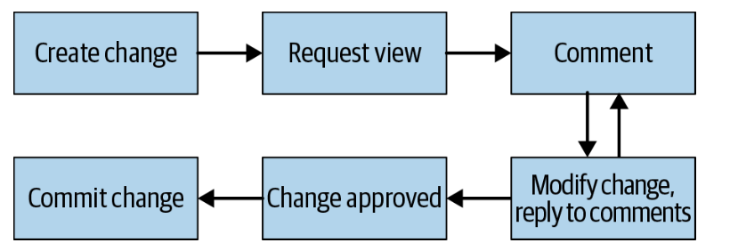
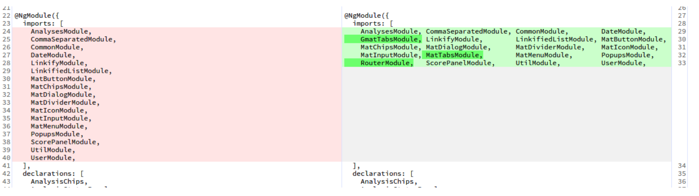
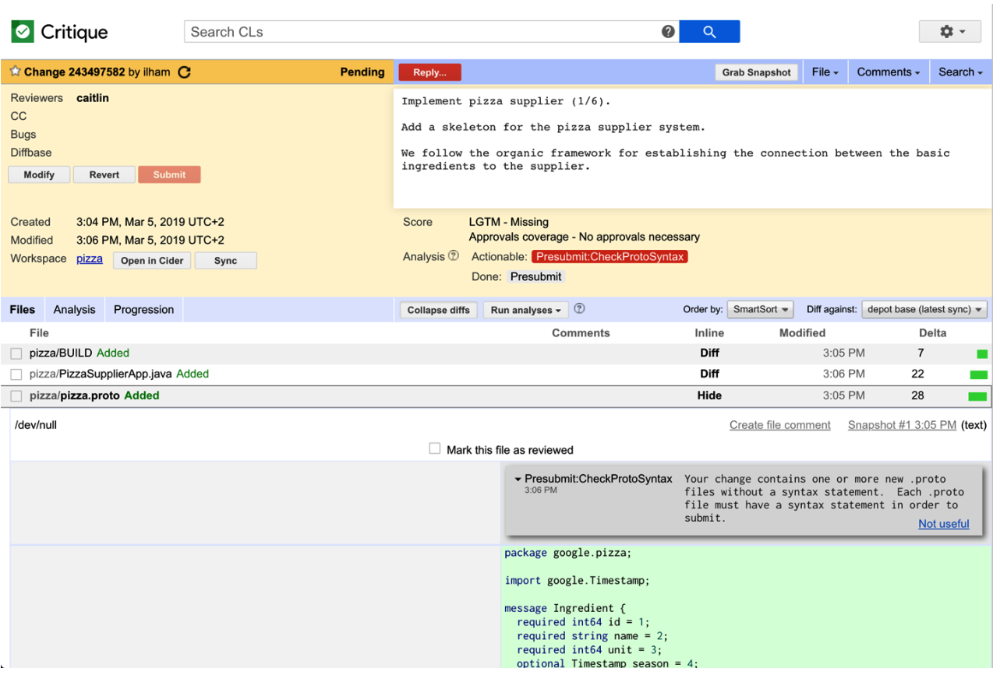
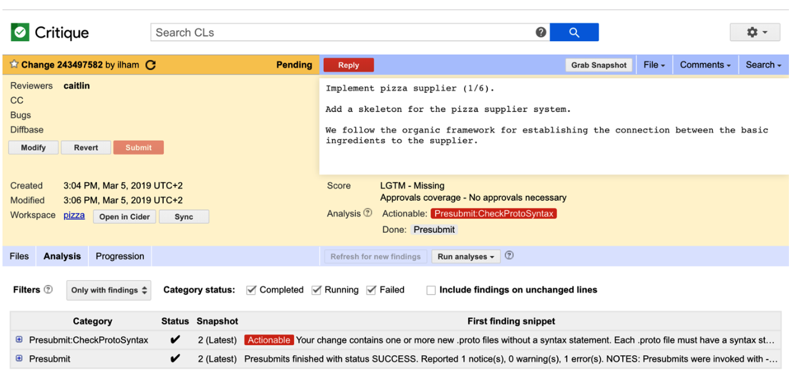
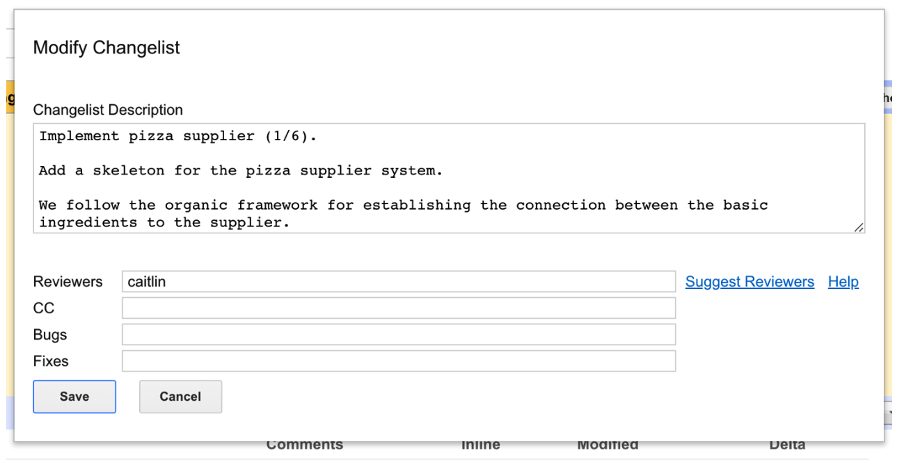
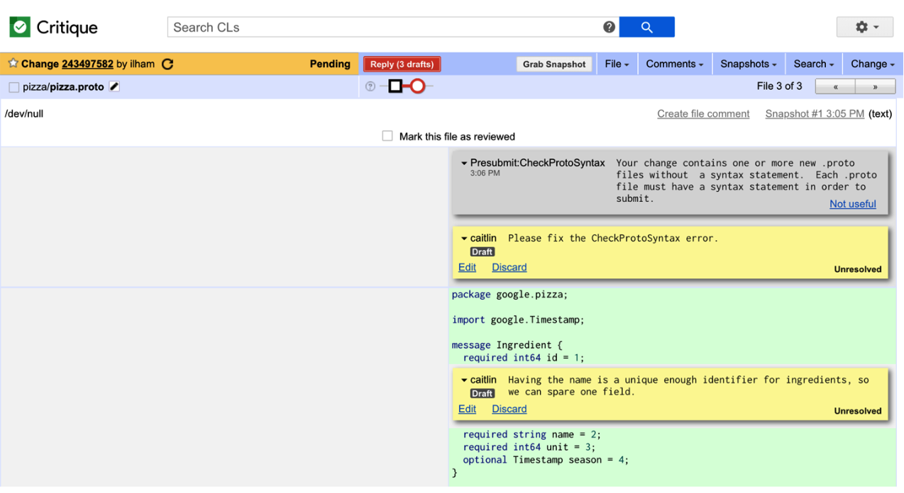
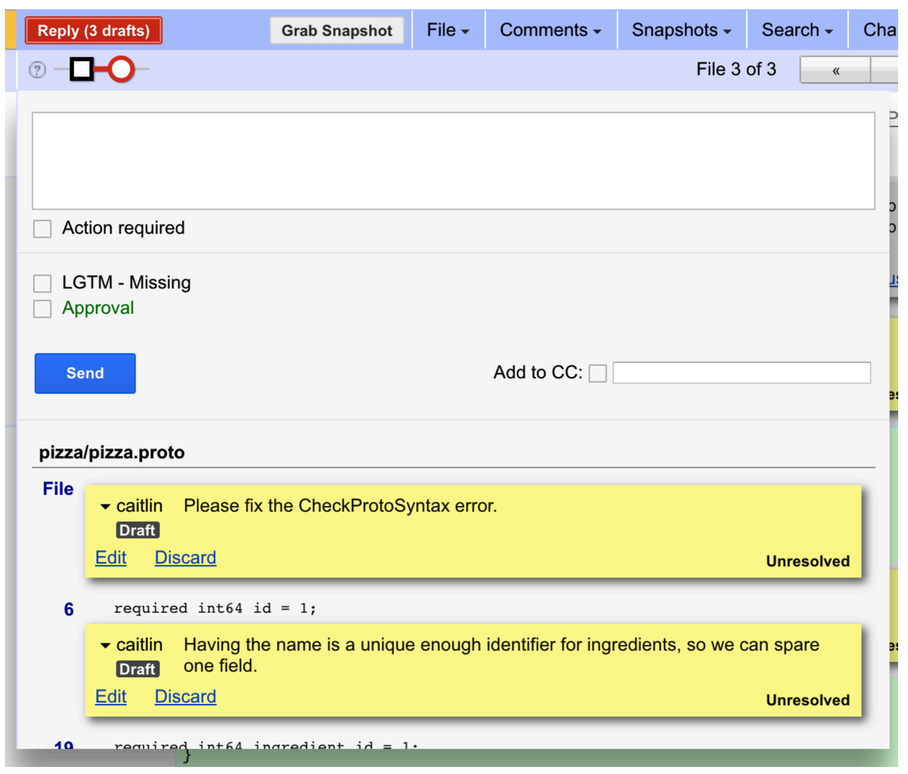
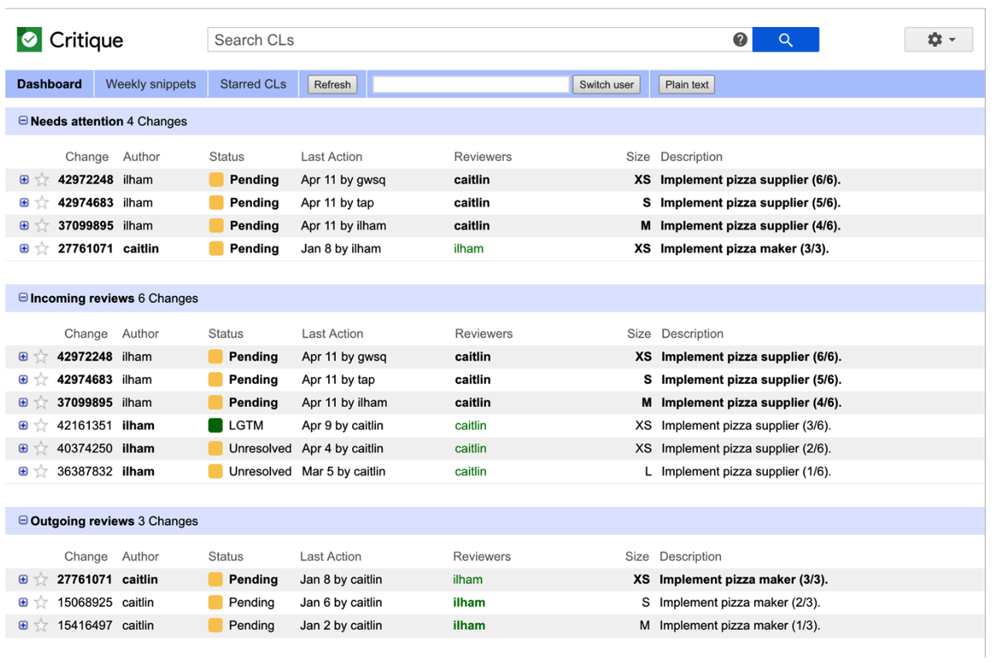

**CHAPTER** **19**

# Critique: Google’s Code Review Tool

# 第十九章 评价：google的代码审查工具

            Written by  Written by Caitlin Sadowski, Ilham Kurnia, and Ben Rohlfs Edited by Lisa Carey

As you saw in Chapter 9, code review is a vital part of software development, particu‐ larly when working at scale. The main goal of code review is to improve the readabil‐ ity and maintainability of the code base, and this is supported fundamentally by the review process. However, having a well-defined code review process in only one part of the code review story. Tooling that supports that process also plays an important part in its success.
In this chapter, we’ll look at what makes successful code review tooling via Google’s well-loved in-house system, Critique. Critique has explicit support for the primary motivations of code review, providing reviewers and authors with a view of the review and ability to comment on the change. Critique also has support for gatekeep‐ ing what code is checked into the codebase, discussed in the section on “scoring” changes. Code review information from Critique also can be useful when doing code archaeology, following some technical decisions that are explained in code review interactions (e.g., when inline comments are lacking). Although Critique is not the only code review tool used at Google, it is the most popular one by a large margin.

## Code Review Tooling Principles

We mentioned above that Critique provides functionality to support the goals of code review (we look at this functionality in more detail later in this chapter), but why is it so successful? Critique has been shaped by Google’s development culture, which includes code review as a core part of the workflow. This cultural influence translates into a set of guiding principles that Critique was designed to emphasize:
*Simplicity*
	Critique’s user interface (UI) is based around making it easy to do code review without a lot of unnecessary choices, and with a smooth interface. The UI loads fast, navigation is easy and hotkey supported, and there are clear visual markers for the overall state of whether a change has been reviewed.
*Foundation of trust*
	Code review is not for slowing others down; instead, it is for empowering others. Trusting colleagues as much as possible makes it work. This might mean, for example, trusting authors to make changes and not requiring an additional review phase to double check that minor comments are actually addressed. Trust also plays out by making changes openly accessible (for viewing and reviewing) across Google.
*Generic communication*
	Communication problems are rarely solved through tooling. Critique prioritizes generic ways for users to comment on the code changes, instead of complicated protocols. Critique encourages users to spell out what they want in their com‐ ments or even suggests some edits instead of making the data model and process more complex. Communication can go wrong even with the best code review tool because the users are humans.
*Workflow integration*
	Critique has a number of integration points with other core software develop‐ ment tools. Developers can easily navigate to view the code under review in our code search and browsing tool, edit code in our web-based code editing tool, or view test results associated with a code change.

Across these guiding principles, simplicity has probably had the most impact on the tool. There were many interesting features we considered adding, but we decided not to make the model more complicated to support a small set of users.
Simplicity also has an interesting tension with workflow integration. We considered but ultimately decided against creating a “Code Central” tool with code editing, reviewing, and searching in one tool. Although Critique has many touchpoints with other tools, we consciously decided to keep code review as the primary focus. Fea‐ tures are linked from Critique but implemented in different subsystems.
## Code Review Flow
Code reviews can be executed at many stages of software development, as illustrated in Figure 19-1. Critique reviews typically take place before a change can be commit‐ ted to the codebase, also known as precommit reviews. Although Chapter 9 contains a brief description of the code review flow, here we expand it to describe key aspects of Critique that help at each stage. We’ll look at each stage in more detail in the follow‐ ing sections.



*Figure 19-1. The code review flow*

Typical review steps go as follows:

1. **Create a change.** A user authors a change to the codebase in their workspace. This *author* then uploads a *snapshot* (showing a patch at a particular point in time) to Critique, which triggers the run of automatic code analyzers (see [Chapter 20](#_bookmark1781)).

2. **Request** **review.** After the author is satisfied with the diff of the change and the result of the analyzers shown in Critique, they mail the change to one or more reviewers.
3. **Comment.** *Reviewers* open the change in Critique and draft comments on the diff. Comments are by default marked as *unresolved,* meaning they are crucial for the author to address. Additionally, reviewers can add *resolved* comments that are optional or informational. Results from automatic code analyzers, if present, are also visible to reviewers. Once a reviewer has drafted a set of comments, they need to *publish* them in order for the author to see them; this has the advantage of allowing a reviewer to provide a complete thought on a change atomically, after having reviewed the entire change. Anyone can comment on changes, pro‐ viding a “drive-by review” as they see it necessary.

4. **Modify change and reply to comments.** The author modifies the change, uploads new snapshots based on the feedback, and replies back to the reviewers. The author addresses (at least) all unresolved comments, either by changing the code or just replying to the comment and changing the comment type to be *resolved*. The author and reviewers can look at diffs between any pairs of snap‐ shots to see what changed. Steps 3 and 4 might be repeated multiple times.

5. **Change approval.** When the reviewers are happy with the latest state of the change, they approve the change and mark it as “looks good to me” (LGTM). They can optionally include comments to address. After a change is deemed good for submission, it is clearly marked green in the UI to show this state.

6. **Commit a change.** Provided the change is approved (which we’ll discuss shortly), the author can trigger the commit process of the change. If automatic 

7. analyzers and other precommit hooks (called “presubmits”) don’t find any prob‐ lems, the change is committed to the codebase.

   

Even after the review process is started, the entire system provides significant flexibil‐ ity to deviate from the regular review flow. For example, reviewers can un-assign themselves from the change or explicitly assign it to someone else, and the author can postpone the review altogether. In emergency cases, the author can forcefully commit their change and have it reviewed after commit.

### Hotifications

As a change moves through the stages outlined earlier, Critique publishes event noti‐ fications that might be used by other supporting tools. This notification model allows Critique to focus on being a primary code review tool instead of a general purpose tool, while still being integrated into the developer workflow. Notifications enable a separation of concerns such that Critique can just emit events and other systems build off of those events.

For example, users can install a Chrome extension that consumes these event notifi‐ cations. When a change needs the user’s attention—for example, because it is their turn to review the change or some presubmit fails—the extension displays a Chrome notification with a button to go directly to the change or silence the notification. We have found that some developers really like immediate notification of change updates, but others choose not to use this extension because they find it is too disruptive to their flow.

Critique also manages emails related to a change; important Critique events trigger email notifications. In addition to being displayed in the Critique UI, some analyzer findings are configured to also send the results out by email. Critique also processes email replies and translates them to comments, supporting users who prefer an email-based flow. Note that for many users, emails are not a key feature of code review; they use Critique’s dashboard view (discussed later) to manage reviews.

## Stage 1: Create a Change

A code review tool should provide support at all stages of the review process and should not be the bottleneck for committing changes. In the prereview step, making it easier for change authors to polish a change before sending it out for review helps reduce the time taken by the reviewers to inspect the change. Critique displays change diffs with knobs to ignore whitespace changes and highlight move-only changes. Critique also surfaces the results from builds, tests, and static analyzers, including style checks (as discussed in [Chapter 9](#_bookmark664)).

Showing an author the diff of a change gives them the opportunity to wear a different hat: that of a code reviewer. Critique lets a change author see the diff of their changes as their reviewer will, and also see the automatic analysis results. Critique also sup‐ ports making lightweight modifications to the change from within the review tool and suggests appropriate reviewers. When sending out the request, the author can also include preliminary comments on the change, providing the opportunity to ask reviewers directly about any open questions. Giving authors the chance to see a change just as their reviewers do prevents misunderstanding.
To provide further context for the reviewers, the author can also link the change to a specific bug. Critique uses an autocomplete service to show relevant bugs, prioritizing bugs that are assigned to the author.
### Diffing
The core of the code review process is understanding the code change itself. Larger changes are typically more difficult to understand than smaller ones. Optimizing the diff of a change is thus a core requirement for a good code review tool.
In Critique, this principle translates onto multiple layers (see Figure 19-2). The diff‐ ing component, starting from an optimized longest common subsequence algorithm, is enhanced with the following:
•	Syntax highlighting
•	Cross-references (powered by Kythe; see Chapter 17)
•	Intraline diffing that shows the difference on character-level factoring in the word boundaries (Figure 19-2)
•	An option to ignore whitespace differences to a varying degree
•	Move detection, in which chunks of code that are moved from one place to another are marked as being moved (as opposed to being marked as removed here and added there, as a naive diff algorithm would)



*Figure 19-2. Intraline diffing showing character-level differences*

Users can also view the diff in various different modes, such as overlay and side by side. When developing Critique, we decided that it was important to have side-by- side diffs to make the review process easier. Side-by-side diffs take a lot of space: to make them a reality, we had to simplify the diff view structure, so there is no border, no padding—just the diff and line numbers. We also had to play around with a vari‐ ety of fonts and sizes until we had a diff view that accommodates even for Java’s 100- character line limit for the typical screen-width resolution when Critique launched (1,440 pixels).

Critique further supports a variety of custom tools that provide diffs of artifacts pro‐ duced by a change, such as a screenshot diff of the UI modified by a change or con‐ figuration files generated by a change.

To make the process of navigating diffs smooth, we were careful not to waste space and spent significant effort ensuring that diffs load quickly, even for images and large files and/or changes. We also provide keyboard shortcuts to quickly navigate through files while visiting only modified sections.

When users drill down to the file level, Critique provides a UI widget with a compact display of the chain of snapshot versions of a file; users can drag and drop to select which versions to compare. This widget automatically collapses similar snapshots, drawing focus to important snapshots. It helps the user understand the evolution of a file within a change; for example, which snapshots have test coverage, have already been reviewed, or have comments. To address concerns of scale, Critique prefetches everything, so loading different snapshots is very quick.

### Analysis Results

Uploading a snapshot of the change triggers code analyzers (see [Chapter 20](#_bookmark1781)). Critique displays the analysis results on the change page, summarized by analyzer status chips shown below the change description, as depicted in [Figure 19-3](#_bookmark1742), and detailed in the Analysis tab, as illustrated in [Figure 19-4](#_bookmark1743).

Analyzers can mark specific findings to highlight in red for increased visibility. Ana‐ lyzers that are still in progress are represented by yellow chips, and gray chips are dis‐ played otherwise. For the sake of simplicity, Critique offers no other options to mark or highlight findings—actionability is a binary option. If an analyzer produces some results (“findings”), clicking the chip opens up the findings. Like comments, findings can be displayed inside the diff but styled differently to make them easily distinguish‐ able. Sometimes, the findings also include fix suggestions, which the author can pre‐ view and choose to apply from Critique.



*Figure* *19-3.* *Change* *summary* *and* *diff*  view



*Figure* *19-4.* *Analysis* *results*

For example, suppose that a linter finds a style violation of extra spaces at the end of the line. The change page will display a chip for that linter. From the chip, the author can quickly go to the diff showing the offending code to understand the style viola‐ tion with two clicks. Most linter violations also include fix suggestions. With a click, the author can preview the fix suggestion (for example, remove the extra spaces), and with another click, apply the fix on the change.

### Tight Tool Integration

Google has tools built on top of Piper, its monolithic source code repository (see [Chapter 16](#_bookmark1364)), such as the following:
•   Cider, an online IDE for editing source code stored in the cloud
•   Code Search, a tool for searching code in the codebase
•   Tricorder, a tool for displaying static analysis results (mentioned earlier)
•   Rapid, a release tool that packages and deploys binaries containing a series of changes
•   Zapfhahn, a test coverage calculation tool

Additionally, there are services that provide context on change metadata (for exam‐ ple, about users involved in a change or linked bugs). Critique is a natural melting pot for a quick one-click/hover access or even embedded UI support to these systems, although we need to be careful not to sacrifice simplicity. For example, from a change page in Critique, the author needs to click only once to start editing the change fur‐ ther in Cider. There is support to navigate between cross-references using Kythe or view the mainline state of the code in Code Search (see [Chapter 17](#_bookmark1485)). Critique links out to the release tool so that users can see whether a submitted change is in a specific release. For these tools, Critique favors links rather than embedding so as not to dis‐ tract from the core review experience. One exception here is test coverage: the infor‐ mation of whether a line of code is covered by a test is shown by different background colors on the line gutter in the file’s diff view (not all projects use this coverage tool).

Note that tight integration between Critique and a developer’s workspace is possible because of the fact that workspaces are stored in a FUSE-based filesystem, accessible beyond a particular developer’s computer. The Source of Truth is hosted in the cloud and accessible to all of these tools.

## Stage 2: Request Review

After the author is happy with the state of the change, they can send it for review, as depicted in [Figure 19-5](#_bookmark1751). This requires the author to pick the reviewers. Within a small team, finding a reviewer might seem simple, but even there it is useful to distribute reviews evenly across team members and consider situations like who is on vacation. To address this, teams can provide an email alias for incoming code reviews. The alias is used by a tool called *GwsQ* (named after the initial team that used this technique:

Google Web Server) that assigns specific reviewers based on the configuration linked to the alias. For example, a change author can assign a review to some-team-list-alias, and GwsQ will pick a specific member of some-team-list-alias to perform the review.



Figure 19-5. Requesting reviewers

Given the size of Google’s codebase and the number of people modifying it, it can be difficult to find out who is best qualified to review a change outside your own project. Finding reviewers is a problem to consider when reaching a certain scale. Critique must deal with scale. Critique offers the functionality to propose sets of reviewers that are sufficient to approve the change. The reviewer selection utility takes into account the following factors:
•   Who owns the code that is being changed (see the next section)
•   Who is most familiar with the code (i.e., who recently changed it)
•   Who is available for review (i.e., not out of office and preferably in the same time zone)
•   The GwsQ team alias setup

Assigning a reviewer to a change triggers a review request. This request runs “presub‐ mits” or precommit hooks applicable to the change; teams can configure the presub‐ mits related to their projects in many ways. The most common hooks include the following:
•   Automatically adding email lists to changes to raise awareness and transparency
•   Running automated test suites for the project
•   Enforcing project-specific invariants on both code (to enforce local code style restrictions) and change descriptions (to allow generation of release notes or other forms of tracking)

As running tests is resource intensive, at Google they are part of presubmits (run when requesting review and when committing changes) rather than for every snap‐ shot like Tricorder checks. Critique surfaces the result of running the hooks in a simi‐ lar way to how analyzer results are displayed, with an extra distinction to highlight the fact that a failed result blocks the change from being sent for review or commit‐ ted. Critique notifies the author via email if presubmits fail.

 

## Stages 3 and 4: Understanding and Commenting on a Change

After the review process starts, the author and the reviewers work in tandem to reach the goal of committing changes of high quality.

### Commenting

Making comments is the second most common action that users make in Critique after viewing changes ([Figure 19-6](#_bookmark1757)). Commenting in Critique is free for all. Anyone—not only the change author and the assigned reviewers—can comment on a change.

Critique also offers the ability to track review progress via per-person state. Reviewers have checkboxes to mark individual files at the latest snapshot as reviewed, helping the reviewer keep track of what they have already looked at. When the author modi‐ fies a file, the “reviewed” checkbox for that file is cleared for all reviewers because the latest snapshot has been updated.



*Figure 19-6. Commenting on the diff view*

When a reviewer sees a relevant analyzer finding, they can click a “Please fix” button to create an unresolved comment asking the author to address the finding. Reviewers can also suggest a fix to a change by inline editing the latest version of the file. Cri‐ tique transforms this suggestion into a comment with a fix attached that can be applied by the author.

Critique does not dictate what comments users should create, but for some common comments, Critique provides quick shortcuts. The change author can click the “Done” button on the comment panel to indicate when a reviewer’s comment has been addressed, or the “Ack” button to acknowledge that the comment has been read, typically used for informational or optional comments. Both have the effect of resolv‐ ing the comment thread if it is unresolved. These shortcuts simplify the workflow and reduce the time needed to respond to review comments.

As mentioned earlier, comments are drafted as-you-go, but then “published” atomi‐ cally, as shown in [Figure 19-7](#_bookmark1758). This allows authors and reviewers to ensure that they are happy with their comments before sending them out.



*Figure 19-7. Preparing comments to the author*

### Understanding the State of a Change

Critique provides a number of mechanisms to make it clear where in the comment- and-iterate phase a change is currently located. These include a feature for determin‐ ing who needs to take action next, and a dashboard view of review/author status for all of the changes with which a particular developer is involved.

#### “Whose turn” feature

One important factor in accelerating the review process is understanding when it’s your turn to act, especially when there are multiple reviewers assigned to a change. This might be the case if the author wants to have their change reviewed by a software engineer and the user-experience person responsible for the feature, or the SRE car‐ rying the pager for the service. Critique helps define who is expected to look at the change next by managing an *attention set* for each change.

The attention set comprises the set of people on which a change is currently blocked. When a reviewer or author is in the attention set, they are expected to respond in a timely manner. Critique tries to be smart about updating the attention set when a user publishes their comments, but users can also manage the attention set them‐ selves. Its usefulness increases even more when there are more reviewers in the change. The attention set is surfaced in Critique by rendering the relevant usernames in bold.

After we implemented this feature, our users had a difficult time imagining the previ‐ ous state. The prevailing opinion is: how did we get along without this? The alterna‐ tive before we implemented this feature was chatting between reviewers and authors to understand who was dealing with a change. This feature also emphasizes the turn- based nature of code review; it is always at least one person’s turn to take action.

#### Dashboard and search system

Critique’s landing page is the user’s dashboard page, as depicted in [Figure 19-8](#_bookmark1762). The dashboard page is divided into user-customizable sections, each of them containing a list of change summaries.



*Figure* *19-8. Dashboard view*

The dashboard page is powered by a search system called *Changelist Search*. Change‐ list Search indexes the latest state of all available changes (both pre- and post-submit) across all users at Google and allows its users to look up relevant changes by regular expression–based queries. Each dashboard section is defined by a query to Changelist Search. We have spent time ensuring Changelist Search is fast enough for interactive use; everything is indexed quickly so that authors and reviewers are not slowed down, despite the fact that we have an extremely large number of concurrent changes hap‐ pening simultaneously at Google.

To optimize the user experience (UX), Critique’s default dashboard setting is to have the first section display the changes that need a user’s attention, although this is cus‐ tomizable. There is also a search bar for making custom queries over all changes and browsing the results. As a reviewer, you mostly just need the attention set. As an author, you mostly just need to take a look at what is still waiting for review to see if you need to ping any changes. Although we have shied away from customizability in some other parts of the Critique UI, we found that users like to set up their dash‐ boards differently without detracting from the fundamental experience, similar to the way everyone organizes their emails differently.[1](#_bookmark1770)

## Stage 5: Change Approvals (Scoring a Change)

Showing whether a reviewer thinks a change is good boils down to providing con‐ cerns and suggestions via comments. There also needs to be some mechanism for providing a high-level “OK” on a change. At Google, the scoring for a change is divi‐ ded into three parts:
•   LGTM (“looks good to me”)
•   Approval
•   The number of unresolved comments

An LGTM stamp from a reviewer means that “I have reviewed this change, believe that it meets our standards, and I think it is okay to commit it after addressing unre‐ solved comments.” An Approval stamp from a reviewer means that “as a gatekeeper, I allow this change to be committed to the codebase.” A reviewer can mark comments as unresolved, meaning that the author will need to act upon them. When the change has at least one LGTM, sufficient approvals and no unresolved comments, the author can then commit the change. Note that every change requires an LGTM regardless of approval status, ensuring that at least two pairs of eyes viewed the change. This sim‐ ple scoring rule allows Critique to inform the author when a change is ready to com‐ mit (shown prominently as a green page header).

```
1	Centralized “global” reviewers for large-scale changes (LSCs) are particularly prone to customizing this dash‐ board to avoid flooding it during an LSC (see Chapter 22).
```

We made a conscious decision in the process of building Critique to simplify this rat‐ ing scheme. Initially, Critique had a “Needs More Work” rating and also a “LGTM++”. The model we have moved to is to make LGTM/Approval always posi‐ tive. If a change definitely needs a second review, primary reviewers can add com‐ ments but without LGTM/Approval. After a change transitions into a mostly-good state, reviewers will typically trust authors to take care of small edits—the tooling does not require repeated LGTMs regardless of change size.

This rating scheme has also had a positive influence on code review culture. Review‐ ers cannot just thumbs-down a change with no useful feedback; all negative feedback from reviewers must be tied to something specific to be fixed (for example, an unre‐ solved comment). The phrasing “unresolved comment” was also chosen to sound rel‐ atively nice.

Critique includes a scoring panel, next to the analysis chips, with the following information:
•   Who has LGTM’ed the change
•   What approvals are still required and why
•   How many unresolved comments are still open

Presenting the scoring information this way helps the author quickly understand what they still need to do to get the change committed.

LGTM and Approval are *hard* requirements and can be granted only by reviewers. Reviewers can also revoke their LGTM and Approval at any time before the change is committed. Unresolved comments are *soft* requirements; the author can mark a com‐ ment “resolved” as they reply. This distinction promotes and relies on trust and com‐ munication between the author and the reviewers. For example, a reviewer can LGTM the change accompanied with unresolved comments without later on check‐ ing precisely whether the comments are truly addressed, highlighting the trust the reviewer places on the author. This trust is particularly important for saving time when there is a significant difference in time zones between the author and the reviewer. Exhibiting trust is also a good way to build trust and strengthen teams.

## Stage 6: Commiting a Change

Last but not least, Critique has a button for committing the change after the review to avoid context-switching to a command-line interface.

### After Commit: Tracking History

In addition to the core use of Critique as a tool for reviewing source code changes before they are committed to the repository, Critique is also used as a tool for change archaeology. For most files, developers can view a list of the past history of changes that modified a particular file in the Code Search system (see [Chapter 17](#_bookmark1485)), or navigate directly to a change. Anyone at Google can browse the history of a change to gener‐ ally viewable files, including the comments on and evolution of the change. This ena‐ bles future auditing and is used to understand more details about why changes were made or how bugs were introduced. Developers can also use this feature to learn how changes were engineered, and code review data in aggregate is used to produce trainings.

Critique also supports the ability to comment after a change is committed; for exam‐ ple, when a problem is discovered later or additional context might be useful for someone investigating the change at another time. Critique also supports the ability to roll back changes and see whether a particular change has already been rolled back.

------

Case Study: Gerrit

Although Critique is the most commonly used review tool at Google, it is not the only one. Critique is not externally available due to its tight interdependencies with our large monolithic repository and other internal tools. Because of this, teams at Google that work on open source projects (including Chrome and Android) or internal projects that can’t or don’t want to be hosted in the monolithic repository use a differ‐ ent code review tool: Gerrit.

Gerrit is a standalone, open source code review tool that is tightly integrated with the Git version control system. As such, it offers a web UI to many Git features including code browsing, merging branches, cherry-picking commits, and, of course, code review. In addition, Gerrit has a fine-grained permission model that we can use to restrict access to repositories and branches.

Both Critique and Gerrit have the same model for code reviews in that each commit is reviewed separately. Gerrit supports stacking commits and uploading them for individual review. It also allows the chain to be committed atomically after it’s reviewed.

Being open source, Gerrit accommodates more variants and a wider range of use cases; Gerrit’s rich plug-in system enables a tight integration into custom environ‐ ments. To support these use cases, Gerrit also supports a more sophisticated scoring system. A reviewer can veto a change by placing a –2 score, and the scoring system is highly configurable.

You can learn more about Gerrit and see it in action at [*https://www.gerritcodereview.com*](https://www.gerritcodereview.com/).

------

## Conclusion

There are a number of implicit trade-offs when using a code review tool. Critique builds in a number of features and integrates with other tools to make the review pro‐ cess more seamless for its users. Time spent in code reviews is time not spent coding, so any optimization of the review process can be a productivity gain for the company. Having only two people in most cases (author and reviewer) agree on the change before it can be committed keeps velocity high. Google greatly values the educational aspects of code review, even though they are more difficult to quantify.

To minimize the time it takes for a change to be reviewed, the code review process should flow seamlessly, informing users succinctly of the changes that need their attention and identifying potential issues before human reviewers come in (issues are caught by analyzers and Continuous Integration). When possible, quick analysis results are presented before the longer-running analyses can finish.

There are several ways in which Critique needs to support questions of scale. The Critique tool must scale to the large quantity of review requests produced without suffering a degradation in performance. Because Critique is on the critical path to getting changes committed, it must load efficiently and be usable for special situa‐ tions such as unusually large changes.[2](#_bookmark1778) The interface must support managing user activities (such as finding relevant changes) over the large codebase and help review‐ ers and authors navigate the codebase. For example, Critique helps with finding appropriate reviewers for a change without having to figure out the ownership/main‐ tainer landscape (a feature that is particularly important for large-scale changes such as API migrations that can affect many files).

Critique favors an opinionated process and a simple interface to improve the general review workflow. However, Critique does allow some customizability: custom ana‐ lyzers and presubmits provide specific context on changes, and some team-specific policies (such as requiring LGTM from multiple reviewers) can be enforced.

```
2	Although most changes are small (fewer than 100 lines), Critique is sometimes used to review large refactor‐ ing changes that can touch hundreds or thousands of files, especially for LSCs that must be executed atomi‐ cally (see Chapter 22).
```

Trust and communication are core to the code review process. A tool can enhance the experience, but can’t replace them. Tight integration with other tools has also been a key factor in Critique’s success.

## TL;DRs

•   Trust and communication are core to the code review process. A tool can enhance the experience, but it can’t replace them.
•   Tight integration with other tools is key to great code review experience.
•   Small workflow optimizations, like the addition of an explicit “attention set,” can increase clarity and reduce friction substantially.


