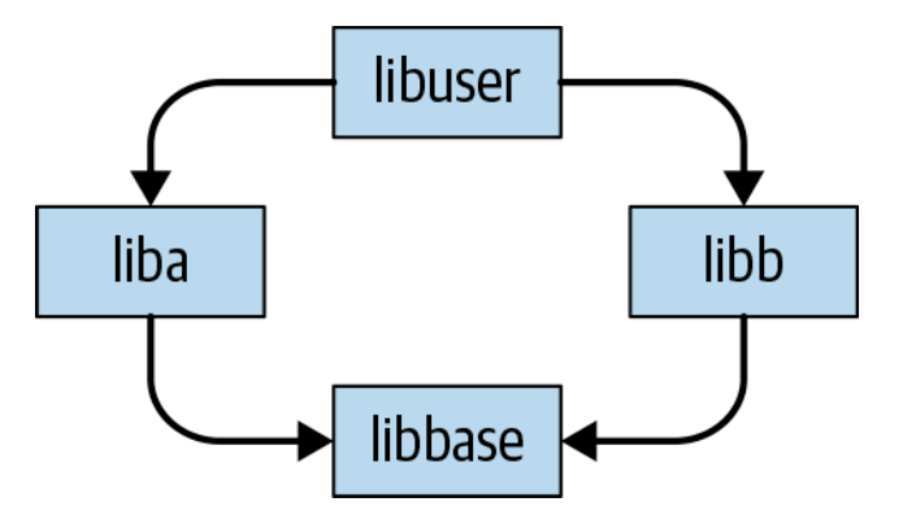

**CHAPTER  21 **

# Dependency Management

# 第二十一章 依赖管理

                       							 Written by Titus Winters Edited by Lisa Carey

Dependency management—the management of networks of libraries, packages, and dependencies that we don’t control—is one of the least understood and most chal‐ lenging problems in software engineering. Dependency management focuses on questions like: how do we update between versions of external dependencies? How do we describe versions, for that matter? What types of changes are allowed or expected in our dependencies? How do we decide when it is wise to depend on code produced by other organizations?

For comparison, the most closely related topic here is source control. Both areas describe how we work with source code. Source control covers the easier part: where do we check things in? How do we get things into the build? After we accept the value of trunk-based development, most of the day-to-day source control questions for an organization are fairly mundane: “I’ve got a new thing, what directory do I add it to?”

Dependency management adds additional complexity in both time and scale. In a trunk-based source control problem, it’s fairly clear when you make a change that you need to run the tests and not break existing code. That’s predicated on the idea that you’re working in a shared codebase, have visibility into how things are being used, and can trigger the build and run the tests. Dependency management focuses on the problems that arise when changes are being made outside of your organization, without full access or visibility. Because your upstream dependencies can’t coordinate with your private code, they are more likely to break your build and cause your tests to fail. How do we manage that? Should we not take external dependencies? Should we ask for greater consistency between releases of external dependencies? When do we update to a new version?

Scale makes all of these questions more complex, with the realization that we aren’t really talking about single dependency imports, and in the general case that we’re depending on an entire network of external dependencies. When we begin dealing with a network, it is easy to construct scenarios in which your organization’s use of two dependencies becomes unsatisfiable at some point in time. Generally, this hap‐ pens because one dependency stops working without some requirement,[1](#_bookmark1850) whereas the other is incompatible with the same requirement. Simple solutions about how to manage a single outside dependency usually fail to account for the realities of manag‐ ing a large network. We’ll spend much of this chapter discussing various forms of these conflicting requirement problems.

Source control and dependency management are related issues separated by the ques‐ tion: “Does our organization control the development/update/management of this subproject?” For example, if every team in your company has separate repositories, goals, and development practices, the interaction and management of code produced by those teams is going to have more to do with dependency management than source control. On the other hand, a large organization with a (virtual?) single reposi‐ tory (monorepo) can scale up significantly farther with source control policies—this is Google’s approach. Separate open source projects certainly count as separate organ‐ izations: interdependencies between unknown and not-necessarily-collaborating projects are a dependency management problem. Perhaps our strongest single piece of advice on this topic is this: *All else being equal, prefer source control problems over dependency-management problems.* If you have the option to redefine “organization” more broadly (your entire company rather than just one team), that’s very often a good trade-off. Source control problems are a lot easier to think about and a lot cheaper to deal with than dependency-management ones.

As the Open Source Software (OSS) model continues to grow and expand into new domains, and the dependency graph for many popular projects continues to expand over time, dependency management is perhaps becoming the most important prob‐ lem in software engineering policy. We are no longer disconnected islands built on one or two layers outside an API. Modern software is built on towering pillars of dependencies; but just because we can build those pillars doesn’t mean we’ve yet fig‐ ured out how to keep them standing and stable over time.

In this chapter, we’ll look at the particular challenges of dependency management, explore solutions (common and novel) and their limitations, and look at the realities of working with dependencies, including how we’ve handled things in Google. It is important to preface all of this with an admission: we’ve invested a lot of *thought* into this problem and have extensive experience with refactoring and maintenance issues that show the practical shortcomings with existing approaches. We don’t have first‐ hand evidence of solutions that work well across organizations at scale. To some extent, this chapter is a summary of what we know does not work (or at least might not work at larger scales) and where we think there is the potential for better out‐ comes. We definitely cannot claim to have all the answers here; if we could, we wouldn’t be calling this one of the most important problems in software engineering.

```
1	This could be any of language version, version of a lower-level library, hardware version, operating system, compiler flag, compiler version, and so on.
```

## Why Is Dependency Management So Difficult?

Even defining the dependency-management problem presents some unusual chal‐ lenges. Many half-baked solutions in this space focus on a too-narrow problem for‐ mulation: “How do we import a package that our locally developed code can depend upon?” This is a necessary-but-not-sufficient formulation. The trick isn’t just finding a way to manage one dependency—the trick is how to manage a *network* of depen‐ dencies and their changes over time. Some subset of this network is directly necessary for your first-party code, some of it is only pulled in by transitive dependencies. Over a long enough period, all of the nodes in that dependency network will have new ver‐ sions, and some of those updates will be important.[2](#_bookmark1856) How do we manage the resulting cascade of upgrades for the rest of the dependency network? Or, specifically, how do we make it easy to find mutually compatible versions of all of our dependencies given that we do not control those dependencies? How do we analyze our dependency net‐ work? How do we manage that network, especially in the face of an ever-growing graph of dependencies?

### Conflicting Requirements and Diamond Dependencies

The central problem in dependency management highlights the importance of think‐ ing in terms of dependency networks, not individual dependencies. Much of the diffi‐ culty stems from one problem: what happens when two nodes in the dependency network have conflicting requirements, and your organization depends on them both? This can arise for many reasons, ranging from platform considerations (operat‐ ing system [OS], language version, compiler version, etc.) to the much more mun‐ dane issue of version incompatibility. The canonical example of version incompatibility as an unsatisfiable version requirement is the *diamond dependency* problem. Although we don’t generally include things like “what version of the com‐ piler” are you using in a dependency graph, most of these conflicting requirements problems are isomorphic to “add a (hidden) node to the dependency graph represent‐ ing this requirement.” As such, we’ll primarily discuss conflicting requirements in terms of diamond dependencies, but keep in mind that libbase might actually be absolutely any piece of software involved in the construction of two or more nodes in your dependency network.

The diamond dependency problem, and other forms of conflicting requirements, require at least three layers of dependency, as demonstrated in [Figure 21-1](#_bookmark1857).



*Figure* *21-1.* *The* *diamond* *dependency* *problem*

In this simplified model, libbase is used by both liba and libb, and liba and libb are both used by a higher-level component libuser. If libbase ever introduces an incompatible change, there is a chance that liba and libb, as products of separate organizations, don’t update simultaneously. If liba depends on the new libbase ver‐ sion and libb depends on the old version, there’s no general way for libuser (aka your code) to put everything together. This diamond can form at any scale: in the entire network of your dependencies, if there is ever a low-level node that is required to be in two incompatible versions at the same time (by virtue of there being two paths from some higher level node to those two versions), there will be a problem.

Different programming languages tolerate the diamond dependency problem to dif‐ ferent degrees. For some languages, it is possible to embed multiple (isolated) ver‐ sions of a dependency within a build: a call into libbase from liba might call a different version of the same API as a call into libbase from libb. For example, Java provides fairly well-established mechanisms to rename the symbols provided by such a dependency.[3](#_bookmark1858) Meanwhile, C++ has nearly zero tolerance for diamond dependencies in a normal build, and they are very likely to trigger arbitrary bugs and undefined behavior (UB) as a result of a clear violation of C++’s [One Definition Rule](https://oreil.ly/VTZe5). You can at best use a similar idea as Java’s shading to hide some symbols in a dynamic-link library (DLL) or in cases in which you’re building and linking separately. However, in all programming languages that we’re aware of, these workarounds are partial solu‐ tions at best: embedding multiple versions can be made to work by tweaking the names of *functions*, but if there are *types* that are passed around between dependen‐ cies, all bets are off. For example, there is simply no way for a map defined in libbase v1 to be passed through some libraries to an API provided by libbase v2 in a seman‐ tically consistent fashion. Language-specific hacks to hide or rename entities in sepa‐ rately compiled libraries can provide some cushion for diamond dependency problems, but are not a solution in the general case.

If you encounter a conflicting requirement problem, the only easy answer is to skip forward or backward in versions for those dependencies to find something compati‐ ble. When that isn’t possible, we must resort to locally patching the dependencies in question, which is particularly challenging because the cause of the incompatibility in both provider and consumer is probably not known to the engineer that first discov‐ ers the incompatibility. This is inherent: liba developers are still working in a com‐ patible fashion with libbase v1, and libb devs have already upgraded to v2. Only a dev who is pulling in both of those projects has the chance to discover the issue, and it’s certainly not guaranteed that they are familiar enough with libbase and liba to work through the upgrade. The easier answer is to downgrade libbase and libb, although that is not an option if the upgrade was originally forced because of security issues.

Systems of policy and technology for dependency management largely boil down to the question, “How do we avoid conflicting requirements while still allowing change among noncoordinating groups?” If you have a solution for the general form of the diamond dependency problem that allows for the reality of continuously changing requirements (both dependencies and platform requirements) at all levels of the net‐ work, you’ve described the interesting part of a dependency-management solution.

```
2	For instance, security bugs, deprecations, being in the dependency set of a higher-level dependency that has a security bug, and so on.
3	This is called shading or versioning.
```

## Importing Dependencies

In programming terms, it’s clearly better to reuse some existing infrastructure rather than build it yourself. This is obvious, and part of the fundamental march of technol‐ ogy: if every novice had to reimplement their own JSON parser and regular expres‐ sion engine, we’d never get anywhere. Reuse is healthy, especially compared to the cost of redeveloping quality software from scratch. So long as you aren’t downloading trojaned software, if your external dependency satisfies the requirements for your programming task, you should use it.

### Compatibility Promises

When we start considering time, the situation gains some complicated trade-offs. Just because you get to avoid a *development* cost doesn’t mean importing a dependency is the correct choice. In a software engineering organization that is aware of time and change, we need to also be mindful of its ongoing maintenance costs. Even if we import a dependency with no intent of upgrading it, discovered security vulnerabili‐ ties, changing platforms, and evolving dependency networks can conspire to force that upgrade, regardless of our intent. When that day comes, how expensive is it going to be? Some dependencies are more explicit than others about the expected maintenance cost for merely using that dependency: how much compatibility is assumed? How much evolution is assumed? How are changes handled? For how long are releases supported?

We suggest that a dependency provider should be clearer about the answers to these questions. Consider the example set by large infrastructure projects with millions of users and their compatibility promises.

#### C++

For the C++ standard library, the model is one of nearly indefinite backward compat‐ ibility. Binaries built against an older version of the standard library are expected to build and link with the newer standard: the standard provides not only API compati‐ bility, but ongoing backward compatibility for the binary artifacts, known as *ABI compatibility*. The extent to which this has been upheld varies from platform to plat‐ form. For users of gcc on Linux, it’s likely that most code works fine over a range of roughly a decade. The standard doesn’t explicitly call out its commitment to ABI compatibility—there are no public-facing policy documents on that point. However, the standard does publish [Standing Document 8 ](https://oreil.ly/LoJq8)(SD-8), which calls out a small set of types of change that the standard library can make between versions, defining implic‐ itly what type of changes to be prepared for. Java is similar: source is compatible between language versions, and JAR files from older releases will readily work with newer versions.

#### Go

Not all languages prioritize the same amount of compatibility. The Go programming language explicitly promises source compatibility between most releases, but no binary compatibility. You cannot build a library in Go with one version of the lan‐ guage and link that library into a Go program built with a different version of the language.

#### Abseil

Google’s Abseil project is much like Go, with an important caveat about time. We are unwilling to commit to compatibility *indefinitely*: Abseil lies at the foundation of most of our most computationally heavy services internally, which we believe are likely to be in use for many years to come. This means we’re careful to reserve the right to make changes, especially in implementation details and ABI, in order to allow better performance. We have experienced far too many instances of an API turning out to be confusing and error prone after the fact; publishing such known faults to tens of thousands of developers for the indefinite future feels wrong. Internally, we already have roughly 250 million lines of C++ code that depend on this library—we aren’t going to make API changes lightly, but it must be possible. To that end, Abseil explicitly does not promise ABI compatibility, but does promise a slightly limited form of API compatibility: we won’t make a breaking API change without also providing an automated refactoring tool that will transform code from the old API to the new transparently. We feel that shifts the risk of unexpected costs significantly in favor of users: no matter what version a dependency was written against, a user of that dependency and Abseil should be able to use the most current version. The high‐ est cost should be “run this tool,” and presumably send the resulting patch for review in the mid-level dependency (liba or libb, continuing our example from earlier). In practice, the project is new enough that we haven’t had to make any significant API breaking changes. We can’t say how well this will work for the ecosystem as a whole, but in theory, it seems like a good balance for stability versus ease of upgrade.

#### Boost

By comparison, the Boost C++ library makes no promises of [compatibility between](https://www.boost.org/users/faq.html) [versions](https://www.boost.org/users/faq.html). Most code doesn’t change, of course, but “many of the Boost libraries are actively maintained and improved, so backward compatibility with prior version isn’t always possible.” Users are advised to upgrade only at a period in their project life cycle in which some change will not cause problems. The goal for Boost is fundamen‐ tally different than the standard library or Abseil: Boost is an experimental proving ground. A particular release from the Boost stream is probably perfectly stable and appropriate for use in many projects, but Boost’s project goals do not prioritize com‐ patibility between versions—other long-lived projects might experience some friction keeping up to date. The Boost developers are every bit as expert as the developers for the standard library[4](#_bookmark1870)—none of this is about technical expertise: this is purely a matter of what a project does or does not promise and prioritize.

Looking at the libraries in this discussion, it’s important to recognize that these com‐ patibility issues are *software engineering* issues, not *programming* issues. You can download something like Boost with no compatibility promise and embed it deeply in the most critical, long-lived systems in your organization; it will *work* just fine. All of the concerns here are about how those dependencies will change over time, keep‐ ing up with updates, and the difficulty of getting developers to worry about mainte‐ nance instead of just getting features working. Within Google, there is a constant stream of guidance directed to our engineers to help them consider this difference between “I got it to work” and “this is working in a supported fashion.” That’s unsur‐ prising: it’s basic application of Hyrum’s Law, after all.

Put more broadly: it is important to realize that dependency management has a wholly different nature in a programming task versus a software engineering task. If you’re in a problem space for which maintenance over time is relevant, dependency management is difficult. If you’re purely developing a solution for today with no need to ever update anything, it is perfectly reasonable to grab as many readily available dependencies as you like with no thought of how to use them responsibly or plan for upgrades. Getting your program to work today by violating everything in SD-8 and also relying on binary compatibility from Boost and Abseil works fine…so long as you never upgrade the standard library, Boost, or Abseil, and neither does anything that depends on you.

```
4	In many cases, there is significant overlap in those populations.
```

### Considerations When Importing

Importing a dependency for use in a programming project is nearly free: assuming that you’ve taken the time to ensure that it does what you need and isn’t secretly a security hole, it is almost always cheaper to reuse than to reimplement functionality. Even if that dependency has taken the step of clarifying what compatibility promise it will make, so long as we aren’t ever upgrading, anything you build on top of that snapshot of your dependency is fine, no matter how many rules you violate in con‐ suming that API. But when we move from programming to software engineering, those dependencies become subtly more expensive, and there are a host of hidden costs and questions that need to be answered. Hopefully, you consider these costs before importing, and, hopefully, you know when you’re working on a programming project versus working on a software engineering project.

When engineers at Google try to import dependencies, we encourage them to ask this (incomplete) list of questions first:

•   Does the project have tests that you can run?

•   Do those tests pass?

•   Who is providing that dependency? Even among “No warranty implied” OSS projects, there is a significant range of experience and skill set—it’s a very differ‐ ent thing to depend on compatibility from the C++ standard library or Java’s Guava library than it is to select a random project from GitHub or npm. Reputa‐ tion isn’t everything, but it is worth investigating.

•   What sort of compatibility is the project aspiring to?

•   Does the project detail what sort of usage is expected to be supported?

•   How popular is the project?

•   How long will we be depending on this project?

•   How often does the project make breaking changes? Add to this a short selection of internally focused questions:

•   How complicated would it be to implement that functionality within Google?

•   What incentives will we have to keep this dependency up to date?

•   Who will perform an upgrade?

•   How difficult do we expect it to be to perform an upgrade?

Our own Russ Cox has [written about this more extensively](https://research.swtch.com/deps). We can’t give a perfect formula for deciding when it’s cheaper in the long term to import versus reimple‐ ment; we fail at this ourselves, more often than not.

### How Google Handles Importing Dependencies

In short: we could do better.

The overwhelming majority of dependencies in any given Google project are inter‐ nally developed. This means that the vast majority of our internal dependency- management story isn’t really dependency management, it’s just source control—by design. As we have mentioned, it is a far easier thing to manage and control the com‐ plexities and risks involved in adding dependencies when the providers and consum‐ ers are part of the same organization and have proper visibility and Continuous Integration (CI; see [Chapter 23](#_bookmark2022)) available. Most problems in dependency manage‐ ment stop being problems when you can see exactly how your code is being used and know exactly the impact of any given change. Source control (when you control the projects in question) is far easier than dependency management (when you don’t).

That ease of use begins failing when it comes to our handling of external projects. For projects that we are importing from the OSS ecosystem or commercial partners, those dependencies are added into a separate directory of our monorepo, labeled *third_party*. Let’s examine how a new OSS project is added to *third_party*.

Alice, a software engineer at Google, is working on a project and realizes that there is an open source solution available. She would really like to have this project completed and demo’ed soon, to get it out of the way before going on vacation. The choice then is whether to reimplement that functionality from scratch or download the OSS pack‐ age and get it added to *third_party*. It’s very likely that Alice decides that the faster development solution makes sense: she downloads the package and follows a few steps in our *third_party* policies. This is a fairly simple checklist: make sure it builds with our build system, make sure there isn’t an existing version of that package, and make sure at least two engineers are signed up as OWNERS to maintain the package in the event that any maintenance is necessary. Alice gets her teammate Bob to say, “Yes, I’ll help.” Neither of them need to have any experience maintaining a *third_party* package, and they have conveniently avoided the need to understand anything about the *implementation* of this package. At most, they have gained a little experience with its interface as part of using it to solve the prevacation demo problem.

From this point on, the package is usually available to other Google teams to use in their own projects. The act of adding additional dependencies is completely transparent to Alice and Bob: they might be completely unaware that the package they downloaded and promised to maintain has become popular. Subtly, even if they are monitoring for new direct usage of their package, they might not necessarily notice growth in the *transitive* usage of their package. If they use it for a demo, while Charlie adds a dependency from within the guts of our Search infrastructure, the package will have suddenly moved from fairly innocuous to being in the critical infrastructure for important Google systems. However, we don’t have any particular signals surfaced to Charlie when he is considering whether to add this dependency.

Now, it’s possible that this scenario is perfectly fine. Perhaps that dependency is well written, has no security bugs, and isn’t depended upon by other OSS projects. It might be *possible* for it to go quite a few years without being updated. It’s not neces‐ sarily *wise* for that to happen: changes externally might have optimized it or added important new functionality, or cleaned up security holes before CVEs[5](#_bookmark1877) were discov‐ ered. The longer that the package exists, the more dependencies (direct and indirect) are likely to accrue. The more that the package remains stable, the more that we are likely to accrete Hyrum’s Law reliance on the particulars of the version that is checked into *third_party*.

One day, Alice and Bob are informed that an upgrade is critical. It could be the dis‐ closure of a security vulnerability in the package itself or in an OSS project that depends upon it that forces an upgrade. Bob has transitioned to management and hasn’t touched the codebase in a while. Alice has moved to another team since the demo and hasn’t used this package again. Nobody changed the OWNERS file. Thou‐ sands of projects depend on this indirectly—we can’t just delete it without breaking the build for Search and a dozen other big teams. Nobody has any experience with the implementation details of this package. Alice isn’t necessarily on a team that has a lot of experience undoing Hyrum’s Law subtleties that have accrued over time.

All of which is to say: Alice and the other users of this package are in for a costly and difficult upgrade, with the security team exerting pressure to get this resolved imme‐ diately. Nobody in this scenario has practice in performing the upgrade, and the upgrade is extra difficult because it is covering many smaller releases covering the entire period between initial introduction of the package into *third_party* and the security disclosure.

Our *third_party* policies don’t work for these unfortunately common scenarios. We roughly understand that we need a higher bar for ownership, we need to make it eas‐ ier (and more rewarding) to update regularly and more difficult for *third_party* pack‐ ages to be orphaned and important at the same time. The difficulty is that it is difficult for codebase maintainers and *third_party* leads to say, “No, you can’t use this thing that solves your development problem perfectly because we don’t have resour‐ ces to update everyone with new versions constantly.” Projects that are popular and have no compatibility promise (like Boost) are particularly risky: our developers might be very familiar with using that dependency to solve programming problems outside of Google, but allowing it to become ingrained into the fabric of our codebase is a big risk. Our codebase has an expected lifespan of decades at this point: upstream projects that are not explicitly prioritizing stability are a risk.

```
5	Common Vulnerabilities and Exposures
```

## Dependency Management, In Theory

Having looked at the ways that dependency management is difficult and how it can go wrong, let’s discuss more specifically the problems we’re trying to solve and how we might go about solving them. Throughout this chapter, we call back to the formu‐ lation, “How do we manage code that comes from outside our organization (or that we don’t perfectly control): how do we update it, how do we manage the things it depends upon over time?” We need to be clear that any good solution here avoids conflicting requirements of any form, including diamond dependency version con‐ flicts, even in a dynamic ecosystem in which new dependencies or other requirements might be added (at any point in the network). We also need to be aware of the impact of time: all software has bugs, some of those will be security critical, and some frac‐ tion of our dependencies will therefore be *critical* to update over a long enough period of time.

A stable dependency-management scheme must therefore be flexible with time and scale: we can’t assume indefinite stability of any particular node in the dependency graph, nor can we assume that no new dependencies are added (either in code we control or in code we depend upon). If a solution to dependency management pre‐ vents conflicting requirement problems among your dependencies, it’s a good solu‐ tion. If it does so without assuming stability in dependency version or dependency fan-out, coordination or visibility between organizations, or significant compute resources, it’s a great solution.

When proposing solutions to dependency management, there are four common options that we know of that exhibit at least some of the appropriate properties: noth‐ ing ever changes, semantic versioning, bundle everything that you need (coordinat‐ ing not per project, but per distribution), or Live at Head.

### Nothing Changes (aka The Static Dependency Model)

The simplest way to ensure stable dependencies is to never change them: no API changes, no behavioral changes, nothing. Bug fixes are allowed only if no user code could be broken. This prioritizes compatibility and stability over all else. Clearly, such a scheme is not ideal due to the assumption of indefinite stability. If, somehow, we get to a world in which security issues and bug fixes are a nonissue and dependencies aren’t changing, the Nothing Changes model is very appealing: if we start with satisfi‐ able constraints, we’ll be able to maintain that property indefinitely.

Although not sustainable in the long term, practically speaking, this is where every organization starts: up until you’ve demonstrated that the expected lifespan of your project is long enough that change becomes necessary, it’s really easy to live in a world where we assume that nothing changes. It’s also important to note: this is prob‐ ably the right model for most new organizations. It is comparatively rare to know that you’re starting a project that is going to live for decades and have a *need* to be able to update dependencies smoothly. It’s much more reasonable to hope that stability is a real option and pretend that dependencies are perfectly stable for the first few years of a project.

The downside to this model is that, over a long enough time period, it *is* false, and there isn’t a clear indication of exactly how long you can pretend that it is legitimate. We don’t have long-term early warning systems for security bugs or other critical issues that might force you to upgrade a dependency—and because of chains of dependencies, a single upgrade can in theory become a forced update to your entire dependency network.

In this model, version selection is simple: there are no decisions to be made, because there are no versions.

### Semantic Versioning

The de facto standard for “how do we manage a network of dependencies today?” is semantic versioning (SemVer).[6](#_bookmark1886) SemVer is the nearly ubiquitous practice of repre‐ senting a version number for some dependency (especially libraries) using three decimal-separated integers, such as 2.4.72 or 1.1.4. In the most common convention, the three component numbers represent major, minor, and patch versions, with the implication that a changed major number indicates a change to an existing API that can break existing usage, a changed minor number indicates purely added functional‐ ity that should not break existing usage, and a changed patch version is reserved for non-API-impacting implementation details and bug fixes that are viewed as particu‐ larly low risk.

With the SemVer separation of major/minor/patch versions, the assumption is that a version requirement can generally be expressed as “anything newer than,” barring API-incompatible changes (major version changes). Commonly, we’ll see “Requires libbase ≥ 1.5,” that requirement would be compatible with any libbase in 1.5, including 1.5.1, and anything in 1.6 onward, but not libbase 1.4.9 (missing the API introduced in 1.5) or 2.x (some APIs in libbase were changed incompatibly). Major version changes are a significant incompatibility: because an existing piece of func‐ tionality has changed (or been removed), there are potential incompatibilities for all dependents. Version requirements exist (explicitly or implicitly) whenever one dependency uses another: we might see “liba requires libbase ≥ 1.5” and “libb requires libbase ≥ 1.4.7.”

If we formalize these requirements, we can conceptualize a dependency network as a collection of software components (nodes) and the requirements between them (edges). Edge labels in this network change as a function of the version of the source node, either as dependencies are added (or removed) or as the SemVer requirement is updated because of a change in the source node (requiring a newly added feature in a dependency, for instance). Because this whole network is changing asynchronously over time, the process of finding a mutually compatible set of dependencies that sat‐ isfy all the transitive requirements of your application can be challenging.[7](#_bookmark1889) Version- satisfiability solvers for SemVer are very much akin to SAT-solvers in logic and algorithms research: given a set of constraints (version requirements on dependency edges), can we find a set of versions for the nodes in question that satisfies all con‐ straints? Most package management ecosystems are built on top of these sorts of graphs, governed by their SemVer SAT-solvers.

SemVer and its SAT-solvers aren’t in any way promising that there *exists* a solution to a given set of dependency constraints. Situations in which dependency constraints cannot be satisfied are created constantly, as we’ve already seen: if a lower-level com‐ ponent (libbase) makes a major-number bump, and some (but not all) of the libra‐ ries that depend on it (libb but not liba) have upgraded, we will encounter the diamond dependency issue.

SemVer solutions to dependency management are usually SAT-solver based. Version selection is a matter of running some algorithm to find an assignment of versions for dependencies in the network that satisfies all of the version-requirement constraints. When no such satisfying assignment of versions exists, we colloquially call it “dependency hell.”

We’ll look at some of the limitations of SemVer in more detail later in this chapter.

```
6	Strictly speaking, SemVer refers only to the emerging practice of applying semantics to major/minor/patch version numbers, not the application of compatible version requirements among dependencies numbered in that fashion. There are numerous minor variations on those requirements among different ecosystems, but in general, the version-number-plus-constraints system described here as SemVer is representative of the prac‐ tice at large.
```

### Bundled Distribution Models

As an industry, we’ve seen the application of a powerful model of managing depen‐ dencies for decades now: an organization gathers up a collection of dependencies, finds a mutually compatible set of those, and releases the collection as a single unit. This is what happens, for instance, with Linux distributions—there’s no guarantee that the various pieces that are included in a distro are cut from the same point in time. In fact, it’s somewhat more likely that the lower-level dependencies are some‐ what older than the higher-level ones, just to account for the time it takes to integrate them.

This “draw a bigger box around it all and release that collection” model introduces entirely new actors: the distributors. Although the maintainers of all of the individual dependencies may have little or no knowledge of the other dependencies, these higher-level *distributors* are involved in the process of finding, patching, and testing a mutually compatible set of versions to include. Distributors are the engineers respon‐ sible for proposing a set of versions to bundle together, testing those to find bugs in that dependency tree, and resolving any issues.

For an outside user, this works great, so long as you can properly rely on only one of these bundled distributions. This is effectively the same as changing a dependency network into a single aggregated dependency and giving that a version number. Rather than saying, “I depend on these 72 libraries at these versions,” this is, “I depend on RedHat version N,” or, “I depend on the pieces in the NPM graph at time T.”

In the bundled distribution approach, version selection is handled by dedicated distributors.


```
7	In fact, it has been proven that SemVer constraints applied to a dependency network are NP-complete.
```


### Live at Head

The model that some of us at Google[8](#_bookmark1895) have been pushing for is theoretically sound, but places new and costly burdens on participants in a dependency network. It’s wholly unlike the models that exist in OSS ecosystems today, and it is not clear how to get from here to there as an industry. Within the boundaries of an organization like Google, it is costly but effective, and we feel that it places most of the costs and incentives into the correct places. We call this model “Live at Head.” It is viewable as the dependency-management extension of trunk-based development: where trunk- based development talks about source control policies, we’re extending that model to apply to upstream dependencies as well.

Live at Head presupposes that we can unpin dependencies, drop SemVer, and rely on dependency providers to test changes against the entire ecosystem before commit‐ ting. Live at Head is an explicit attempt to take time and choice out of the issue of dependency management: always depend on the current version of everything, and never change anything in a way in which it would be difficult for your dependents to adapt. A change that (unintentionally) alters API or behavior will in general be caught by CI on downstream dependencies, and thus should not be committed. For cases in which such a change *must* happen (i.e., for security reasons), such a break should be made only after either the downstream dependencies are updated or an automated tool is provided to perform the update in place. (This tooling is essential for closed- source downstream consumers: the goal is to allow any user the ability to update use of a changing API without expert knowledge of the use or the API. That property sig‐ nificantly mitigates the “mostly bystanders” costs of breaking changes.) This philo‐ sophical shift in responsibility in the open source ecosystem is difficult to motivate initially: putting the burden on an API provider to test against and change all of its downstream customers is a significant revision to the responsibilities of an API provider.

Changes in a Live at Head model are not reduced to a SemVer “I think this is safe or not.” Instead, tests and CI systems are used to test against visible dependents to deter‐ mine experimentally how safe a change is. So, for a change that alters only efficiency or implementation details, all of the visible affected tests might likely pass, which demonstrates that there are no obvious ways for that change to impact users—it’s safe to commit. A change that modifies more obviously observable parts of an API (syn‐ tactically or semantically) will often yield hundreds or even thousands of test failures. It’s then up to the author of that proposed change to determine whether the work involved to resolve those failures is worth the resulting value of committing the change. Done well, that author will work with all of their dependents to resolve the test failures ahead of time (i.e., unwinding brittle assumptions in the tests) and might potentially create a tool to perform as much of the necessary refactoring as possible.

The incentive structures and technological assumptions here are materially different than other scenarios: we assume that there exist unit tests and CI, we assume that API providers will be bound by whether downstream dependencies will be broken, and we assume that API consumers are keeping their tests passing and relying on their dependency in supported ways. This works significantly better in an open source eco‐ system (in which fixes can be distributed ahead of time) than it does in the face of hidden/closed-source dependencies. API providers are incentivized when making changes to do so in a way that can be smoothly migrated to. API consumers are incentivized to keep their tests working so as not to be labeled as a low-signal test and potentially skipped, reducing the protection provided by that test.

In the Live at Head approach, version selection is handled by asking “What is the most recent stable version of everything?” If providers have made changes responsi‐ bly, it will all work together smoothly.

```
8	Especially the author and others in the Google C++ community.
```

## The Limitations of SemVer

The Live at Head approach may build on recognized practices for version control (trunk-based development) but is largely unproven at scale. SemVer is the de facto standard for dependency management today, but as we’ve suggested, it is not without its limitations. Because it is such a popular approach, it is worth looking at it in more detail and highlighting what we believe to be its potential pitfalls.

There’s a lot to unpack in the SemVer definition of what a dotted-triple version num‐ ber really means. Is this a promise? Or is the version number chosen for a release an estimate? That is, when the maintainers of libbase cut a new release and choose whether this is a major, minor, or patch release, what are they saying? Is it provable that an upgrade from 1.1.4 to 1.2.0 is safe and easy, because there were only API addi‐ tions and bug fixes? Of course not. There’s a host of things that ill-behaved users of libbase could have done that could cause build breaks or behavioral changes in the face of a “simple” API addition.[9](#_bookmark1902) Fundamentally, you can’t *prove* anything about com‐ patibility when only considering the source API; you have to know *with which* things you are asking about compatibility.

However, this idea of “estimating” compatibility begins to weaken when we talk about networks of dependencies and SAT-solvers applied to those networks. The funda‐ mental problem in this formulation is the difference between node values in tradi‐ tional SAT and version values in a SemVer dependency graph. A node in a three-SAT graph *is* either True or False. A version value (1.1.14) in a dependency graph is pro‐ vided by the maintainer as an *estimate* of how compatible the new version is, given code that used the previous version. We’re building all of our version-satisfaction logic on top of a shaky foundation, treating estimates and self-attestation as absolute. As we’ll see, even if that works OK in limited cases, in the aggregate, it doesn’t neces‐ sarily have enough fidelity to underpin a healthy ecosystem.

If we acknowledge that SemVer is a lossy estimate and represents only a subset of the possible scope of changes, we can begin to see it as a blunt instrument. In theory, it works fine as a shorthand. In practice, especially when we build SAT-solvers on top of it, SemVer can (and does) fail us by both overconstraining and underprotecting us.

### SemVer Might Overconstrain

Consider what happens when libbase is recognized to be more than a single mono‐ lith: there are almost always independent interfaces within a library. Even if there are only two functions, we can see situations in which SemVer overconstrains us. Imag‐ ine that libbase is indeed composed of only two functions, Foo and Bar. Our mid- level dependencies liba and libb use only Foo. If the maintainer of libbase makes a breaking change to Bar, it is incumbent on them to bump the major version of lib base in a SemVer world. liba and libb are known to depend on libbase 1.x— SemVer dependency solvers won’t accept a 2.x version of that dependency. However, in reality these libraries would work together perfectly: only Bar changed, and that was unused. The compression inherent in “I made a breaking change; I must bump the major version number” is lossy when it doesn’t apply at the granularity of an indi‐ vidual atomic API unit. Although some dependencies might be fine grained enough for that to be accurate,[10](#_bookmark1905) that is not the norm for a SemVer ecosystem.

If SemVer overconstrains, either because of an unnecessarily severe version bump or insufficiently fine-grained application of SemVer numbers, automated package man‐ agers and SAT-solvers will report that your dependencies cannot be updated or installed, even if everything would work together flawlessly by ignoring the SemVer checks. Anyone who has ever been exposed to dependency hell during an upgrade might find this particularly infuriating: some large fraction of that effort was a com‐ plete waste of time.

```
9	For example: a poorly implemented polyfill that adds the new libbase API ahead of time, causing a conflict‐ ing definition. Or, use of language reflection APIs to depend upon the precise number of APIs provided by libbase, introducing crashes if that number changes. These shouldn’t happen and are certainly rare even if they do happen by accident—the point is that the libbase providers can’t prove compatibility.
```

### SemVer Might Overpromise

On the flip side, the application of SemVer makes the explicit assumption that an API provider’s estimate of compatibility can be fully predictive and that changes fall into three buckets: breaking (by modification or removal), strictly additive, or non-API- impacting. If SemVer is a perfectly faithful representation of the risk of a change by classifying syntactic and semantic changes, how do we characterize a change that adds a one-millisecond delay to a time-sensitive API? Or, more plausibly: how do we characterize a change that alters the format of our logging output? Or that alters the order that we import external dependencies? Or that alters the order that results are returned in an “unordered” stream? Is it reasonable to assume that those changes are “safe” merely because those aren’t part of the syntax or contract of the API in ques‐ tion? What if the documentation said “This may change in the future”? Or the API was named “ForInternalUseByLibBaseOnlyDoNotTouchThisIReallyMeanIt?”[11](#_bookmark1906)

The idea that SemVer patch versions, which in theory are only changing implementa‐ tion details, are “safe” changes absolutely runs afoul of Google’s experience with Hyrum’s Law—“With a sufficient number of users, every observable behavior of your system will be depended upon by someone.” Changing the order that dependencies are imported, or changing the output order for an “unordered” producer will, at scale, invariably break assumptions that some consumer was (perhaps incorrectly) relying upon. The very term “breaking change” is misleading: there are changes that are the‐ oretically breaking but safe in practice (removing an unused API). There are also changes that are theoretically safe but break client code in practice (any of our earlier Hyrum’s Law examples). We can see this in any SemVer/dependency-management system for which the version-number requirement system allows for restrictions on the patch number: if you can say liba requires libbase >1.1.14 rather than liba requires libbase 1.1, that’s clearly an admission that there are observable differ‐ ences in patch versions.

*A change in isolation isn’t breaking or nonbreaking—*that statement can be evaluated only in the context of how it is being used. There is no absolute truth in the notion of “This is a breaking change”; a change can been seen to be breaking for only a (known or unknown) set of existing users and use cases. The reality of how we evaluate a change inherently relies upon information that isn’t present in the SemVer formula‐ tion of dependency management: how are downstream users consuming this dependency?

Because of this, a SemVer constraint solver might report that your dependencies work together when they don’t, either because a bump was applied incorrectly or because something in your dependency network had a Hyrum’s Law dependence on some‐ thing that wasn’t considered part of the observable API surface. In these cases, you might have either build errors or runtime bugs, with no theoretical upper bound on their severity.

```
10	The Node ecosystem has noteworthy examples of dependencies that provide exactly one API.
11	It’s worth noting: in our experience, naming like this doesn’t fully solve the problem of users reaching in to access private APIs. Prefer languages that have good control over public/private access to APIs of all forms.

```

### Motivations

There is a further argument that SemVer doesn’t always incentivize the creation of stable code. For a maintainer of an arbitrary dependency, there is variable systemic incentive to *not* make breaking changes and bump major versions. Some projects care deeply about compatibility and will go to great lengths to avoid a major-version bump. Others are more aggressive, even intentionally bumping major versions on a fixed schedule. The trouble is that most users of any given dependency are indirect users—they wouldn’t have any significant reasons to be aware of an upcoming change. Even most direct users don’t subscribe to mailing lists or other release notifications.

All of which combines to suggest that no matter how many users will be inconven‐ ienced by adoption of an incompatible change to a popular API, the maintainers bear a tiny fraction of the cost of the resulting version bump. For maintainers who are also users, there can also be an incentive *toward* breaking: it’s always easier to design a bet‐ ter interface in the absence of legacy constraints. This is part of why we think projects should publish clear statements of intent with respect to compatibility, usage, and breaking changes. Even if those are best-effort, nonbinding, or ignored by many users, it still gives us a starting point to reason about whether a breaking change/ major version bump is “worth it,” without bringing in these conflicting incentive structures.

[Go ](https://research.swtch.com/vgo-import)and [Clojure ](https://oreil.ly/Iq9f_)both handle this nicely: in their standard package management eco‐ systems, the equivalent of a major-version bump is expected to be a fully new pack‐ age. This has a certain sense of justice to it: if you’re willing to break backward compatibility for your package, why do we pretend this is the same set of APIs? Repackaging and renaming everything seems like a reasonable amount of work to expect from a provider in exchange for them taking the nuclear option and throwing away backward compatibility.

Finally, there’s the human fallibility of the process. In general, SemVer version bumps should be applied to *semantic* changes just as much as syntactic ones; changing the behavior of an API matters just as much as changing its structure. Although it’s plau‐ sible that tooling could be developed to evaluate whether any particular release involves syntactic changes to a set of public APIs, discerning whether there are mean‐ ingful and intentional semantic changes is computationally infeasible.[12](#_bookmark1913) Practically speaking, even the potential tools for identifying syntactic changes are limited. In almost all cases, it is up to the human judgement of the API provider whether to bump major, minor, or patch versions for any given change. If you’re relying on only a handful of professionally maintained dependencies, your expected exposure to this form of SemVer clerical error is probably low.[13](#_bookmark1914) If you have a network of thousands of dependencies underneath your product, you should be prepared for some amount of chaos simply from human error.

### Minimum Version Selection

In 2018, as part of an essay series on building a package management system for the Go programming language, Google’s own Russ Cox described an interesting variation on SemVer dependency management: [Minimum Version Selection](https://research.swtch.com/vgo-mvs) (MVS). When updating the version for some node in the dependency network, it is possible that its dependencies need to be updated to newer versions to satisfy an updated SemVer requirement—this can then trigger further changes transitively. In most constraint- satisfaction/version-selection formulations, the newest possible versions of those downstream dependencies are chosen: after all, you’ll need to update to those new versions eventually, right?

MVS makes the opposite choice: when liba’s specification requires libbase ≥1.7, we’ll try libbase 1.7 directly, even if a 1.8 is available. This “produces high-fidelity builds in which the dependencies a user builds are as close as possible to the ones the author developed against.”[14](#_bookmark1918) There is a critically important truth revealed in this point: when liba says it requires libbase ≥1.7, that almost certainly means that the developer of liba had libbase 1.7 installed. Assuming that the maintainer per‐ formed even basic testing before publishing,[15](#_bookmark1919) we have at least anecdotal evidence of interoperability testing for that version of liba and version 1.7 of libbase. It’s not CI or proof that everything has been unit tested together, but it’s something.

Absent accurate input constraints derived from 100% accurate prediction of the future, it’s best to make the smallest jump forward possible. Just as it’s usually safer to commit an hour of work to your project instead of dumping a year of work all at once, smaller steps forward in your dependency updates are safer. MVS just walks forward each affected dependency only as far as is required and says, “OK, I’ve walked forward far enough to get what you asked for (and not farther). Why don’t you run some tests and see if things are good?”

Inherent in the idea of MVS is the admission that a newer version might introduce an incompatibility in practice, even if the version numbers *in theory* say otherwise. This is recognizing the core concern with SemVer, using MVS or not: there is some loss of fidelity in this compression of software changes into version numbers. MVS gives some additional practical fidelity, trying to produce selected versions closest to those that have presumably been tested together. This might be enough of a boost to make a larger set of dependency networks function properly. Unfortunately, we haven’t found a good way to empirically verify that idea. The jury is still out on whether MVS makes SemVer “good enough” without fixing the basic theoretical and incentive problems with the approach, but we still believe it represents a manifest improvement in the application of SemVer constraints as they are used today.

```
12	In a world of ubiquitous unit tests, we could identify changes that required a change in test behavior, but it would still be difficult to algorithmically separate “This is a behavioral change” from “This is a bug fix to a behavior that wasn’t intended/promised.”
13	So, when it matters in the long term, choose well-maintained dependencies.

```

### So, Does SemVer Work?

SemVer works well enough in limited scales. It’s deeply important, however, to recog‐ nize what it is actually saying and what it cannot. SemVer will work fine provided that:

•   Your dependency providers are accurate and responsible (to avoid human error in SemVer bumps)

•   Your dependencies are fine grained (to avoid falsely overconstraining when unused/unrelated APIs in your dependencies are updated, and the associated risk of unsatisfiable SemVer requirements)

•   All usage of all APIs is within the expected usage (to avoid being broken in sur‐ prising fashion by an assumed-compatible change, either directly or in code you depend upon transitively)

When you have only a few carefully chosen and well-maintained dependencies in your dependency graph, SemVer can be a perfectly suitable solution.

However, our experience at Google suggests that it is unlikely that you can have *any* of those three properties at scale and keep them working constantly over time. Scale tends to be the thing that shows the weaknesses in SemVer. As your dependency net‐ work scales up, both in the size of each dependency and the number of dependencies (as well as any monorepo effects from having multiple projects depending on the same network of external dependencies), the compounded fidelity loss in SemVer will begin to dominate. These failures manifest as both false positives (practically incom‐ patible versions that theoretically should have worked) and false negatives (compati‐ ble versions disallowed by SAT-solvers and resulting dependency hell).

## Dependency Management with Infinite Resources

Here’s a useful thought experiment when considering dependency-management solu‐ tions: what would dependency management look like if we all had access to infinite compute resources? That is, what’s the best we could hope for, if we aren’t resource constrained but are limited only by visibility and weak coordination among organiza‐ tions? As we see it currently, the industry relies on SemVer for three reasons:

•   It requires only local information (an API provider doesn’t *need* to know the par‐ ticulars of downstream users)

•   It doesn’t assume the availability of tests (not ubiquitous in the industry yet, but definitely moving that way in the next decade), compute resources to run the tests, or CI systems to monitor the test results

•   It’s the existing practice

The “requirement” of local information isn’t really necessary, specifically because dependency networks tend to form in only two environments:

•   Within a single organization

•   Within the OSS ecosystem, where source is visible even if the projects are not necessarily collaborating

In either of those cases, significant information about downstream usage is *available*, even if it isn’t being readily exposed or acted upon today. That is, part of SemVer’s effective dominance is that we’re choosing to ignore information that is theoretically available to us. If we had access to more compute resources and that dependency information was surfaced readily, the community would probably find a use for it.

Although an OSS package can have innumerable closed-source dependents, the com‐ mon case is that popular OSS packages are popular both publicly and privately. Dependency networks don’t (can’t) aggressively mix public and private dependencies: generally, there is a public subset and a separate private subgraph.[16](#_bookmark1923)

Next, we must remember the *intent* of SemVer: “In my estimation, this change will be easy (or not) to adopt.” Is there a better way of conveying that information? Yes, in the form of practical experience demonstrating that the change is easy to adopt. How do we get such experience? If most (or at least a representative sample) of our dependen‐ cies are publicly visible, we run the tests for those dependencies with every proposed change. With a sufficiently large number of such tests, we have at least a statistical argument that the change is safe in the practical Hyrum’s-Law sense. The tests still pass, the change is good—it doesn’t matter whether this is API impacting, bug fixing, or anything in between; there’s no need to classify or estimate.

Imagine, then, that the OSS ecosystem moved to a world in which changes were accompanied with *evidence* of whether they are safe. If we pull compute costs out of the equation, the *truth*[17](#_bookmark1924) of “how safe is this” comes from running affected tests in downstream dependencies.

Even without formal CI applied to the entire OSS ecosystem, we can of course use such a dependency graph and other secondary signals to do a more targeted presub‐ mit analysis. Prioritize tests in dependencies that are heavily used. Prioritize tests in dependencies that are well maintained. Prioritize tests in dependencies that have a history of providing good signal and high-quality test results. Beyond just prioritizing tests based on the projects that are likely to give us the most information about exper‐ imental change quality, we might be able to use information from the change authors to help estimate risk and select an appropriate testing strategy. Running “all affected” tests is theoretically necessary if the goal is “nothing that anyone relies upon is change in a breaking fashion.” If we consider the goal to be more in line with “risk mitiga‐ tion,” a statistical argument becomes a more appealing (and cost-effective) approach.

In [Chapter 12](#_bookmark938), we identified four varieties of change, ranging from pure refactorings to modification of existing functionality. Given a CI-based model for dependency updating, we can begin to map those varieties of change onto a SemVer-like model for which the author of a change estimates the risk and applies an appropriate level of testing. For example, a pure refactoring change that modifies only internal APIs might be assumed to be low risk and justify running tests only in our own project and perhaps a sampling of important direct dependents. On the other hand, a change that removes a deprecated interface or changes observable behaviors might require as much testing as we can afford.

What changes would we need to the OSS ecosystem to apply such a model? Unfortu‐ nately, quite a few:

•   All dependencies must provide unit tests. Although we are moving inexorably toward a world in which unit testing is both well accepted and ubiquitous, we are not there yet.

•   The dependency network for the majority of the OSS ecosystem is understood. It is unclear that any mechanism is currently available to perform graph algorithms on that network—the information is *public* and *available,* but not actually gener‐ ally indexed or usable. Many package-management systems/dependency- management ecosystems allow you to see the dependencies of a project, but not the reverse edges, the dependents.

•   The availability of compute resources for executing CI is still very limited. Most developers don’t have access to build-and-test compute clusters.

•   Dependencies are often expressed in a pinned fashion. As a maintainer of libbase, we can’t experimentally run a change through the tests for liba and libb if those dependencies are explicitly depending on a specific pinned version of libbase.

•   We might want to explicitly include history and reputation in CI calculations. A proposed change that breaks a project that has a longstanding history of tests continuing to pass gives us a different form of evidence than a breakage in a project that was only added recently and has a history of breaking for unrelated reasons.

Inherent in this is a scale question: against which versions of each dependency in the network do you test presubmit changes? If we test against the full combination of all historical versions, we’re going to burn a truly staggering amount of compute resources, even by Google standards. The most obvious simplification to this version- selection strategy would seem to be “test the current stable version” (trunk-based development is the goal, after all). And thus, the model of dependency management given infinite resources is effectively that of the Live at Head model. The outstanding question is whether that model can apply effectively with a more practical resource availability and whether API providers are willing to take greater responsibility for testing the practical safety of their changes. Recognizing where our existing low-cost facilities are an oversimplification of the difficult-to-compute truth that we are look‐ ing for is still a useful exercise.

```
16	Because the public OSS dependency network can’t generally depend on a bunch of private nodes, graphics firmware notwithstanding.
17	Or something very close to it.

```

### Exporting Dependencies

So far, we’ve only talked about taking on dependencies; that is, depending on software that other people have written. It’s also worth thinking about how we build software that can be *used* as a dependency. This goes beyond just the mechanics of packaging software and uploading it to a repository: we need to think about the benefits, costs, and risks of providing software, for both us and our potential dependents.

There are two major ways that an innocuous and hopefully charitable act like “open sourcing a library” can become a possible loss for an organization. First, it can even‐ tually become a drag on the reputation of your organization if implemented poorly or not maintained properly. As the Apache community saying goes, we ought to priori‐ tize “community over code.” If you provide great code but are a poor community member, that can still be harmful to your organization and the broader community. Second, a well-intentioned release can become a tax on engineering efficiency if you can’t keep things in sync. Given time, all forks will become expensive.

#### Example: open sourcing gflags

For reputation loss, consider the case of something like Google’s experience circa 2006 open sourcing our C++ command-line flag libraries. Surely giving back to the open source community is a purely good act that won’t come back to haunt us, right? Sadly, no. A host of reasons conspired to make this good act into something that cer‐ tainly hurt our reputation and possibly damaged the OSS community as well:

•   At the time, we didn’t have the ability to execute large-scale refactorings, so everything that used that library internally had to remain exactly the same—we couldn’t move the code to a new location in the codebase.

•   We segregated our repository into “code developed in-house” (which can be copied freely if it needs to be forked, so long as it is renamed properly) and “code that may have legal/licensing concerns” (which can have more nuanced usage requirements).

•   If an OSS project accepts code from outside developers, that’s generally a legal issue—the project originator doesn’t *own* that contribution, they only have rights to it.

As a result, the gflags project was doomed to be either a “throw over the wall” release or a disconnected fork. Patches contributed to the project couldn’t be reincorporated into the original source inside of Google, and we couldn’t move the project within our monorepo because we hadn’t yet mastered that form of refactoring, nor could we make everything internally depend on the OSS version.

Further, like most organizations, our priorities have shifted and changed over time. Around the time of the original release of that flags library, we were interested in  products outside of our traditional space (web applications, search), including things like Google Earth, which had a much more traditional distribution mechanism: pre‐ compiled binaries for a variety of platforms. In the late 2000s, it was unusual but not unheard of for a library in our monorepo, especially something low-level like flags, to be used on a variety of platforms. As time went on and Google grew, our focus nar‐ rowed to the point that it was extremely rare for any libraries to be built with any‐ thing other than our in-house configured toolchain, then deployed to our production fleet. The “portability” concerns for properly supporting an OSS project like flags were nearly impossible to maintain: our internal tools simply didn’t have support for those platforms, and our average developer didn’t have to interact with external tools. It was a constant battle to try to maintain portability.

As the original authors and OSS supporters moved on to new companies or new teams, it eventually became clear that nobody internally was really supporting our OSS flags project—nobody could tie that support back to the priorities for any partic‐ ular team. Given that it was no specific team’s job, and nobody could say why it was important, it isn’t surprising that we basically let that project rot externally.[18](#_bookmark1928) The internal and external versions diverged slowly over time, and eventually some exter‐ nal developers took the external version and forked it, giving it some proper attention.

Other than the initial “Oh look, Google contributed something to the open source world,” no part of that made us look good, and yet every little piece of it made sense given the priorities of our engineering organization. Those of us who have been close to it have learned, “Don’t release things without a plan (and a mandate) to support it for the long term.” Whether the whole of Google engineering has learned that or not remains to be seen. It’s a big organization.

```
18	That isn’t to say it’s right or wise, just that as an organization we let some things slip through the cracks.
```

Above and beyond the nebulous “We look bad,” there are also parts of this story that illustrate how we can be subject to technical problems stemming from poorly released/poorly maintained external dependencies. Although the flags library was shared but ignored, there were still some Google-backed open source projects, or projects that needed to be shareable outside of our monorepo ecosystem. Unsurpris‐ ingly, the authors of those other projects were able to identify[19](#_bookmark1930) the common API sub‐ set between the internal and external forks of that library. Because that common subset stayed fairly stable between the two versions for a long period, it silently became “the way to do this” for the rare teams that had unusual portability require‐ ments between roughly 2008 and 2017. Their code could build in both internal and external ecosystems, switching out forked versions of the flags library depending on environment.

Then, for unrelated reasons, C++ library teams began tweaking observable-but-not- documented pieces of the internal flag implementation. At that point, everyone who was depending on the stability and equivalence of an unsupported external fork started screaming that their builds and releases were suddenly broken. An optimiza‐ tion opportunity worth some thousands of aggregate CPUs across Google’s fleet was significantly delayed, not because it was difficult to update the API that 250 million lines of code depended upon, but because a tiny handful of projects were relying on unpromised and unexpected things. Once again, Hyrum’s Law affects software changes, in this case even for forked APIs maintained by separate organizations.

----

#### Case Study: AppEngine

A more serious example of exposing ourselves to greater risk of unexpected technical dependency comes from publishing Google’s AppEngine service. This service allows users to write their applications on top of an existing framework in one of several popular programming languages. So long as the application is written with a proper
storage/state management model, the AppEngine service allows those applications to scale up to huge usage levels: backing storage and frontend management are managed and cloned on demand by Google’s production infrastructure.

Originally, AppEngine’s support for Python was a 32-bit build running with an older version of the Python interpreter. The AppEngine system itself was (of course) implemented in our monorepo and built with the rest of our common tools, in Python and in C++ for backend support. In 2014 we started the process of doing a major update to the Python runtime alongside our C++ compiler and standard library installations, with the result being that we effectively tied “code that builds with the current C++ compiler” to “code that uses the updated Python version”—a project that upgraded one of those dependencies inherently upgraded the other at the same time. For most projects, this was a non-issue. For a few projects, because of edge cases and Hyrum’s Law, our language platform experts wound up doing some investigation and debugging to unblock the transition. In a terrifying instance of Hyrum’s Law running into
business practicalities, AppEngine discovered that many of its users, our paying customers, couldn’t (or wouldn’t) update: either they didn’t want to take the change to the newer Python version, or they couldn’t afford the resource consumption changes involved in moving from 32-bit to 64-bit Python. Because there were some customers that were paying a significant amount of money for AppEngine services, AppEngine was able to make a strong business case that a forced switch to the new language and compiler versions must be delayed. This inherently meant that every piece of C++ code in the transitive closure of dependencies from AppEngine had to be compatible with the older compiler and standard library versions: any bug fixes or performance optimizations that could be made to that infrastructure had to be compatible across versions. That situation persisted for almost three years.

-----

With enough users, any “observable” of your system will come to be depended upon by somebody. At Google, we constrain all of our internal users within the boundaries of our technical stack and ensure visibility into their usage with the monorepo and code indexing systems, so it is far easier to ensure that useful change remains possi‐ ble. When we shift from source control to dependency management and lose visibil‐ ity into how code is used or are subject to competing priorities from outside groups (especially ones that are paying you), it becomes much more difficult to make pure engineering trade-offs. Releasing APIs of any sort exposes you to the possibility of competing priorities and unforeseen constraints by outsiders. This isn’t to say that you shouldn’t release APIs; it serves only to provide the reminder: external users of an API cost a lot more to maintain than internal ones.

Sharing code with the outside world, either as an open source release or as a closed- source library release, is not a simple matter of charity (in the OSS case) or business opportunity (in the closed-source case). Dependent users that you cannot monitor, in different organizations, with different priorities, will eventually exert some form of Hyrum’s Law inertia on that code. Especially if you are working with long timescales, it is impossible to accurately predict the set of necessary or useful changes that could become valuable. When evaluating whether to release something, be aware of the long-term risks: externally shared dependencies are often much more expensive to modify over time.

## Conclusion

Dependency management is inherently challenging—we’re looking for solutions to management of complex API surfaces and webs of dependencies, where the main‐ tainers of those dependencies generally have little or no assumption of coordination. The de facto standard for managing a network of dependencies is semantic version‐ ing, or SemVer, which provides a lossy summary of the perceived risk in adopting any particular change. SemVer presupposes that we can a priori predict the severity of a change, in the absence of knowledge of how the API in question is being consumed: Hyrum’s Law informs us otherwise. However, SemVer works well enough at small scale, and even better when we include the MVS approach. As the size of the depend‐ ency network grows, Hyrum’s Law issues and fidelity loss in SemVer make managing the selection of new versions increasingly difficult.

It is possible, however, that we move toward a world in which maintainer-provided estimates of compatibility (SemVer version numbers) are dropped in favor of experience-driven evidence: running the tests of affected downstream packages. If API providers take greater responsibility for testing against their users and clearly advertise what types of changes are expected, we have the possibility of higher-fidelity dependency networks at even larger scale.

## TL;DRs

•   Prefer source control problems to dependency management problems: if you can get more code from your organization to have better transparency and coordina‐ tion, those are important simplifications.

•   Adding a dependency isn’t free for a software engineering project, and the com‐ plexity in establishing an “ongoing” trust relationship is challenging. Importing dependencies into your organization needs to be done carefully, with an under‐ standing of the ongoing support costs.

•   A dependency is a contract: there is a give and take, and both providers and con‐ sumers have some rights and responsibilities in that contract. Providers should be clear about what they are trying to promise over time.

•   SemVer is a lossy-compression shorthand estimate for “How risky does a human think this change is?” SemVer with a SAT-solver in a package manager takes those estimates and escalates them to function as absolutes. This can result in either overconstraint (dependency hell) or underconstraint (versions that should work together that don’t).

•   By comparison, testing and CI provide actual evidence of whether a new set of versions work together.


