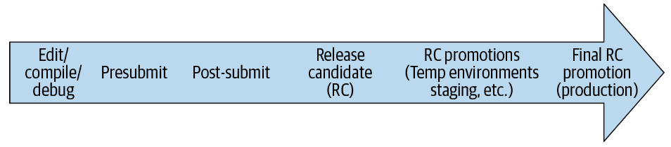
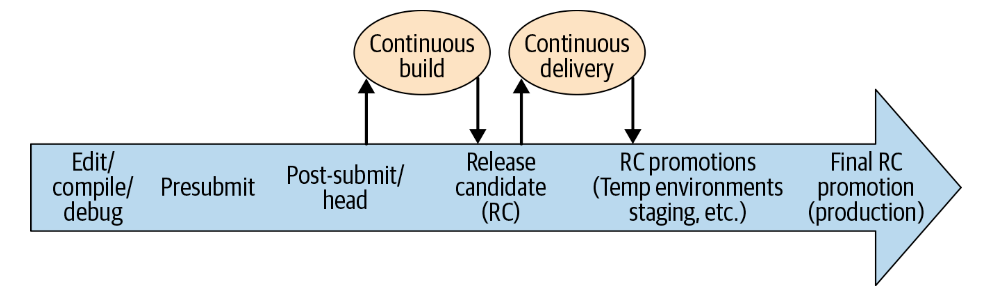
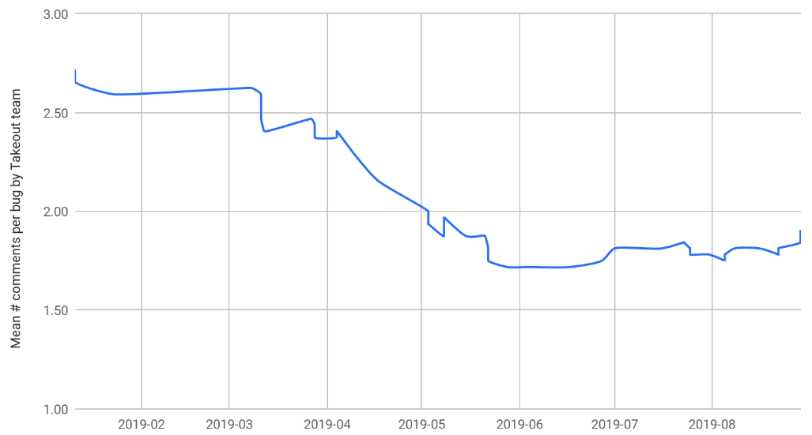
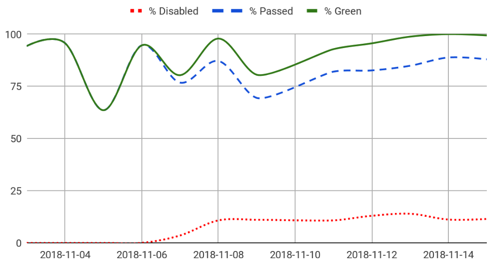
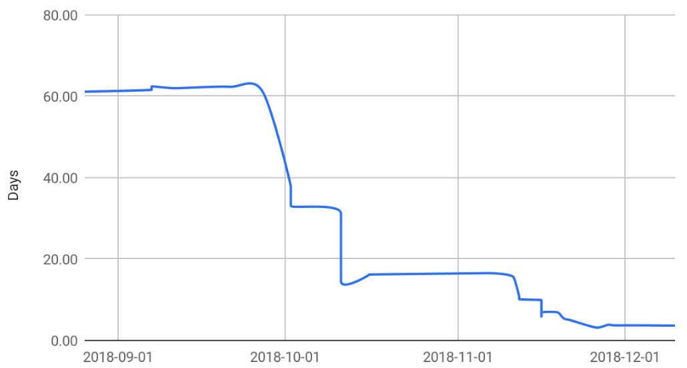

**CHAPTER  23 **

# Continuous Integration

# 第二十三章 持续集成

                                    Written by Rachel Tannenbaum Edited by Lisa Carey

*Continuous Integration*, or CI, is generally defined as “a software development practice where members of a team integrate their work frequently [...] Each integration is verified by an automated build (including test) to detect integration errors as quickly as possible.”[1](#_bookmark2024) Simply put, the fundamental goal of CI is to automatically catch problematic changes as early as possible.

*持续集成*，或CI，通常被定义为 "一种软件开发实践，团队成员经常集成他们的工作[......]每个集成都由自动构建（包括测试）来验证，以尽快发现集成错误。"1简单地说，CI的基本目标是尽可能早地自动捕捉有问题的变化。

In practice, what does “integrating work frequently” mean for the modern, distributed application? Today’s systems have many moving pieces beyond just the latest versioned code in the repository. In fact, with the recent trend toward microservices, the changes that break an application are less likely to live inside the project’s immediate codebase and more likely to be in loosely coupled microservices on the other side of a network call. Whereas a traditional continuous build tests changes in your binary, an extension of this might test changes to upstream microservices. The dependency is just shifted from your function call stack to an HTTP request or Remote Procedure Calls (RPC).

在实践中，"频繁地集成工作 "对于现代的、分布式的应用程序意味着什么？今天的系统除了存储库中最新版本的代码外，还有许多可移动的部分。事实上，随着近来的微服务趋势，破坏应用程序的变化不太可能存在于项目的即时代码库中，而更可能存在于网络调用的另一端的松散耦合的微服务中。传统的持续构建是测试二进制文件的变更，而其延伸则是测试上游微服务的变化。依赖性只是从你的函数调用栈转移到HTTP请求或远程过程调用（RPC）。

Even further from code dependencies, an application might periodically ingest data or update machine learning models. It might execute on evolving operating systems, runtimes, cloud hosting services, and devices. It might be a feature that sits on top of a growing platform or be the platform that must accommodate a growing feature base. All of these things should be considered dependencies, and we should aim to “continuously integrate” their changes, too. Further complicating things, these changing components are often owned by developers outside our team, organization, or company and deployed on their own schedules.

甚至在代码依赖性之外，应用程序可能会定期接收数据或更新机器学习模型。它可能在不断发展的操作系统、运行时、云托管服务和设备上执行。它可能是位于不断增长的平台之上的功能，也可能是必须适应不断增长的功能基础的平台。所有这些都应该被视为依赖关系，我们也应该致力于“持续集成”它们的变化。更复杂的是，这些变化的组件通常由我们团队、组织或公司之外的开发人员拥有，并按照他们自己的时间表部署。

```
1	https://www.martinfowler.com/articles/continuousIntegration.html
```

So, perhaps a better definition for CI in today’s world, particularly when developing at scale, is the following:

*Continuous Integration (2)*: the continuous assembling and testing of our entire complex and rapidly evolving ecosystem.

因此，在当今世界，特别是在大规模开发时，对CI更好的定义也许是以下几点：

·持续集成：对我们整个复杂和快速发展的生态系统进行持续的组装和测试。

It is natural to conceptualize CI in terms of testing because the two are tightly coupled, and we’ll do so throughout this chapter. In previous chapters, we’ve discussed a comprehensive range of testing, from unit to integration, to larger-scoped systems.

从测试的角度对CI进行思考是很自然的，因为两者紧密结合，我们将在本章中这样做。在前面的章节中，我们讨论了一系列全面的测试，从单元到集成，再到更大范围的系统。

From a testing perspective, CI is a paradigm to inform the following:

•   *Which* tests to run *when* in the development/release workflow, as code (and other) changes are continuously integrated into it

•   *How* to compose the system under test (SUT) at each point, balancing concerns like fidelity and setup cost

从测试的角度来看，CI是一种范式，可以告知以下内容：

- 在开发/发布工作流程中，由于代码（和其他）变化不断地被集成到其中，在什么时候运行哪些测试

- 如何在每个点上组成被测系统（SUT），平衡仿真度和设置成本等问题

For example, which tests do we run on presubmit, which do we save for post-submit, and which do we save even later until our staging deploy? Accordingly, how do we represent our SUT at each of these points? As you might imagine, requirements for a presubmit SUT can differ significantly from those of a staging environment under test. For example, it can be dangerous for an application built from code pending review on presubmit to talk to real production backends (think security and quota vulnerabilities), whereas this is often acceptable for a staging environment.

例如，我们在预提交上运行哪些测试，在提交后保存哪些测试，哪些甚至要保存到我们的临时部署？因此，我们如何在这些点上表示SUT？正如你所想象的，预提交SUT的需求可能与测试中的部署环境的需求有很大的不同。例如，从预提交的待审代码构建的应用程序与真正的生产后端对话可能是危险的（考虑安全和配额漏洞），而这对于临时环境来说通常是可以接受的。

And *why* should we try to optimize this often-delicate balance of testing “the right things” at “the right times” with CI? Plenty of prior work has already established the benefits of CI to the engineering organization and the overall business alike.[2](#_bookmark2026) These outcomes are driven by a powerful guarantee: verifiable—and timely—proof that the application is good to progress to the next stage. We don’t need to just hope that all contributors are very careful, responsible, and thorough; we can instead guarantee the working state of our application at various points from build throughout release, thereby improving confidence and quality in our products and productivity of our teams.

为什么我们要尝试用 CI 来优化在 "正确的时间 "测试 "正确的事情 "的这种往往很微妙的平衡？这些结果是由一个强有力的保证所驱动的：可验证的、及时的、可证明应用程序可以进入下一阶段的证明。我们不需要仅仅希望所有的贡献者都非常谨慎、负责和闭环；相反，我们可以保证我们的应用程序在从构建到发布的各个阶段的工作状态，从而提高对我们产品的信心和质量以及我们团队的生产力。

In the rest of this chapter, we’ll introduce some key CI concepts, best practices and challenges, before looking at how we manage CI at Google with an introduction to our continuous build tool, TAP, and an in-depth study of one application’s CI transformation.

在本章的其余部分中，我们将介绍一些关键CI概念、最佳实践和挑战，然后介绍我们如何在Google管理CI，并介绍我们的持续构建工具TAP，以及对某个应用程序的CI转换的深入研究。

 ```
 2	Forsgren, Nicole, et al. (2018). Accelerate: The Science of Lean Software and DevOps: Building and Scaling High Performing Technology Organizations. IT Revolution.
 2   Forsgren，Nicole等人（2018年）。加速：精益软件科学和DevOps：建立和扩展高性能技术组织。这是一场革命。
 ```


## CI Concepts CI概念

First, let’s begin by looking at some core concepts of CI.

首先，让我们先看看CI的一些核心概念。

### Fast Feedback Loops 快速反馈回路

As discussed in [Chapter 11](#_bookmark838), the cost of a bug grows almost exponentially the later it is caught. [Figure 23-1 ](#_bookmark2031)shows all the places a problematic code change might be caught in its lifetime.

正如第11章所讨论的，一个bug被捕获的时间越晚，其成本几乎呈指数增长。图23-1显示了有问题的代码更改在其生命周期中可能出现的所有位置。



*Figure* *23-1.* *Life* *of* *a* *code* *change*

In general, as issues progress to the “right” in our diagram, they become costlier for the following reasons:

•   They must be triaged by an engineer who is likely unfamiliar with the problematic code change.

•   They require more work for the code change author to recollect and investigate the change.

•   They negatively affect others, whether engineers in their work or ultimately the end user.

一般来说，随着问题向我们图中的 "右侧 "发展，它们的成本会变得更高，原因如下：

- 它们必须由可能不熟悉问题代码更改的工程师来处理。

- 这些问题需要代码修改者做更多的工作来回忆和调查这些修改。

- 它们会对其他人产生负面影响，无论是工作中的工程师还是最终的终端用户。

To minimize the cost of bugs, CI encourages us to use *fast feedback loops.*[3](#_bookmark2032) Each time we integrate a code (or other) change into a testing scenario and observe the results, we get a new *feedback loop*. Feedback can take many forms; following are some common ones (in order of fastest to slowest):

•   The edit-compile-debug loop of local development

•   Automated test results to a code change author on presubmit

•   An integration error between changes to two projects, detected after both are submitted and tested together (i.e., on post-submit)

•   An incompatibility between our project and an upstream microservice dependency, detected by a QA tester in our staging environment, when the upstream service deploys its latest changes

•   Bug reports by internal users who are opted in to a feature before external users

•   Bug or outage reports by external users or the press

为了使bug的代价最小化，CI鼓励我们使用*快速反馈环*。每次我们将代码（或其他）变化集成到测试场景中并观察结果时，我们就会得到一个新的*反馈回路*。反馈可以有很多形式；下面是一些常见的形式（按从快到慢的顺序）。

- 本地开发的编辑-编译-调试回路

- 在提交前向代码修改者提供自动测试结果

- 两个项目变更之间的集成错误，在两个项目一起提交和测试后检测（即提交后）。

- 当上游服务部署其最新变化时，我们的项目和上游微服务的依赖关系之间的不兼容，由我们临时环境中的QA测试员发现。

- 在外部用户之前使用功能的内部用户的错误报告

- 外部用户或媒体的错误或故障报告

```
3	This is also sometimes called “shifting left on testing.”
3 这有时也被称为 "测试左移"。
```

*Canarying*—or deploying to a small percentage of production first—can help minimize issues that do make it to production, with a subset-of-production initial feedback loop preceding all-of-production. However, canarying can cause problems, too, particularly around compatibility between deployments when multiple versions are deployed at once. This is sometimes known as *version skew*, a state of a distributed system in which it contains multiple incompatible versions of code, data, and/or configuration. Like many issues we look at in this book, version skew is another example of a challenging problem that can arise when trying to develop and manage software over time.

*金丝雀*-或者先部署到一小部分生产，可以有助于最小化减少进入生产的问题，在所有生产之前先部署一部分生产初始反馈回路。但是，金丝雀部署也会导致新的问题，尤其是在同时部署多个版本时，部署之间的兼容性问题。这有时被称为版本倾斜，分布式系统的一种状态，其中包含多个不兼容的代码、数据和/或配置版本。就像我们在本书中看到的许多问题一样，版本倾斜是另一个在尝试开发和管理软件时可能出现的具有挑战性的问题的例子。

*Experiments* and *feature flags* are extremely powerful feedback loops. They reduce deployment risk by isolating changes within modular components that can be dynamically toggled in production. Relying heavily on feature-flag-guarding is a common paradigm for Continuous Delivery, which we explore further in [Chapter 24](#_bookmark2100).

*实验*特性标志是非常强大的反馈回路。它们通过隔离模块化组件中可以在生产中动态切换的更改来降低部署风险。严重依赖功能标志保护是持续交付的常见范例，我们将在第24章中进一步探讨。

#### Accessible and actionable feedback 可获取和可操作的反馈

It’s also important that feedback from CI be widely accessible. In addition to our open culture around code visibility, we feel similarly about our test reporting. We have a unified test reporting system in which anyone can easily look up a build or test run, including all logs (excluding user Personally Identifiable Information [PII]), whether for an individual engineer’s local run or on an automated development or staging build.

同样重要的是，来自CI的反馈可以被广泛获取。除了我们围绕代码可见性的开放文化之外，我们对我们的测试报告也有类似的方式。我们有一个统一的测试报告系统，任何人都可以很容易地查看构建或测试运行，包括所有的日志（不包括用户的个人身份信息[PII]），无论是个人工程师的本地运行还是自动化开发或分段构建。

Along with logs, our test reporting system provides a detailed history of when build or test targets began to fail, including audits of where the build was cut at each run, where it was run, and by whom. We also have a system for flake classification, which uses statistics to classify flakes at a Google-wide level, so engineers don’t need to figure this out for themselves to determine whether their change broke another project’s test (if the test is flaky: probably not).

除了日志，我们的测试报告系统还提供了构建或测试目标开始失败的详细历史记录，包括每次运行时在何处剪切构建、在何处运行以及由谁执行的审计日志。我们还有一个薄片分类系统，该系统使用统计数据在谷歌范围内对薄片进行分类，因此工程师不需要自己来确定他们的更改是否破坏了另一个项目的测试（如果测试是薄片：可能不是）。

Visibility into test history empowers engineers to share and collaborate on feedback, an essential requirement for disparate teams to diagnose and learn from integration failures between their systems. Similarly, bugs (e.g., tickets or issues) at Google are open with full comment history for all to see and learn from (with the exception, again, of customer PII).

对测试历史的可视性使工程师能够就反馈进行共享和协作，这是不同团队诊断和学习系统间集成故障的基本要求。类似地，谷歌的bug（如罚单或问题）是开放的，有完整的评论历史供所有人查看和学习（客户PII除外）。

Finally, any feedback from CI tests should not just be accessible but actionable—easy to use to find and fix problems. We’ll look at an example of improving user-unfriendly feedback in our case study later in this chapter. By improving test output readability, you automate the understanding of feedback.

最后，来自CI测试的任何反馈不仅应该是可访问的，而且应该是可操作的--易于用来发现和修复问题。我们将在本章后面的案例研究中看一个改进用户不友好反馈的例子。通过改善测试输出的可读性，你可以自动理解反馈。

### Automation 自动化

It’s well known that [automating development-related tasks saves engineering resources](https://oreil.ly/UafCh)in the long run. Intuitively, because we automate processes by defining them as code, peer review when changes are checked in will reduce the probability of error. Of course, automated processes, like any other software, will have bugs; but when implemented effectively, they are still faster, easier, and more reliable than if they were attempted manually by engineers.

众所周知，从长远来看，开发相关任务的自动化可以节省工程资源。直观地说，因为我们通过将流程定义为代码来实现自动化，所以在修改时的同行评审将减少错误的概率。当然，自动化流程，像其他软件一样，会有错误；但如果有效地实施，它们仍然比工程师手动尝试更快，更容易，更可靠。

CI, specifically, automates the *build* and *release* processes, with a Continuous Build and Continuous Delivery. Continuous testing is applied throughout, which we’ll look at in the next section.

特别是CI，它使*构建*和*发布*过程自动化，有持续构建和持续交付。持续测试贯穿始终，我们将在下一节中介绍。

#### Continuous Build 连续构建

The *Continuous Build* (CB) integrates the latest code changes at head[4](#_bookmark2042) and runs an automated build and test. Because the CB runs tests as well as building code, “breaking the build” or “failing the build” includes breaking tests as well as breaking compilation.

持续构建（CB）集成了最新的代码修改，并运行自动构建和测试。因为CB在运行测试的同时也在构建代码，"破坏构建 "或 "构建失败 "包括破坏测试和破坏编译。

After a change is submitted, the CB should run all relevant tests. If a change passes all tests, the CB marks it passing or “green,” as it is often displayed in user interfaces (UIs). This process effectively introduces two different versions of head in the repository: *true head*, or the latest change that was committed, and *green head,* or the latest change the CB has verified. Engineers are able to sync to either version in their local development. It’s common to sync against green head to work with a stable environment, verified by the CB, while coding a change but have a process that requires changes to be synced to true head before submission.

提交变更后，CB应运行所有相关测试。如果更改通过了所有测试，CB会将其标记为通过或绿色”，因为它通常显示在用户界面（UI）中。该流程有效地在报告中引入了两种不同版本的head：真实head或已提交的最新变更，以及绿色head或CB已验证的最新变更。工程师可以在本地开发中同步到任一版本。在编写变更代码时，通常会与绿色head同步，以便在稳定的环境中工作，并经CB验证，但有一个流程要求在提交变更之前将变更同步到真实head。

#### Continuous Delivery 连续交付

The first step in Continuous Delivery (CD; discussed more fully in [Chapter 24](#_bookmark2100)) is *release automation*, which continuously assembles the latest code and configuration from head into release candidates. At Google, most teams cut these at green, as opposed to true, head.

持续交付（CD；在第24章中详细讨论）的第一步是发布自动化，它不断地将最新的代码和配置从head组装成候选发布版本。在谷歌，大多数团队都是在绿色（而不是真正的）head进行切割。

​	*Release candidate* (RC): A cohesive, deployable unit created by an automated process,[5](#_bookmark2043) assembled of code, configuration, and other dependencies that have passed the continuous build.

​	*候选版本*（RC）。由自动化流程创建的内聚、可部署单元，由通过持续构建的代码、配置和其他依赖关系组成。

```
4	Head is the latest versioned code in our monorepo. In other workflows, this is also referred to as master, mainline, or trunk. Correspondingly, integrating at head is also known as trunk-based development.
4 Head是我们monorepo中最新版本的代码。在其他工作流程中，这也被称为主干、主线或主干。相应地，在head集成也被称为基于主干的开发。
```

Note that we include configuration in release candidates—this is extremely important, even though it can slightly vary between environments as the candidate is promoted. We’re not necessarily advocating you compile configuration into your binaries—actually, we would recommend dynamic configuration, such as experiments or feature flags, for many scenarios.[6](#_bookmark2044)

请注意，我们在候选版本中包含了配置--这一点极为重要，尽管在候选版本的推广过程中，不同环境下的配置会略有不同。我们不一定提倡你把配置编译到你的二进制文件中--事实上，我们建议在许多情况下使用动态配置，如实验或特征标志。

Rather, we are saying that any static configuration you *do* have should be promoted as part of the release candidate so that it can undergo testing along with its corresponding code. Remember, a large percentage of production bugs are caused by “silly” configuration problems, so it’s just as important to test your configuration as it is your code (and to test it along *with* the same code that will use it). Version skew is often caught in this release-candidate-promotion process. This assumes, of course, that your static configuration is in version control—at Google, static configuration is in version control along with the code, and hence goes through the same code review process.

相反，我们的意思是，您所拥有的任何静态配置都应该作为候选版本的一部分进行升级，以便它可以与其对应的代码一起接受测试。记住，很大比例的生产错误是由 "愚蠢的 "配置问题引起的，所以测试你的配置和测试你的代码一样重要（而且要和将要使用它的相同代码一起测试）。在这个发布--候选--推广的过程中，经常会出现版本倾斜。当然，这是假设你的静态配置是在版本控制中的--在谷歌，静态配置是和代码一起在版本控制中的，因此要经过同样的代码审查过程。

We then define CD as follows:

​    *Continuous Delivery* (CD): a continuous assembling of release candidates, followed by the promotion and testing of those candidates throughout a series of environments— sometimes reaching production and sometimes not.

那么我们对CD的定义如下。

​    *持续交付（CD）*：持续集合候选版本，然后在一系列环境中推广和测试这些候选版本--有时达到生产阶段，有时不达到生产阶段。

The promotion and deployment process often depends on the team. We’ll show how our case study navigated this process.

升级和部署过程通常取决于团队。我们将展示我们的案例研究如何引导这一过程。

For teams at Google that want continuous feedback from new changes in production (e.g., Continuous Deployment), it’s usually infeasible to continuously push entire binaries, which are often quite large, on green. For that reason, doing a *selective* Continuous Deployment, through experiments or feature flags, is a common strategy.[7](#_bookmark2045)

对于谷歌的团队来说，他们希望从生产中的新变化（例如，持续部署）中获得持续的反馈，通常不可能持续地将整个二进制文件（通常相当大）推到绿色上。因此，通过实验或特性标志进行选择性连续部署是一种常见的策略。

As an RC progresses through environments, its artifacts (e.g., binaries, containers) ideally should not be recompiled or rebuilt. Using containers such as Docker helps enforce consistency of an RC between environments, from local development onward. Similarly, using orchestration tools like Kubernetes (or in our case, usually [Borg](https://oreil.ly/89yPv)), helps enforce consistency between deployments. By enforcing consistency of our release and deployment between environments, we achieve higher-fidelity earlier testing and fewer surprises in production.

当一个RC在各种环境中发展，它的构建（如二进制文件、容器）最好不要被重新编译或重建。使用像Docker这样的容器有助于在不同的环境中强制执行RC的一致性，从本地开发开始。同样，使用像Kubernetes这样的协调工具（或者在我们的例子中，通常是[Borg](https://oreil.ly/89yPv)），有助于强制执行部署之间的一致性。通过强制执行在不同环境间的发布和部署的一致性，我们实现了更高的保真度、更早的测试和更少的生产意外。

```
5	At Google, release automation is managed by a separate system from TAP. We won’t focus on how release automation assembles RCs, but if you’re interested, we do refer you to Site Reliability Engineering (O’Reilly) in which our release automation technology (a system called Rapid) is discussed in detail.
6	CD with experiments and feature flags is discussed further in Chapter 24.
7	We call these “mid-air collisions” because the probability of it occurring is extremely low; however, when this does happen, the results can be quite surprising.

5 在谷歌，发布自动化是由一个独立于TAP的系统管理的。我们不会专注于发布自动化是如何组装RC的，但如果你有兴趣，我们会向你推荐《网站可靠性工程》（O'Reilly），其中详细讨论了我们的发布自动化技术（一个叫做Rapid的系统）。
6 第24章进一步讨论了带有实验和特征标志的CD。
7 我们称这些为 "空中碰撞"，因为它发生的概率极低；然而，当这种情况发生时，其结果可能是相当令人惊讶的。
```

### Continuous Testing 持续测试

Let’s look at how CB and CD fit in as we apply Continuous Testing (CT) to a code change throughout its lifetime, as shown [Figure 23-2](#_bookmark2049).

让我们来看看，当我们将持续测试（CT）应用于代码变更的整个生命周期时，CB和CD是如何配合的，如图23-2所示。



*Figure* *23-2.* *Life* *of* *a* *code* *change* *with* *CB* *and* *CD*

The rightward arrow shows the progression of a single code change from local development to production. Again, one of our key objectives in CI is determining *what* to test *when* in this progression. Later in this chapter, we’ll introduce the different testing phases and provide some considerations for what to test in presubmit versus post-submit, and in the RC and beyond. We’ll show that, as we shift to the right, the code change is subjected to progressively larger-scoped automated tests.

向右箭头显示单个代码更改从本地开发到生产的过程。同样，我我们在CI中的一个关键目标是确定在这个过程中*什么时候*测试什么。在本章后面，我们将介绍不同的测试阶段，并就提交前与提交后以及RC和其他阶段测试内容的注意事项。我们将展示，当我们向右移动时，代码更改将受到范围越来越大的自动化测试的影响。

#### Why presubmit isn’t enough 为什么仅靠预提交还不够的

With the objective to catch problematic changes as soon as possible and the ability to run automated tests on presubmit, you might be wondering: why not just run all tests on presubmit?

为了尽快发现有问题的更改，并且能够在预提交上运行自动测试，你可能会想：为什么不在预提交时运行所有测试？

The main reason is that it’s too expensive. Engineer productivity is extremely valuable, and waiting a long time to run every test during code submission can be severely disruptive. Further, by removing the constraint for presubmits to be exhaustive, a lot of efficiency gains can be made if tests pass far more frequently than they fail. For example, the tests that are run can be restricted to certain scopes, or selected based on a model that predicts their likelihood of detecting a failure.

主要原因是它成本太高了。工程师的工作效率是非常宝贵的，在提交代码期间等待很长时间运行每个测试可能会严重降低生产力。此外，通过取消对预提交的限制，如果测试通过的频率远远高于失败的频率，就可以获得大量的效率提升。例如，运行的测试可以限制在特定范围内，或者根据预测其检测故障可能性的模型进行选择。

Similarly, it’s expensive for engineers to be blocked on presubmit by failures arising from instability or flakiness that has nothing to do with their code change.

同样，如果工程师在提交前被与他们的代码修改无关的不稳定或软弱性引起的故障所阻挡，代价也很高。

Another reason is that during the time we run presubmit tests to confirm that a change is safe, the underlying repository might have changed in a manner that is incompatible with the changes being tested. That is, it is possible for two changes that touch completely different files to cause a test to fail. We call this a mid-air collision,and though generally rare, it happens most days at our scale. CI systems for smaller repositories or projects can avoid this problem by serializing submits so that there is no difference between what is about to enter and what just did.

另一个原因是，在我们运行预提交测试以确认更改是安全的过程中，底层存储库可能以与正在测试的更改不兼容的方式进行了更改。也就是说，两个涉及完全不同文件的更改可能会导致测试失败。我们称这种情况为空中碰撞，虽然一般来说很少发生，但大多数情况下都会发生在我们的掌控范围内。用于较小存储库或项目的CI系统可以通过序列化提交来避免此问题，以便在即将输入的内容和刚刚输入的内容之间没有区别。

#### Presubmit versus post-submit 预提交与提交后

So, which tests *should* be run on presubmit? Our general rule of thumb is: only fast, reliable ones. You can accept some loss of coverage on presubmit, but that means you need to catch any issues that slip by on post-submit, and accept some number of rollbacks. On post-submit, you can accept longer times and some instability, as long as you have proper mechanisms to deal with it.

那么，哪些测试*应该*在预提交时运行？我们的一般经验法则是：只有快速、可靠的测试。你可以接受在预提交时有一些覆盖面的损失，但这意味着你需要在提交后抓住任何漏掉的问题，并接受一定的回滚的次数。在提交后，你可以接受更长的时间和一些不稳定性，只要你有适当的机制来处理它。

We don’t want to waste valuable engineer productivity by waiting too long for slow tests or for too many tests—we typically limit presubmit tests to just those for the project where the change is happening. We also run tests concurrently, so there is a resource decision to consider as well. Finally, we don’t want to run unreliable tests on presubmit, because the cost of having many engineers affected by them, debugging the same problem that is not related to their code change, is too high.

我们不想因为等待太长时间的缓慢测试或太多测试而浪费宝贵的工程师生产力--我们通常将预提交的测试限制在发生变化的项目上。我们还同时运行测试，所以也要考虑资源决定。最后，我们不希望在预提交时运行不可靠的测试，因为让许多工程师受其影响，调试与他们的代码变更无关的同一个问题的成本太高。

Most teams at Google run their small tests (like unit tests) on presubmit[8](#_bookmark2053)—these are the obvious ones to run as they tend to be the fastest and most reliable. Whether and how to run larger-scoped tests on presubmit is the more interesting question, and this varies by team. For teams that do want to run them, hermetic testing is a proven approach to reducing their inherent instability. Another option is to allow large- scoped tests to be unreliable on presubmit but disable them aggressively when they start failing.

谷歌的大多数团队都在预提交上运行他们的小型测试（如单元测试）--这些是明显要运行的，因为它们往往是最快和最可靠的。是否以及如何在提交前运行更大范围的测试是个更有趣的问题，这因团队而异。对于想要运行这些测试的团队来说，封闭测试是一种行之有效的方法来减少其固有的不稳定性。另一个选择是允许大范围的测试在预提交时不可靠，但当它们开始失败时，要主动禁用它们。

#### Release candidate testing 候选版本测试

After a code change has passed the CB (this might take multiple cycles if there were failures), it will soon encounter CD and be included in a pending release candidate.

在代码修改通过CB（如果有失败的话，这可能需要多个周期）后，它很快再进行CD，并被纳入待发布的候选版本。

As CD builds RCs, it will run larger tests against the entire candidate. We test a release candidate by promoting it through a series of test environments and testing it at each deployment. This can include a combination of sandboxed, temporary environments and shared test environments, like dev or staging. It’s common to include some manual QA testing of the RC in shared environments, too.

在CD构建RC的过程中，它将针对整个候选版本运行更大范围测试。我们通过一系列的测试环境来测试候选发布版，并在每次部署时对其进行测试。这可能包括沙盒、临时环境和共享测试环境的组合，如开发或临时。通常也包括在共享环境中对RC的一些手动QA测试。

```
8	Each team at Google configures a subset of its project’s tests to run on presubmit (versus post-submit). In reality, our continuous build actually optimizes some presubmit tests to be saved for post-submit, behind the scenes. We’ll further discuss this later on in this chapter.
8 谷歌的每个团队都将其项目的测试的一个子集配置为在预提交运行（相对于提交后）。实际上，我们的持续构建实际上在幕后优化了一些预提交的测试，以保存到提交后。我们将在本章的后面进一步讨论这个问题。
```

There are several reasons why it’s important to run a comprehensive, automated test suite against an RC, even if it is the same suite that CB just ran against the code on post-submit (assuming the CD cuts at green):

*As a sanity check*

​	We double check that nothing strange happened when the code was cut and recompiled in the RC.

*For* *auditability*

​	If an engineer wants to check an RC’s test results, they are readily available and associated with the RC, so they don’t need to dig through CB logs to find them.

*To allow for cherry picks*

​	If you apply a cherry-pick fix to an RC, your source code has now diverged from the latest cut tested by the CB.

*For emergency pushes*

​	In that case, CD can cut from true head and run the minimal set of tests necessary to feel confident about an emergency push, without waiting for the full CB to pass.

有几个原因可以说明为什么对RC运行一个全面的、自动化的测试套件很重要，即使它是CB在提交后对代码运行的同一个套件（假设CD是绿色的）:

*作为理性的检查*
​	我们仔细检查，当代码在RC中被切割和重新编译时，确保没有任何奇怪的事情发生。

*为了便于审计*

​	如果工程师想检查RC的测试结果，他们很容易得到，并与RC相关联，所以他们不需要在CB日志中寻找它们。

*允许偷梁换柱*

​	如果你对一个RC应用了偷梁换柱式的修复，你的源代码现在已经与CB测试的最新版本相去甚远。

*用于紧急推送*

​	在这种情况下，CD可以从真正的head切分，并运行必要的最小的测试集，对紧急推送感到有信心，而不等待完整的CB通过。

#### Production testing 生产测试

Our continuous, automated testing process goes all the way to the final deployed environment: production. We should run the same suite of tests against production (sometimes called *probers*) that we did against the release candidate earlier on to verify: 1) the working state of production, according to our tests, and 2) the relevance of our tests, according to production.

我们的持续、自动化测试过程一直持续到最后的部署环境：生产环境。我们应该对生产环境运行相同的测试套件（有时称为*probers*），就像我们早期对候选发布版所做的那样，以验证：1）根据我们的测试，生产环境的工作状态；2）根据生产环境，我们测试的相关性。

Continuous testing at each step of the application’s progression, each with its own trade-offs, serves as a reminder of the value in a “defense in depth” approach to catching bugs—it isn’t just one bit of technology or policy that we rely upon for quality and stability, it’s many testing approaches combined.

在应用程序进展的每一步进行持续测试，每一步都有其自身的权衡，这提醒了 "深度防御 "方法在捕捉错误方面的价值--我们依靠的不仅仅是一种技术或政策来保证质量和稳定性，还有多种测试方法的结合。

-----

CI Is Alerting CI正在告警
Titus Winters

As with responsibly running production systems, sustainably maintaining software systems also requires continual automated monitoring. Just as we use a monitoring and alerting system to understand how production systems respond to change, CI reveals how our software is responding to changes in its environment. Whereas production monitoring relies on passive alerts and active probers of running systems, CI uses unit and integration tests to detect changes to the software before it is deployed. Drawing comparisons between these two domains lets us apply knowledge from one to the other.

与负责任地运行生产系统一样，可持续地维护软件系统也需要持续的自动监控。正如我们使用监控和告警系统来了解生产系统对变化的反应一样，CI揭示了我们的软件是如何对其环境的变化做出反应的。生产监控依赖于运行系统的被动告警和主动探测，而CI则使用单元和集成测试来检测软件在部署前的变化。在这两个领域之间进行比较，可以让我们把一个领域的知识应用到另一个领域。

Both CI and alerting serve the same overall purpose in the developer workflow—to identify problems as quickly as reasonably possible. CI emphasizes the early side of the developer workflow, and catches problems by surfacing test failures. Alerting focuses on the late end of the same workflow and catches problems by monitoring metrics and reporting when they exceed some threshold. Both are forms of “identify problems automatically, as soon as possible.”

CI和告警在开发者工作流程中的总体目的是一样的--尽可能快地发现问题。CI强调开发者工作流程的早期阶段，并通过显示测试失败来捕获问题。告警侧重于同一工作流程的后期，通过监测指标并在指标超过某个阈值时报告来捕捉问题。两者都是 "自动、尽快地识别问题"的形式。

A well-managed alerting system helps to ensure that your Service-Level Objectives (SLOs) are being met. A good CI system helps to ensure that your build is in good shape—the code compiles, tests pass, and you could deploy a new release if you needed to. Best-practice policies in both spaces focus a lot on ideas of fidelity and actionable alerting: tests should fail only when the important underlying invariant is violated, rather than because the test is brittle or flaky. A flaky test that fails every few CI runs is just as much of a problem as a spurious alert going off every few minutes and generating a page for the on-call. If it isn’t actionable, it shouldn’t be alerting. If it isn’t actually violating the invariants of the SUT, it shouldn’t be a test failure.

一个管理良好的告警系统有助于确保你的服务水平目标（SLO）得到满足。一个好的CI系统有助于确保你的构建处于良好状态--代码编译，测试通过，如果需要的话，你可以部署一个新版本。这两个领域的最佳实践策略都非常注重仿真度和可操作的告警：测试应该只在重要的基础不变因素被违反时才失败，而不是因为测试很脆弱或不稳定。一个脆弱的测试，每运行几次CI就会失败，就像一个虚假的警报每隔几分钟就会响起，并为值班人员生成一个页面一样，是一个问题。如果它不具有可操作性，就不应该发出警报。如果它实际上没有违反SUT的不变性，就不应该是测试失败。

CI and alerting share an underlying conceptual framework. For instance, there’s a similar relationship between localized signals (unit tests, monitoring of isolated statistics/cause-based alerting) and cross-dependency signals (integration and release tests, black-box probing). The highest fidelity indicators of whether an aggregate system is working are the end-to-end signals, but we pay for that fidelity in flakiness, increasing resource costs, and difficulty in debugging root causes.

CI和告警共享一个基本的概念框架。例如，在局部信号（单元测试、独立统计监测/基于原因的警报）和交叉依赖信号（集成和发布测试、黑盒探测）之间存在类似的关系。衡量一个整体系统是否工作的最高仿真度指标是端到端的信号，但我们要为这种仿真度付出代价，即松散性、不断增加的资源成本和调试根源的难度。

Similarly, we see an underlying connection in the failure modes for both domains. Brittle cause-based alerts fire based on crossing an arbitrary threshold (say, retries in the past hour), without there necessarily being a fundamental connection between that threshold and system health as seen by an end user. Brittle tests fail when an arbitrary test requirement or invariant is violated, without there necessarily being a fundamental connection between that invariant and the correctness of the software being tested. In most cases these are easy to write, and potentially helpful in debugging a larger issue. In both cases they are rough proxies for overall health/correctness, failing to capture the holistic behavior. If you don’t have an easy end-to-end probe, but you do make it easy to collect some aggregate statistics, teams will write threshold alerts based on arbitrary statistics. If you don’t have a high-level way to say, “Fail the test if the decoded image isn’t roughly the same as this decoded image,” teams will instead build tests that assert that the byte streams are identical.

同样，我们在这两个领域的故障模式中看到了一种潜在的联系。脆弱的基于原因的告警基于超过任意阈值（例如，过去一小时内的重试）而启动，而该阈值与终端用户看到的系统健康状况之间不一定有根本联系。当一个任意的测试要求或不变量被违反时，脆性测试就会失败，而不一定在该不变量和被测软件的正确性之间有根本的联系。在大多数情况下，这些测试很容易写，并有可能有助于调试更大的问题。在这两种情况下，它们都是整体健康/正确性的粗略代理，无法捕获整体行为。如果你没有一个简单的端到端探针，但你确实可以轻松地收集一些聚合统计信息，那么团队将基于任意统计信息编写阈值警报。如果你没有一个高层次的方法说："如果解码后的图像与这个解码后的图像不大致相同，则测试失败"，团队就会建立测试，断言字节流是相同的。

Cause-based alerts and brittle tests can still have value; they just aren’t the ideal way to identify potential problems in an alerting scenario. In the event of an actual failure, having more debug detail available can be useful. When SREs are debugging an outage, it can be useful to have information of the form, “An hour ago users, started experiencing more failed requests. Around the same, time the number of retries started ticking up. Let’s start investigating there.” Similarly, brittle tests can still provide extra debugging information: “The image rendering pipeline started spitting out garbage. One of the unit tests suggests that we’re getting different bytes back from the JPEG compressor. Let’s start investigating there.”

基于原因的告警和脆性测试仍然有价值；它们只是在告警场景中不是识别潜在问题的理想方式。在实际发生故障的情况下，有更多的调试细节可以使用。当SRE正在调试一个故障时，有这样的信息是很有用的："一小时前，用户开始遇到更多的失败请求。大约在同一时间，重试的数量开始上升。让我们开始调查。" 同样地，脆弱的测试仍然可以提供额外的调试信息。"图像渲染管道开始吐出垃圾。其中一个单元测试表明，我们从JPEG压缩器那里得到了不同的字节。让我们开始调查吧。"

Although monitoring and alerting are considered a part of the SRE/production management domain, where the insight of “Error Budgets” is well understood,[9](#_bookmark2057) CI comes from a perspective that still tends to be focused on absolutes. Framing CI as the “left shift” of alerting starts to suggest ways to reason about those policies and propose better best practices:

•   Having a 100% green rate on CI, just like having 100% uptime for a production service, is awfully expensive. If that is *actually* your goal, one of the biggest problems is going to be a race condition between testing and submission.

•   Treating every alert as an equal cause for alarm is not generally the correct approach. If an alert fires in production but the service isn’t actually impacted, silencing the alert is the correct choice. The same is true for test failures: until our CI systems learn how to say, “This test is known to be failing for irrelevant reasons,” we should probably be more liberal in accepting changes that disable a failed test. Not all test failures are indicative of upcoming production issues.

•   Policies that say, “Nobody can commit if our latest CI results aren’t green” are probably misguided. If CI reports an issue, such failures should definitely be *investigated* before letting people commit or compound the issue. But if the root cause is well understood and clearly would not affect production, blocking commits is unreasonable.

尽管监控和告警被认为是SRE/生产管理领域的一部分，其中 "错误成本 "的洞察力被很好地理解，CI来自一个仍然倾向于关注绝对性的视角。将CI定义为告警的 "左移"，开始建议如何推理这些政策并提出更好的最佳实践：

- 在CI上实现100%的绿色率，就像在生产服务中实现100%的正常运行时间一样，是非常昂贵的。如果这确实是你的目标，那么最大的问题之一就是测试和提交之间的竞争条件。

- 把每一个告警都当作一个相同原因来处理，一般来说不是正确的方法。如果一个告警在生产中被触发，但服务实际上并没有受到影响，让告警沉默是正确的选择。对于测试失败也是如此：在我们的CI系统学会如何说“已知此测试因无关原因而失败”之前，我们可能应该更自由地接受禁用失败测试的更改。并非所有测试失败都表明即将出现生产问题。

- 那些说 "如果我们最新的CI结果不是绿色的，任何人都不能提交 "的政策可能是错误的。如果 CI 报告了一个问题，在让人们提交或使问题复杂化之前，肯定要对这种失败进行调查。但如果根本原因已被充分理解，并且显然不会影响生产，那么阻止提交是不合理的。

This “CI is alerting” insight is new, and we’re still figuring out how to fully draw parallels. Given the higher stakes involved, it’s unsurprising that SRE has put a lot of thought into best practices surrounding monitoring and alerting, whereas CI has been viewed as more of a luxury feature.[10](#_bookmark2058) For the next few years, the task in software engineering will be to see where existing SRE practice can be reconceptualized in a CI context to help reformulate the testing and CI landscape—and perhaps where best practices in testing can help clarify goals and policies on monitoring and alerting.

这种 "CI就是警报 "的见解是新的，我们仍在摸索如何充分地得出相似之处。鉴于所涉及的风险较高，SRE对围绕监控和警报的最佳实践进行了大量的思考，而CI则被视为一种奢侈的功能，这一点并不奇怪。在未来几年，软件工程的任务将是看看现有的SRE实践可以在CI背景下重新概念化，以帮助重新制定测试和CI景观，也许测试的最佳实践可以帮助澄清监控和警报的目标和政策。

----

```
9	Aiming for 100% uptime is the wrong target. Pick something like 99.9% or 99.999% as a business or product trade-off, define and monitor your actual uptime, and use that “budget” as an input to how aggressively you’re willing to push risky releases.
10	We believe CI is actually critical to the software engineering ecosystem: a must-have, not a luxury. But that is not universally understood yet.
9 以100%的正常运行时间为目标是错误的。选择像99.9%或99.999%这样的目标作为业务或产品的权衡，定义并监控你的实际正常运行时间，并使用该 "成本预算 "作为你愿意多积极地推动风险发布的输入。
10 我们相信CI实际上对软件工程生态系统至关重要：它是必需品，而不是奢侈品。但这一点尚未得到普遍理解。

```

### CI Challenges

We’ve discussed some of the established best practices in CI and have introduced some of the challenges involved, such as the potential disruption to engineer productivity of unstable, slow, conflicting, or simply too many tests at presubmit. Some common additional challenges when implementing CI include the following:

• - *Presubmit optimization*, including *which* tests to run at presubmit time given the potential issues we’ve already described, and *how* to run them.

• - *Culprit finding* and *failure isolation*: Which code or other change caused the problem, and which system did it happen in? “Integrating upstream microservices” is one approach to failure isolation in a distributed architecture, when you want to figure out whether a problem originated in your own servers or a backend. In this approach, you stage combinations of your stable servers along with upstream microservices’ new servers. (Thus, you are integrating the microservices’ latest changes into your testing.) This approach can be particularly challenging due to version skew: not only are these environments often incompatible, but you’re also likely to encounter false positives—problems that occur in a particular staged combination that wouldn’t actually be spotted in production.

-   *Resource constraints*: Tests need resources to run, and large tests can be very expensive. In addition, the cost for the infrastructure for inserting automated testing throughout the process can be considerable.

我们已经讨论了CI的一些已确认的最佳实践，并介绍了其中的一些挑战，例如不稳定的、缓慢的、冲突的或仅仅是在预提交时太多的测试对工程师生产力的潜在干扰。实施CI时，一些常见的额外挑战包括以下内容：

- *提交前优化*，包括考虑到我们已经描述过的潜在问题，在提交前运行哪些测试，以及如何运行它们。

- *找出罪魁祸首*和*故障隔离*。哪段代码或其他变化导致了问题，它发生在哪个系统中？"整合上游微服务 "是分布式架构中故障隔离的一种方法，当你想弄清楚问题是源于你自己的服务器还是后端。在这种方法中，你把你的稳定服务器与上游微服务的新服务器组合在一起。(因此，你将微服务的最新变化整合到你的测试中）。由于版本偏差，这种方法可能特别具有挑战性：不仅这些环境经常不兼容，而且你还可能遇到假阳性--在某个特定的阶段性组合中出现的问题，实际上在生产中不会被发现。

- *资源限制*。测试需要资源来运行，而大型测试可能非常昂贵。此外，在整个过程中插入自动化测试的基础设施的成本可能是相当大的。

There’s also the challenge of *failure management—*what to do when tests fail. Although smaller problems can usually be fixed quickly, many of our teams find that it’s extremely difficult to have a consistently green test suite when large end-to-end tests are involved. They inherently become broken or flaky and are difficult to debug; there needs to be a mechanism to temporarily disable and keep track of them so that the release can go on. A common technique at Google is to use bug “hotlists” filed by an on-call or release engineer and triaged to the appropriate team. Even better is when these bugs can be automatically generated and filed—some of our larger products, like Google Web Server (GWS) and Google Assistant, do this. These hotlists should be curated to make sure any release-blocking bugs are fixed immediately. Nonrelease blockers should be fixed, too; they are less urgent, but should also be prioritized so the test suite remains useful and is not simply a growing pile of disabled, old tests. Often, the problems caught by end-to-end test failures are actually with tests rather than code.

还有一个挑战是*失败管理*--当测试失败时该怎么做。尽管较小的问题通常可以很快得到解决，但我们的许多团队发现，当涉及到大型的端到端测试时，要有一个持续的绿色测试套件是非常困难的。它们本来就会出现故障或不稳定，而且难以调试；需要有一种机制来暂时禁用并跟踪它们，以便发布工作能够继续进行。在谷歌，一种常见的技术是使用由值班或发布工程师提交的bug "热名单"，并将其分发给相应的团队。如果这些bug能够自动生成并归档，那就更好了--我们的一些大型产品，如谷歌网络服务器（GWS）和谷歌助手，就能做到这一点。应对这些热名单进行整理，以确保立即修复所有阻止发布的bug。非发布障碍也应该被修复；它们不那么紧急，但也应该被优先处理，这样测试套件才会保持有用，而不仅仅是一堆越来越多的失效的旧测试。通常，由端到端测试失败引起的问题实际上是测试问题，而不是代码问题。

Flaky tests pose another problem to this process. They erode confidence similar to a broken test, but finding a change to roll back is often more difficult because the failure won’t happen all the time. Some teams rely on a tool to remove such flaky tests from presubmit temporarily while the flakiness is investigated and fixed. This keeps confidence high while allowing for more time to fix the problem.

不稳定测试给这个过程带来了另一个问题。它们会侵蚀信心，就像一次失败的测试一样，但找到一个可以回滚的变化往往更困难，因为失败不会一直发生。一些团队依靠一种工具，在调查和修复不稳定的测试时，暂时从预提交中删除这种不稳定测试。这样可以保持较高的信心，同时允许有更多的时间来修复这个问题。

*Test instability* is another significant challenge that we’ve already looked at in the context of presubmits. One tactic for dealing with this is to allow multiple attempts of the test to run. This is a common test configuration setting that teams use. Also, within test code, retries can be introduced at various points of specificity.

*测试的不稳定性*是另一个重大挑战，我们已经在预提交的背景下看过了。处理这个问题的一个策略是允许测试的多次尝试运行。这是团队使用的常见测试配置设置。另外，在测试代码中，可以在不同的特定点引入重试。

Another approach that helps with test instability (and other CI challenges) is hermetic testing, which we’ll look at in the next section.

另一种有助于解决测试不稳定性（和其他CI挑战）的方法是封闭测试，我们将在下一节中讨论。

### Hermetic Testing  封闭测试

Because talking to a live backend is unreliable, we often use [hermetic backends ](https://oreil.ly/-PbRM)for larger-scoped tests. This is particularly useful when we want to run these tests on presubmit, when stability is of utmost importance. In [Chapter 11](#_bookmark838), we introduced the concept of hermetic tests:

*Hermetic tests*: tests run against a test environment (i.e., application servers and resources) that is entirely self-contained (i.e., no external dependencies like production backends).

因为与实时后端交互是不可靠的，我们经常使用[封闭后端](https://oreil.ly/-PbRM)进行较大范围的测试。当我们想在提交前运行这些测试时，这是特别有用的，因为此时稳定性是最重要的。在第11章中，我们介绍了封闭测试的概念。

​	*封闭测试*：针对测试环境（即应用服务器和资源）运行的测试，是完全自成一体的（即没有像生产后端那样的外部依赖）。

Hermetic tests have two important properties: greater determinism (i.e., stability) and isolation. Hermetic servers are still prone to some sources of nondeterminism, like system time, random number generation, and race conditions. But, what goes into the test doesn’t change based on outside dependencies, so when you run a test twice with the same application and test code, you should get the same results. If a hermetic test fails, you know that it’s due to a change in your application code or tests (with a minor caveat: they can also fail due to a restructuring of your hermetic test environment, but this should not change very often). For this reason, when CI systems rerun tests hours or days later to provide additional signals, hermeticity makes test failures easier to narrow down.

封闭测试有两个重要的特性：更高的确定性（即稳定性）和隔离性。封闭式服务器仍然容易受到一些非确定性来源的影响，如系统时间、随机数生成和竞态条件。但是，进入测试的内容不会因为外部的依赖关系而改变，所以当你用相同的应用程序和测试代码运行两次测试时，你应该得到相同的结果。如果一个封闭测试失败了，你就知道是由于你的应用程序代码或测试的变化造成的（有一个小的注意事项：它们也可能由于你的封闭测试环境的重组而失败，但这不应该经常更变）。出于这个原因，当CI系统在几小时或几天后重新运行测试以提供额外的信号时，封闭性使测试失败更容易缩小范围。

The other important property, isolation, means that problems in production should not affect these tests. We generally run these tests all on the same machine as well, so we don’t have to worry about network connectivity issues. The reverse also holds: problems caused by running hermetic tests should not affect production.

另一个重要特性，隔离，意味着生产环境中的问题不应该影响这些测试。我们通常也在同一台机器上运行这些测试，因此我们不必担心网络连接问题。反之亦然：运行封闭测试引起的问题不应影响生产环境。

Hermetic test success should not depend on the user running the test. This allows people to reproduce tests run by the CI system and allows people (e.g., library developers) to run tests owned by other teams.

封闭测试的成功不应取决于运行测试的用户。这允许人们复制CI系统运行的测试，并允许人们（例如，库的开发者）运行其他团队拥有的测试。

One type of hermetic backend is a fake. As discussed in [Chapter 13](#_bookmark1056), these can be cheaper than running a real backend, but they take work to maintain and have limited fidelity.

一种封闭式的后端是模拟的。正如在第13章中所讨论的，这些可能比运行一个真正的后端更廉价，但它们需要花费精力去维护，而且仿真度有限。

The cleanest option to achieve a presubmit-worthy integration test is with a fully hermetic setup—that is, starting up the entire stack sandboxed[11](#_bookmark2075)—and Google provides out-of-the-box sandbox configurations for popular components, like databases, to make it easier. This is more feasible for smaller applications with fewer components, but there are exceptions at Google, even one (by DisplayAds) that starts about four hundred servers from scratch on every presubmit as well as continuously on post- submit. Since the time that system was created, though, record/replay has emerged as a more popular paradigm for larger systems and tends to be cheaper than starting up a large sandboxed stack.

实现具有预提交价值的集成测试的最干净的选择是使用一个完全精细的设置--即启动整个堆栈沙盒--谷歌为流行组件（如数据库）提供开箱即用的沙盒配置，以使其更简单。这对于组件较少的小型应用程序更为可行，但谷歌也有例外，即使是一个（由DisplayAds提供）在每次提交前以及提交后从零开始启动大约400台服务器的应用程序。但是，自创建该系统以来，录制/重播已成为大型系统的一种更受欢迎的范例，并且往往比启动大型沙盒堆栈更便宜。

Record/replay (see [Chapter 14](#_bookmark1181)) systems record live backend responses, cache them, and replay them in a hermetic test environment. Record/replay is a powerful tool for reducing test instability, but one downside is that it leads to brittle tests: it’s difficult to strike a balance between the following:

*False positives*

​	The test passes when it probably shouldn’t have because we are hitting the cache too much and missing problems that would surface when capturing a new response.

*False negatives*

​	The test fails when it probably shouldn’t have because we are hitting the cache too little. This requires responses to be updated, which can take a long time and lead to test failures that must be fixed, many of which might not be actual problems. This process is often submit-blocking, which is not ideal.

记录/重放（见第14章）系统记录实时的后端响应，缓存它们，并在一个封闭的测试环境中重放它们。记录/重放是一个强大的工具，可以减少测试的不稳定性，但一个缺点是它会导致测试变脆弱：很难在以下方面取得平衡：

*假阳性*
​	测试在不应该通过的情况下通过了，因为我们对缓存的访问太多，并且遗漏了捕获新响应时可能出现的问题。

*错误的否定*
​	测试在不应该通过的情况下失败了，因为我们对缓冲区的命中太少。这需要更新响应，这可能需要很长时间，并导致必须修复的测试失败，其中许多可能不是实际问题。这个过程通常是提交阻塞，这并不理想。

Ideally, a record/replay system should detect only problematic changes and cache- miss only when a request has changed in a meaningful way. In the event that that change causes a problem, the code change author would rerun the test with an updated response, see that the test is still failing, and thereby be alerted to the problem. In practice, knowing when a request has changed in a meaningful way can be incredibly difficult in a large and ever-changing system.

理想情况下，记录/重放系统应该只检测有问题的更改，并且只有在请求以有意义的方式更改时才检测缓存未命中。如果该更改导致问题，代码修改者会用更新的响应重新运行测试，查看测试是否仍然失败，并因此收到问题警报。在实践中，在一个大型且不断变化的系统中，知道请求何时以有意义的方式发生了更改可能非常困难。

-----

**The** **Hermetic** **Google** **Assistant** **隐秘的谷歌助手**

Google Assistant provides a framework for engineers to run end-to-end tests, including a test fixture with functionality for setting up queries, specifying whether to simulate on a phone or a smart home device, and validating responses throughout an exchange with Google Assistant.

谷歌助手为工程师提供了一个运行端到端测试的框架，包括一个具有设置查询功能的测试套件，指定是否在手机或智能家居设备上进行模拟，并在与谷歌助手的整个交互中验证响应。

One of its greatest success stories was making its test suite fully hermetic on presubmit. When the team previously used to run nonhermetic tests on presubmit, the tests would routinely fail. In some days, the team would see more than 50 code changes bypass and ignore the test results. In moving presubmit to hermetic, the team cut the runtime by a factor of 14, with virtually no flakiness. It still sees failures, but those failures tend to be fairly easy to find and roll back.

其最大的成功故事之一是使其测试套件在提交前完全密封。当该团队以前在提交前运行非封闭测试时，测试经常会失败。在某些日子里，团队会看到超过50个代码更改绕过并忽略测试结果。在将预提交转为封闭的过程中，该团队将运行时间缩短了14倍，而且几乎没有任何闪失。它仍然会出现故障，但这些故障往往是相当容易发现和回滚的。

Now that nonhermetic tests have been pushed to post-submit, it results in failures accumulating there instead. Debugging failing end-to-end tests is still difficult, and some teams don’t have time to even try, so they just disable them. That’s better than having it stop all development for everyone, but it can result in production failures.

现在，非封闭测试已经被推到提交后，结果反而导致失败在那里累积。调试失败的端到端测试仍然很困难，一些团队甚至没有时间尝试，所以他们只是禁用它们。这比让它停止所有人的开发要好，但它可能导致生产失败。

One of the team’s current challenges is to continue to fine-tuning its caching mechanisms so that presubmit can catch more types of issues that have been discovered only post-submit in the past, without introducing too much brittleness.

该团队目前的挑战之一是继续微调其缓存机制，以便预提交可以捕捉到更多过去只在提交后发现的问题类型，同时不引入过多的脆弱性。

Another is how to do presubmit testing for the decentralized Assistant given that components are shifting into their own microservices. Because the Assistant has a large and complex stack, the cost of running a hermetic stack on presubmit, in terms of engineering work, coordination, and resources, would be very high.

另一个问题是，鉴于组件正在转移到自己的微服务中，如何为分散的助手做预提交测试。因为助手有一个庞大而复杂的堆栈，在预提交上运行一个封闭的堆栈，在工程工作、协调和资源方面的成本会非常高。

Finally, the team is taking advantage of this decentralization in a clever new post- submit failure-isolation strategy. For each of the *N* microservices within the Assistant, the team will run a post-submit environment containing the microservice built at head, along with production (or close to it) versions of the other *N* – 1 services, to isolate problems to the newly built server. This setup would normally be *O*(*N*2) cost to facilitate, but the team leverages a cool feature called *hotswapping* to cut this cost to *O*(*N*). Essentially, hotswapping allows a request to instruct a server to “swap” in the address of a backend to call instead of the usual one. So only *N* servers need to be run, one for each of the microservices cut at head—and they can reuse the same set of prod backends swapped in to each of these *N* “environments.”

最后，该团队正在利用这种分散的优势，采取一种巧妙的新的提交后故障隔离策略。对于助手中的N个微服务中的每一个，团队将运行一个提交后的环境，其中包含在头部构建的微服务，以及其他N-1个服务的生产（或接近生产）版本，以将问题隔离到新构建的服务器。这种设置通常是O(N2)的成本，但该团队利用了一个很酷的功能，称为热交换，将这一成本削减到O(N)。从本质上讲，"热交换 "允许一个请求指示服务器 "交换 "一个后端地址来调用，而不是通常的一个。因此，只需要运行N个服务器，每个微服务都有一个，而且它们可以重复使用同一组被交换到这N个 "环境 "中的生产环境后端。

-----

As we’ve seen in this section, hermetic testing can both reduce instability in larger- scoped tests and help isolate failures—addressing two of the significant CI challenges we identified in the previous section. However, hermetic backends can also be more expensive because they use more resources and are slower to set up. Many teams use combinations of hermetic and live backends in their test environments.

正如我们在本节中所看到的，封闭测试既可以减少大范围测试中的不稳定性，也可以帮助隔离故障，解决我们在上一节中确定的两个重大CI挑战。然而，封闭式后端也可能更昂贵，因为它们使用更多的资源，并且设置速度较慢。许多团队在他们的测试环境中使用密封和活动后端的组合。

## CI at Google 谷歌的CI

Now let’s look in more detail at how CI is implemented at Google. First, we’ll look at our global continuous build, TAP, used by the vast majority of teams at Google, and how it enables some of the practices and addresses some of the challenges that we looked at in the previous section. We’ll also look at one application, Google Takeout, and how a CI transformation helped it scale both as a platform and as a service.

现在让我们更详细地看看CI在谷歌是如何实施的。首先，我们将了解谷歌绝大多数团队使用的全球持续构建TAP，以及它是如何实现一些实践和解决我们在上一节中看到的一些挑战的。我们还将介绍一个应用程序Google Takeout，以及CI转换如何帮助其作为平台和服务进行扩展。

-----

TAP: Google’s Global Continuous Build 谷歌的全球持续构建

**Adam Bender** **亚当-本德 **

We run a massive continuous build, called the Test Automation Platform (TAP), of our entire codebase. It is responsible for running the majority of our automated tests. As a direct consequence of our use of a monorepo, TAP is the gateway for almost all changes at Google. Every day it is responsible for handling more than 50,000 unique changes *and* running more than four billion individual test cases.

我们在整个代码库中运行一个大规模的持续构建，称为测试自动化平台（TAP）。它负责运行我们大部分的自动化测试。由于我们使用的是monorepo，TAP是谷歌几乎所有变化的门户。每天，它负责处理超过50,000个独特的变化，运行超过40亿个单独的测试用例。

TAP is the beating heart of Google’s development infrastructure. Conceptually, the process is very simple. When an engineer attempts to submit code, TAP runs the associated tests and reports success or failure. If the tests pass, the change is allowed into the codebase.

TAP是谷歌发展基础设施的核心。从概念上讲，这个过程非常简单。当工程师试图提交代码时，TAP将运行相关测试并报告成功或失败。如果测试通过，则允许更改进入代码库。

**Presubmit optimization** **预提交优化**

To catch issues quickly and consistently, it is important to ensure that tests are run against every change. Without a CB, running tests is usually left to individual engineer discretion, and that often leads to a few motivated engineers trying to run all tests and keep up with the failures.

为了快速和持续地发现问题，必须确保对每一个变化都进行测试。如果没有CB，运行测试通常是由个别工程师决定的，这往往会导致一些有积极性的工程师试图运行所有的测试并跟进故障。

As discussed earlier, waiting a long time to run every test on presubmit can be severely disruptive, in some cases taking hours. To minimize the time spent waiting, Google’s CB approach allows potentially breaking changes to land in the repository (remember that they become immediately visible to the rest of the company!). All we ask is for each team to create a fast subset of tests, often a project’s unit tests, that can be run before a change is submitted (usually before it is sent for code review)—the presubmit. Empirically, a change that passes the presubmit has a very high likelihood (95%+) of passing the rest of the tests, and we optimistically allow it to be integrated so that other engineers can then begin to use it.

如前所述，等待很长时间来运行预提交的每个测试可能会造成严重破坏，在某些情况下需要数小时。为了最大限度地减少等待时间，谷歌的CB方法允许潜在的破坏性更改提交到存储库中（请记住，这些更改会立即被公司其他人看到！）。我们只要求每个团队创建一个快速的测试子集，通常是一个项目的单元测试，可以在提交更改之前（通常是在发送更改进行代码审查之前）运行这些测试。根据经验，通过预提交的变更通过其余测试的可能性非常高（95%+），我们乐观地允许将其集成，以便其他工程师可以开始使用它。

After a change has been submitted, we use TAP to asynchronously run all potentially affected tests, including larger and slower tests.

提交更改后，我们使用TAP异步运行所有可能受影响的测试，包括较大和较慢的测试。

When a change causes a test to fail in TAP, it is imperative that the change be fixed quickly to prevent blocking other engineers. We have established a cultural norm that strongly discourages committing any new work on top of known failing tests, though flaky tests make this difficult. Thus, when a change is committed that breaks a team’s build in TAP, that change may prevent the team from making forward progress or building a new release. As a result, dealing with breakages quickly is imperative.

当变更导致TAP测试失败时，必须迅速修复变更，以防止阻塞其他工程师。我们已经建立了一种文化规范，强烈反对在已知失败测试的基础上进行任何新的工作，尽管不稳定测试会让这变得困难。因此，当提交的变更打破了团队的内置TAP时，该变更可能会阻止团队向前推进或构建新版本。因此，快速处理故障势在必行。

To deal with such breakages, each team has a “Build Cop.” The Build Cop’s responsibility is keeping all the tests passing in their particular project, regardless of who breaks them. When a Build Cop is notified of a failing test in their project, they drop whatever they are doing and fix the build. This is usually by identifying the offending change and determining whether it needs to be rolled back (the preferred solution) or can be fixed going forward (a riskier proposition).

为了处理这种破坏，每个团队都有一个 "Build Cop"。Build Cop的责任是保持他们特定项目的所有测试通过，无论谁破坏了它们。当Build Cop被告知他们的项目中有一个失败的测试时，他们会放下手中的工作，修复构建。这通常是通过识别违规的变化，并确定它是否需要回滚（首选解决方案）或可以继续修复（风险较大）。

In practice, the trade-off of allowing changes to be committed before verifying all tests has really paid off; the average wait time to submit a change is around 11 minutes, often run in the background. Coupled with the discipline of the Build Cop, we are able to efficiently detect and address breakages detected by longer running tests with a minimal amount of disruption.

在实践中，允许在验证所有测试之前提交更改的折衷方案已经真正得到了回报；提交更改的平均等待时间约为11分钟，通常在后台运行。再加上Build Cop的原则，我们能够以最小的中断量有效地检测和解决运行时间较长的测试检测到的故障。

**Culprit finding** **发现罪魁祸首**

One of the problems we face with large test suites at Google is finding the specific change that broke a test. Conceptually, this should be really easy: grab a change, run the tests, if any tests fail, mark the change as bad. Unfortunately, due to a prevalence of flakes and the occasional issues with the testing infrastructure itself, having confidence that a failure is real isn’t easy. To make matters more complicated, TAP must evaluate so many changes a day (more than one a second) that it can no longer run every test on every change. Instead, it falls back to batching related changes together, which reduces the total number of unique tests to be run. Although this approach can make it faster to run tests, it can obscure which change in the batch caused a test to break.

谷歌大型测试套件面临的一个问题是找到破坏测试的具体变化。从概念上讲，这应该很容易：抓取一个变更，运行测试，如果任何测试失败，将变更标记为坏的。不幸的是，由于片断的流行以及测试基础设施本身偶尔出现的问题，要确信失败是真实的并不容易。更加复杂的是，TAP必须每天评估如此多的变化（一秒钟超过一个），以至于它不能再对每个变化运行每个测试。取而代之的是，它退回到批处理相关的更改，这减少了要运行的独特测试的总数。尽管这种方法可以加快运行测试的速度，但它可以掩盖批处理中导致测试中断的更改。

To speed up failure identification, we use two different approaches. First, TAP automatically splits a failing batch up into individual changes and reruns the tests against each change in isolation. This process can sometimes take a while to converge on a failure, so in addition, we have created culprit finding tools that an individual developer can use to binary search through a batch of changes and identify which one is the likely culprit.

为了加快故障识别，我们使用了两种不同的方法。首先，TAP自动将失败的批次拆分为单独的更改，并针对每个更改单独重新运行测试。这个过程有时需要一段时间才能收敛到失败，因此，我们还创建了罪魁祸首查找工具，每个开发人员可以使用这些工具通过一批更改进行二进制搜索，并确定哪一个是可能的罪魁祸首。

**Failure management** **故障管理**

After a breaking change has been isolated, it is important to fix it as quickly as possible. The presence of failing tests can quickly begin to erode confidence in the test suite. As mentioned previously, fixing a broken build is the responsibility of the Build Cop. The most effective tool the Build Cop has is the *rollback*.

在隔离破坏性变更后，尽快修复该变更非常重要。失败测试的存在可能会很快开始侵蚀测试套件的信心。如前所述，修复损坏的构建是Build Cop的责任。Build Cop最有效的工具是*回滚*。

Rolling a change back is often the fastest and safest route to fix a build because it quickly restores the system to a known good state.[12](#_bookmark2084) In fact, TAP has recently been upgraded to automatically roll back changes when it has high confidence that they are the culprit.

回滚更改通常是修复生成的最快和最安全的方法，因为它可以快速将系统恢复到已知的良好状态。事实上，TAP最近已升级为自动回滚更改，当它高度确信更改是罪魁祸首时。

Fast rollbacks work hand in hand with a test suite to ensure continued productivity. Tests give us confidence to change, rollbacks give us confidence to undo. Without tests, rollbacks can’t be done safely. Without rollbacks, broken tests can’t be fixed quickly, thereby reducing confidence in the system.

快速回滚与测试套件携手并进，以确保持续的生产力。测试给了我们改变的信心，回滚给了我们撤销的信心。没有测试，回滚就不能安全进行。没有回滚，破损的测试就不能被快速修复，从而降低了对系统的信心。

**Resource constraints** **资源限制**

Although engineers can run tests locally, most test executions happen in a distributed build-and-test system called *Forge*. Forge allows engineers to run their builds and tests in our datacenters, which maximizes parallelism. At our scale, the resources required to run all tests executed on-demand by engineers and all tests being run as part of the CB process are enormous. Even given the amount of compute resources we have, systems like Forge and TAP are resource constrained. To work around these constraints, engineers working on TAP have come up with some clever ways to determine which tests should be run at which times to ensure that the minimal amount of resources are spent to validate a given change.

虽然工程师可以在本地运行测试，但大多数测试的执行是在一个叫做*Forge*的分布式构建和测试系统中进行。Forge允许工程师在我们的数据中心运行他们的构建和测试，这最大限度地提高了并行性。在我们的规模下，运行所有由工程师按需执行的测试以及作为CB流程一部分运行的所有测试所需的资源是巨大的。即使考虑到我们拥有的计算资源量，像Forge和TAP这样的系统也受到资源限制。为了解决这些限制，在TAP上工作的工程师想出了一些聪明的方法来确定哪些测试应该在什么时候运行，以确保花费最少的资源来验证一个特定的变化。

The primary mechanism for determining which tests need to be run is an analysis of the downstream dependency graph for every change. Google’s distributed build tools, Forge and Blaze, maintain a near-real-time version of the global dependency graph and make it available to TAP. As a result, TAP can quickly determine which tests are downstream from any change and run the minimal set to be sure the change is safe.

确定需要运行哪些测试的主要机制是分析每个更改的下游依赖关系图。谷歌的分布式构建工具Forge和Blaze维护了一个近乎实时的全球依赖关系图版本，并可供用户使用。因此，TAP可以快速确定任何更改的下游测试，并运行最小集以确保更改是安全的。

Another factor influencing the use of TAP is the speed of tests being run. TAP is often able to run changes with fewer tests sooner than those with more tests. This bias encourages engineers to write small, focused changes. The difference in waiting time between a change that triggers 100 tests and one that triggers 1,000 can be tens of minutes on a busy day. Engineers who want to spend less time waiting end up making smaller, targeted changes, which is a win for everyone.

影响TAP使用的另一个因素是测试运行的速度。TAP通常能够以更少的测试比更多测试更快地运行更改。这种情况鼓励工程师编写小而集中的更改。在繁忙的一天中，触发100个测试的更改和触发1000个测试的更改之间的等待时间差异可能是几十分钟。希望花更少时间等待的工程师最终会做出更小的、有针对性的修改，这对所有人来说都是一种胜利。 

----

### CI Case Study: Google Takeout   CI案例研究：Google Takeout 

Google Takeout started out as a data backup and download product in 2011. Its founders pioneered the idea of “data liberation”—that users should be able to easily take their data with them, in a usable format, wherever they go. They began by integrating Takeout with a handful of Google products themselves, producing archives of users’ photos, contact lists, and so on for download at their request. However, Takeout didn’t stay small for long, growing as both a platform and a service for a wide variety of Google products. As we’ll see, effective CI is central to keeping any large project healthy, but is especially critical when applications rapidly grow.

2011年，Google Takeout开始作为一种数据备份和下载产品。其创始人率先提出了“数据解放”的理念，即用户无论走到哪里，都应该能够轻松地以可用的格式携带数据。他们首先将Takeout与少量谷歌产品整合在一起，制作用户照片、联系人列表等档案，以便在他们的要求下下载。然而，Takeout并没有在很长一段时间内保持规模，它不仅是一个平台，而且是一项针对各种谷歌产品的服务。正如我们将看到的，有效的CI对于保持任何大型项目的健康至关重要，但在应用程序快速增长时尤为关键。

**Scenario #1: Continuously broken dev deploys** **情景#1：持续中断的开发部署**

**Problem:** As Takeout gained a reputation as a powerful Google-wide data fetching, archiving, and download tool, other teams at the company began to turn to it, requesting APIs so that their own applications could provide backup and download functionality, too, including Google Drive (folder downloads are served by Takeout) and Gmail (for ZIP file previews). All in all, Takeout grew from being the backend for just the original Google Takeout product, to providing APIs for at least 10 other Google products, offering a wide range of functionality.

**问题:**随着Takeout作为功能强大的Google范围内的数据获取、归档和下载工具而声名鹊起，该公司的其他团队开始转向它，请求API以便他们自己的应用程序也可以提供备份和下载功能，包括Google Drive（文件夹下载由Takeout提供）和Gmail（用于ZIP文件预览）. 总之，Takeout从最初的Google Takeout产品的后端发展到为至少10种其他Google产品提供API，提供广泛的功能。

The team decided to deploy each of the new APIs as a customized instance, using the same original Takeout binaries but configuring them to work a little differently. For example, the environment for Drive bulk downloads has the largest fleet, the most quota reserved for fetching files from the Drive API, and some custom authentication logic to allow non-signed-in users to download public folders.

团队决定将每个新的API部署为一个定制的实例，使用相同的原始Takeout二进制文件，但将它们配置成有点不同的工作方式。例如，用于Drive批量下载的环境拥有最大的集群，为从Drive API获取文件保留了最多的配额，以及一些自定义的认证逻辑，允许未登录的用户下载公共文件夹。

Before long, Takeout faced “flag issues.” Flags added for one of the instances would break the others, and their deployments would break when servers could not start up due to configuration incompatibilities. Beyond feature configuration, there was security and ACL configuration, too. For example, the consumer Drive download service should not have access to keys that encrypt enterprise Gmail exports. Configuration quickly became complicated and led to nearly nightly breakages.

不久，Takeout就面临“标志问题”。为其中一个实例添加的标志将破坏其他实例，当服务器由于配置不兼容而无法启动时，它们的部署将中断。除了功能配置之外，还有安全性和ACL配置。例如，消费者驱动器下载服务不应访问加密企业Gmail导出的密钥。配置很快变得复杂，几乎每晚都会发生故障。

Some efforts were made to detangle and modularize configuration, but the bigger problem this exposed was that when a Takeout engineer wanted to make a code change, it was not practical to manually test that each server started up under each configuration. They didn’t find out about configuration failures until the next day’s deploy. There were unit tests that ran on presubmit and post-submit (by TAP), but those weren’t sufficient to catch these kinds of issues.

我们做了一些努力来分解和模块化配置，但这暴露出的更大的问题是，当Takeout工程师想要修改代码时，手动测试每台服务器是否在每种配置下启动是不切实际的。他们在第二天的部署中才发现配置失败的情况。有一些单元测试是在提交前和提交后运行的（通过TAP），但这些测试不足以捕获此类问题。

**What the team did.** The team created temporary, sandboxed mini-environments for each of these instances that ran on presubmit and tested that all servers were healthy on startup. Running the temporary environments on presubmit prevented 95% of broken servers from bad configuration and reduced nightly deployment failures by 50%.

**团队所做的**。**团队为每个实例创建了临时的、沙盒式的迷你环境，在预提交时运行，并测试所有服务器在启动时是否健康。在提交前运行临时环境可以防止95%的服务器因配置不当而损坏，并将夜间部署失败率降低了50%。

Although these new sandboxed presubmit tests dramatically reduced deployment failures, they didn’t remove them entirely. In particular, Takeout’s end-to-end tests would still frequently break the deploy, and these tests were difficult to run on presubmit (because they use test accounts, which still behave like real accounts in some respects and are subject to the same security and privacy safeguards). Redesigning them to be presubmit friendly would have been too big an undertaking.

尽管这些新的沙盒式预提交测试大大减少了部署失败，但它们并没有完全消除它们。特别是，Takeout的端到端测试仍然经常中断部署，而且这些测试很难在预提交中运行（因为它们使用的是测试账户，在某些方面仍然与真实账户一样，并受到同样的安全和隐私保护）。重新设计它们以使其对预提交友好，将是一项巨大的工程。

If the team couldn’t run end-to-end tests in presubmit, when could it run them? It wanted to get end-to-end test results more quickly than the next day’s dev deploy and decided every two hours was a good starting point. But the team didn’t want to do a full dev deploy this often—this would incur overhead and disrupt long-running processes that engineers were testing in dev. Making a new shared test environment for these tests also seemed like too much overhead to provision resources for, plus culprit finding (i.e., finding the deployment that led to a failure) could involve some undesirable manual work.

如果团队不能在预提交中运行端到端测试，那么它什么时候可以运行？它想比第二天的开发部署更快得到端到端的测试结果，并决定每两小时一次是一个好的起点。但团队并不想这么频繁地进行全面的开发部署--这将产生开销，并扰乱工程师在开发中测试的长期运行的流程。为这些测试建立一个新的共享测试环境，似乎也需要太多的开销来提供资源，再加上查找问题（即找到导致失败的部署）可能涉及一些不可预知的手动工作。

So, the team reused the sandboxed environments from presubmit, easily extending them to a new post-submit environment. Unlike presubmit, post-submit was compliant with security safeguards to use the test accounts (for one, because the code has been approved), so the end-to-end tests could be run there. The post-submit CI runs every two hours, grabbing the latest code and configuration from green head, creates an RC, and runs the same end-to-end test suite against it that is already run in dev.

因此，该团队重新使用了预提交的沙盒环境，轻松地将它们扩展到新的后提交环境。与预提交不同，后提交符合安全保障措施，可以使用测试账户（其一，因为代码已经被批准），所以端到端的测试可以在那里运行。提交后的CI每两小时运行一次，从绿头抓取最新的代码和配置，创建一个RC，并针对它运行已经在开发中运行的相同的端到端测试套件。

**Lesson learned.** Faster feedback loops prevent problems in dev deploys:

-   Moving tests for different Takeout products from “after nightly deploy” to presubmit prevented 95% of broken servers from bad configuration and reduced nightly deployment failures by 50%.

-   Though end-to-end tests couldn’t be moved all the way to presubmit, they were still moved from “after nightly deploy” to “post-submit within two hours.” This effectively cut the “culprit set” by 12 times.

**经验教训。**更快的反馈循环防止了开发部署中的问题：

- 将不同Takeout产品的测试从 "夜间部署后 "转移到预提交，可以防止95%的服务器因配置不良而损坏，并将夜间部署的失败率降低50%。

- 尽管端到端测试不能全部转移到预提交，但它们仍然从 "夜间部署后 "转移到 "两小时内提交后"。这有效地将 "罪魁祸首集 "减少了12倍。

**Scenario #2: Indecipherable test logs**  **场景2：无法识别的测试日志**

**Problem:** As Takeout incorporated more Google products, it grew into a mature platform that allowed product teams to insert plug-ins, with product-specific data- fetching code, directly into Takeout’s binary. For example, the Google Photos plug-in knows how to fetch photos, album metadata, and the like. Takeout expanded from its original “handful” of products to now integrate with more than *90*.

**问题：**随着Takeout整合了更多的谷歌产品，它已经发展成为一个成熟的平台，允许产品团队直接在Takeout的二进制文件中插入插件，其中包含产品特定的数据获取代码。例如，谷歌照片插件知道如何获取照片、相册元数据等。Takeout从最初的 "少数 "产品扩展到现在与超过*90个*的产品集成。

Takeout’s end-to-end tests dumped its failures to a log, and this approach didn’t scale to 90 product plug-ins. As more products integrated, more failures were introduced. Even though the team was running the tests earlier and more often with the addition of the post-submit CI, multiple failures would still pile up inside and were easy to miss. Going through these logs became a frustrating time sink, and the tests were almost always failing.

Takeout的端到端测试将其故障转储到日志中，这种方法不能扩展到90个产品插件。随着更多产品的集成，更多的故障被引入。尽管团队在提交后的CI中更早更频繁地运行测试，但多个故障还是会堆积在里面，很容易被忽略。翻阅这些日志成了一个令人沮丧的时间消耗，而且测试几乎总是失败。

**What the team did.** The team refactored the tests into a dynamic, configuration-based suite (using a [parameterized test runner](https://oreil.ly/UxkHk)) that reported results in a friendlier UI, clearly showing individual test results as green or red: no more digging through logs. They also made failures much easier to debug, most notably, by displaying failure information, with links to logs, directly in the error message. For example, if Takeout failed to fetch a file from Gmail, the test would dynamically construct a link that searched for that file’s ID in the Takeout logs and include it in the test failure message. This automated much of the debugging process for product plug-in engineers and required less of the Takeout team’s assistance in sending them logs, as demonstrated in [Figure 23-3](#_bookmark2091).

**团队所做的**。团队将测试重构为一个动态的、基于配置的套件（使用一个参数化的测试运行器），在一个更友好的用户界面中报告结果，清楚地显示单个测试结果为绿色或红色：不再翻阅日志。他们还使失败变得更容易调试，最明显的是，在错误信息中直接显示失败信息，并提供日志链接。例如，如果Takeout从Gmail获取文件失败，测试将动态地构建一个链接，在Takeout日志中搜索该文件的ID，并将其包含在测试失败信息中。如图23-3所示，这使产品插件工程师的大部分调试过程自动化，并在向他们发送日志时不再需要Takeout团队的协助。



*Figure* *23-3.* *The* *team’s* *involvement* *in* *debugging* *client* *failures*

**Lesson learned.** Accessible, actionable feedback from CI reduces test failures and improves productivity. These initiatives reduced the Takeout team’s involvement in debugging client (product plug-in) test failures by 35%.

**经验教训。**来自CI的可访问、可操作的反馈减少了测试失败，提高了生产力。这些举措使Takeout团队参与调试客户（产品插件）测试失败的情况减少了35%。

**Scenario #3: Debugging “all of Google”**  **情景#3：调试 "所有谷歌"**

**Problem:** An interesting side effect of the Takeout CI that the team did not anticipate was that, because it verified the output of 90-some odd end-user–facing products, in the form of an archive, they were basically testing “all of Google” and catching issues that had nothing to do with Takeout. This was a good thing—Takeout was able to help contribute to the quality of Google’s products overall. However, this introduced a problem for their CI processes: they needed better failure isolation so that they could determine which problems were in their build (which were the minority) and which lay in loosely coupled microservices behind the product APIs they called.

**问题：**Takeout CI的一个有趣的副作用是团队没有预料到的，因为它以归档的形式验证了90多个面向最终用户的产品的输出，他们基本上是在测试 "所有的Google产品"，捕捉与Takeout无关的问题。这是一件好事--Takeout能够帮助提高谷歌产品的整体质量。然而，这给他们的CI流程带来了一个问题：他们需要更好的故障隔离，以便他们能够确定哪些问题是在他们的构建中（哪些是少数），哪些是在他们调用的产品API背后松散耦合的微服务中。

**What the team did.** The team’s solution was to run the exact same test suite continuously against production as it already did in its post-submit CI. This was cheap to implement and allowed the team to isolate which failures were new in its build and which were in production; for instance, the result of a microservice release somewhere else “in Google.”

**团队所做的**。该团队的解决方案是针对生产持续运行完全相同的测试套件，正如它在提交后CI中所做的那样。这样做的成本很低，并允许团队隔离哪些故障是在其构建中出现的，哪些是在生产中出现的；例如，微服务发布的结果“在谷歌的其他地方”。

**Lesson learned.** Running the same test suite against prod and a post-submit CI (with newly built binaries, but the same live backends) is a cheap way to isolate failures.

**经验教训**。对生产环境和提交后的CI运行相同的测试套件（使用新构建的二进制文件，但相同的实时后端）是隔离故障的廉价方法。

**Remaining challenge.** Going forward, the burden of testing “all of Google” (obviously, this is an exaggeration, as most product problems are caught by their respective teams) grows as Takeout integrates with more products and as those products become more complex. Manual comparisons between this CI and prod are an expensive use of the Build Cop’s time.

**仍然存在的挑战。**展望未来，随着Takeout与更多的产品整合，以及这些产品变得更加复杂，测试 "所有谷歌"（显然，这是一个夸张的说法，因为大多数产品问题都是由他们各自的团队发现的）的负担越来越重。在这个CI和prod之间进行手动比较是对Build Cop时间的昂贵使用。

**Future improvement.** This presents an interesting opportunity to try hermetic testing with record/replay in Takeout’s post-submit CI. In theory, this would eliminate failures from backend product APIs surfacing in Takeout’s CI, which would make the suite more stable and effective at catching failures in the last two hours of Takeout changes—which is its intended purpose.

**Scenario #4: Keeping it green**  **场景4：保持绿色**

**Problem:** As the platform supported more product plug-ins, which each included end-to-end tests, these tests would fail and the end-to-end test suites were nearly always broken. The failures could not all be immediately fixed. Many were due to bugs in product plug-in binaries, which the Takeout team had no control over. And some failures mattered more than others—low-priority bugs and bugs in the test code did not need to block a release, whereas higher-priority bugs did. The team could easily disable tests by commenting them out, but that would make the failures too easy to forget about.

**问题**：随着平台支持更多的产品插件，每个插件都包括端到端的测试，这些测试会失败，端到端的测试套件几乎总是被破坏。这些故障不可能都被立即修复。许多故障是由于产品插件二进制文件中的错误，Takeout 团队无法控制这些错误。有些故障比其他故障更重要--低优先级的bug和测试代码中的bug不需要阻止发布，而高优先级的bug需要阻止。团队可以很容易地通过注释它们来禁用测试，但这将使失败者很容易忘记。

One common source of failures: tests would break when product plug-ins were rolling out a feature. For example, a playlist-fetching feature for the YouTube plug-in might be enabled for testing in dev for a few months before being enabled in prod. The Takeout tests only knew about one result to check, so that often resulted in the test needing to be disabled in particular environments and manually curated as the feature rolled out.

一个常见的失败原因是：当产品插件推出一个功能时，测试会中断。例如，YouTube插件的播放列表获取功能可能在开发阶段启用了几个月的测试，然后才在生产阶段启用。Takeout测试只知道要检查一个结果，所以这往往导致测试需要在特定的环境中被禁用，并在功能推出时被手动修复。

**What the team did.** The team came up with a strategic way to disable failing tests by tagging them with an associated bug and filing that off to the responsible team (usually a product plug-in team). When a failing test was tagged with a bug, the team’s testing framework would suppress its failure. This allowed the test suite to stay green and still provide confidence that everything else, besides the known issues, was passing, as illustrated in [Figure 23-4](#_bookmark2092).

**团队所做的**。该团队提出了一种禁用失败测试的战略方法，方法是使用相关错误标记失败测试，并将其提交给负责的团队（通常是产品插件团队）。当失败的测试被标记为错误时，团队的测试框架将抑制其失败。这允许测试套件保持绿色，并且仍然提供信心，证明除已知问题外的所有其他问题都通过了，如图23-4所示。



*Figure* *23-4.* *Achieving* *greenness* *through* *(responsible)* *test* *disablement* *通过（责任人）测试禁用来实现绿色*

For the rollout problem, the team added capability for plug-in engineers to specify the name of a feature flag, or ID of a code change, that enabled a particular feature along with the output to expect both with and without the feature. The tests were equipped to query the test environment to determine whether the given feature was enabled there and verified the expected output accordingly.

对于推广问题，团队增加了插件工程师指定功能标志名称或代码更改ID的功能，该功能使特定功能和输出能够同时使用和不使用该功能。测试配备了查询测试环境的功能，以确定给定的功能是否在那里启用，并相应地验证预期输出。

When bug tags from disabled tests began to accumulate and were not updated, the team automated their cleanup. The tests would now check whether a bug was closed by querying our bug system’s API. If a tagged-failing test actually passed and was passing for longer than a configured time limit, the test would prompt to clean up the tag (and mark the bug fixed, if it wasn’t already). There was one exception for this strategy: flaky tests. For these, the team would allow a test to be tagged as flaky, and the system wouldn’t prompt a tagged “flaky” failure for cleanup if it passed.

当被禁用的测试的bug标签开始积累并且不被更新时，该团队将其清理自动化。测试现在会通过查询我们的错误系统的API来检查一个错误是否被关闭。如果一个被标记为失败的测试实际通过了，并且通过的时间超过了配置的时间限制，测试就会提示清理标签（如果还没有被修复的话，就标记为bug修复）。这个策略有一个例外：不稳定的测试。对于这些，团队将允许测试被标记为不稳定，如果测试通过了，系统不会提示清理标记的 "不稳定 "故障。

These changes made a mostly self-maintaining test suite, as illustrated in [Figure 23-5](#_bookmark2093).‘

’这些变化使得测试套件大多是自我维护的，如图23-5所示。



*Figure 23-5. Mean time to close bug, after fix submitted* *提交修复程序后关闭bug的平均时间*

**Lessons learned.** Disabling failing tests that can’t be immediately fixed is a practical approach to keeping your suite green, which gives confidence that you’re aware of all test failures. Also, automating the test suite’s maintenance, including rollout management and updating tracking bugs for fixed tests, keeps the suite clean and prevents technical debt. In DevOps parlance, we could call the metric in [Figure 23-5 ](#_bookmark2093)MTTCU: mean time to clean up.

**经验教训。**禁用无法立即修复的失败测试是保持套件绿色的一种切实可行的方法，这使人相信你知道所有的测试失败。另外，自动化测试套件的维护，包括推出管理和更新跟踪固定测试的bug，保持套件的清洁，防止技术债务。用DevOps的说法，我们可以把图23-5MTTCU中的指标称为：平均清理时间。

**Future improvement.** Automating the filing and tagging of bugs would be a helpful next step. This is still a manual and burdensome process. As mentioned earlier, some of our larger teams already do this.

**未来的改进。**自动归档和标记bug将是一个有用的下一步。这仍然是一个手动和繁重的过程。正如前面提到的，我们的一些大型团队已经这样做了。

**Further challenges.** The scenarios we’ve described are far from the only CI challenges faced by Takeout, and there are still more problems to solve. For example, we mentioned the difficulty of isolating failures from upstream services in [“CI Challenges” on](#_bookmark2059) [page 490](#_bookmark2059). This is a problem that Takeout still faces with rare breakages originating with upstream services, such as when a security update in the streaming infrastructure used by Takeout’s “Drive folder downloads” API broke archive decryption when it deployed to production. The upstream services are staged and tested themselves, but there is no simple way to automatically check with CI if they are compatible with Takeout after they’re launched into production. An initial solution involved creating an “upstream staging” CI environment to test production Takeout binaries against the staged versions of their upstream dependencies. However, this proved difficult to maintain, with additional compatibility issues between staging and production versions.

**进一步的挑战。**我们所描述的场景远不是Takeout所面临的唯一的CI挑战，还有更多问题需要解决。例如，我们在第490页的 "CI挑战 "中提到了从上游服务隔离故障的困难。这是Takeout仍然面临的一个问题，即源于上游服务的罕见故障，例如Takeout的“驱动器文件夹下载”API使用的流式基础结构中的安全更新在部署到生产环境时破坏了存档解密。上游服务都是经过阶段性测试的，但没有简单的方法在它们投入生产后用CI自动检查它们是否与Takeout兼容。最初的解决方案是创建一个 "上游临时 "的CI环境，根据上游依赖的暂存版本测试Takeout的生产二进制文件。然而，这被证明是很难维护的，在临时版本和生产版本之间存在着额外的兼容性问题。

### But I Can’t Afford CI  但我用不起CI费用

You might be thinking that’s all well and good, but you have neither the time nor money to build any of this. We certainly acknowledge that Google might have more resources to implement CI than the typical startup does. Yet many of our products have grown so quickly that they didn’t have time to develop a CI system either (at least not an adequate one).

你可能会想，这一切都很好，但你既没有时间也没有钱来建立这些。我们当然承认，谷歌可能比一般的创业公司拥有更多的资源来实施CI。然而，我们的许多产品成长得如此之快，以至于他们也没有时间去开发一个CI系统（至少不是一个合适的系统）。

In your own products and organizations, try and think of the cost you are already paying for problems discovered and dealt with in production. These negatively affect the end user or client, of course, but they also affect the team. Frequent production fire-fighting is stressful and demoralizing. Although building out CI systems is expensive, it’s not necessarily a new cost as much as a cost shifted left to an earlier— and more preferable—stage, reducing the incidence, and thus the cost, of problems occurring too far to the right. CI leads to a more stable product and happier developer culture in which engineers feel more confident that “the system” will catch problems, and they can focus more on features and less on fixing.

在你自己的产品和组织中，试着想想你已经为在生产中发现和处理的问题支付了多少成本。这些问题当然会对最终用户或客户产生负面影响，但它们也会影响到团队。频繁的生产救火是一种压力和士气的体现。尽管建立CI系统是昂贵的，但它不一定是一个新的成本，而是将成本转移到一个更早的、更可取的阶段，减少问题的发生率，从而减少成本，因为问题发生在右边。CI带来了更稳定的产品和更快乐的开发运营文化，在这种文化中，工程师更相信“系统”会发现问题，他们可以更多地关注功能，而不是修复问题。

## Conclusion 总结

Even though we’ve described our CI processes and some of how we’ve automated them, none of this is to say that we have developed perfect CI systems. After all, a CI system itself is just software and is never complete and should be adjusted to meet the evolving demands of the application and engineers it is meant to serve. We’ve tried to illustrate this with the evolution of Takeout’s CI and the future areas of improvement we point out.

尽管我们已经描述了我们的 CI 流程和一些自动化的方法，但这并不是说我们已经开发了完美的 CI 系统。毕竟，CI系统本身只是一个软件，永远不会完整，应该进行调整以满足应用程序和工程师不断变化的需求。我们试图用Takeout的CI的演变和我们指出的未来改进领域来说明这一点。

## TL;DRs

- A CI system decides what tests to use, and when.

- CI systems become progressively more necessary as your codebase ages and grows in scale.

- CI should optimize quicker, more reliable tests on presubmit and slower, less deterministic tests on post-submit.

- Accessible, actionable feedback allows a CI system to become more efficient.


- CI系统决定使用什么测试以及何时使用。

- 随着代码库的老化和规模的扩大，CI系统变得越来越有必要。

- CI应该在提交前优化更快、更可靠的测试，在提交后优化更慢、更不确定的测试。

- 可访问、可操作的反馈使CI系统变得更加有效。


